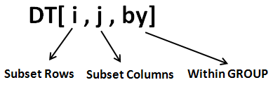

# data.table pt1 {-}
## Запись занятия {-}

Запись занятия 30 сентября:

<iframe width="560" height="315" src="https://www.youtube.com/embed/CIEI0leUf7c?si=-yzkDNrPXjIX-RE2" title="YouTube video player" frameborder="0" allow="accelerometer; autoplay; clipboard-write; encrypted-media; gyroscope; picture-in-picture; web-share" allowfullscreen></iframe>

<br>

## Разбор домашней работы

### списки {-}

 - Код ниже создает иллюстрирует дисперсионный анализ. Прочитайте справки по `iris` и `aov`. Выполните выражения.

```{r}
# 
aov_stats <- aov(Sepal.Length ~ Species, iris)
aov_stats_summary <- summary(aov_stats)
```
 
 - Выведите на печать объект `aov_stats_summary`. Выведите на печать и проанализируйте структуру объекта.

 - ***Выведите на печать уровень значимости (Pr(>F))


Решение. В списке `aov_stat_summary` неименованный подсписок. Этот подсписок является таблицей (data.frame). Соответственно, сначала нам надо обратиться к неименованному подсписку списка с помощью `[[`, а потом обратиться к первой строчке пятой колонки.
Либо использовать то, что таблицы -- это тоже списки, и обратиться к значению в синтаксисе списков, а не колонок.
```{r, message=FALSE, warning=FALSE}
# смотрим структуру объекта
str(aov_stats_summary)

# используем синтаксис списков
aov_stats_summary[[1]]$`Pr(>F)`[1]

# используем синтаксис data.frame -- первая строка, пятая колонка
aov_stats_summary[[1]][1, 5]

# так как мы умеем работать только с data.table
# конвертируем в data.table и извлекаем значение аналогично data.frame
library(data.table)
aov_stats <- as.data.table(aov_stats_summary[[1]])
str(aov_stats)

# по номеру колонки
aov_stats[1, 5]

# по названию колонки
aov_stats[1, `Pr(>F)`]
```

### таблицы. импорт данных {-}
 
 - подключите библиотеку data.table (установите, если не была установлена)
 - скачайте файл [titanic3.csv](https://gitlab.com/hse_mar/mar221s/-/raw/master/data/titanic3.csv): https://gitlab.com/hse_mar/mar221s/-/raw/master/data/titanic3.csv.
 - * с помощью команды `titanic <- fread('titanic3.csv')` импортируйте файл в рабочее окружение. Прочитайте справку по функции `fread()` и попробуйте импортировать данные без явного сохранения на диск (не сработает с файлом в слаке).
```{r}
# можно импортироватьс разу по ссылке
titanic <- fread('https://gitlab.com/hse_mar/mar221s/-/raw/master/data/titanic3.csv')
```
 
 - ** попробуйте написать код, в котором сначала происходит сохранение файла на диск, а потом чтение файла в рабочее окружение R (чтобы не руками сохранять, а кодом).
```{r}
# можно сохранить объект по ссылка на диск
download.file(
  'https://gitlab.com/hse_mar/mar221s/-/raw/master/data/titanic3.csv',
  'titanic_new.csv'
)

# и потом прочитать с диска
titanic <- fread('titanic_new.csv')
```
 
 - посмотрите с помощью команды `class()` объекта. Если он отличается от `data.table` --- преобразуйте в data.table с помощью функции `as.data.table()`
 
```{r}
# fread сразу читает в data.table
class(titanic)
```


### работа со строками {-}

```{r}
# выберите те строки, где возраст пассажира меньше 1 (младенцы)
titanic[age < 1]

# выберите те строки, где возраст пассажира в диапазоне 20 до 50 лет
titanic[age >= 20 & age <= 50]

# выберите строки по выжившим младенцам (survived)
titanic[age < 1 & survived == 1]

# выберите пассажирок, которые имеют титул lady
titanic[grep('lady', name, ignore.case = TRUE)]
titanic[grep('Lady', name)]

# альтернативнй вариант, когда учитываем пробел (' ' или  '\\s')
titanic[grep('\\slady', name, ignore.case = TRUE)]
```


## Основная формула dt-синтаксиса {-}


Общая формула `data.table` выглядит как `dataset[выбор строк, операции над колонками, группировка]`. То есть, указание, какие строки необходимо выделить, осуществляется в первой части (до первой запятой в синтаксисе `data.table`). Если нет необходимости выделять какие-то строки, перед первой запятой ничего не ставится. Параметр группировки (как и прочие параметры, кроме `i` и `j` - опциональны).

Также можно провести параллели с синтаксисом SQL-запроса. В терминах SQL data.table-выражения выглядят как `таблица[where, select, group by]`.

## Создание data.table-таблиц {-}
Создать `data.table` можно следующим образом (синтаксис немного напоминает создание именованного списка, как и для всех форматов таблиц):

```{r}
# подключаем пакет, если не был подключен ранее
library(data.table)

# создаем датасет
dt1 <- data.table(
  month_names = month.name,
  month_abb = month.abb,
  month_ord = seq_len(length(month.abb)),
  is_winter = grepl('Jan|Dec|Feb', month.abb)
)
print(dt1)
```


## Выбор строки {-}

Выбор строк в `data.table` осуществляется аналогично выбору элементов в векторе: по номеру строки или по какому-то условию. При выборе по номеру строки также можно указать вектор номеров строк, которые необходимо вернуть. При выборке строки по условию проверяется, удовлетворяет ли условию каждый элемент строки в определенной колонке, и если удовлетворяет, выделяется вся строка.

```{r}
#  выбор по одному номеру строки
dt1[1, ]

# выбор по нескольким номерам строк
# сначала создаем вектор номеров строк
my_rows <- c(2, 5, 8)

# выводим строки, которые мы указали в векторе
dt1[my_rows]

# или, аналогично, сразу указываем, какие строки хотим выделить
dt1[c(2, 5, 8)]
```

Выбор по условию: мы сразу указываем название колонки, к значениям которых будем применять условие-фильтр. Писать в стиле `dt1[dt1$month_ord <= 3]` избыточно, data.table понимает просто название колонки.
```{r}
# выводим все строки, в которых в колонке month_ord значения меньше или равны 3
dt1[month_ord <= 3]
```
## Работа с колонками {-}

### Обращение к колонке {-}
В синтаксисе `data.table` все операции над колонками производятся после первой запятой. Выделение колонок также относится к операциям над колонками. Для выделения одной или нескольких колонок необходимо просто указать лист (список) с названиями колонки или колонок.

Если указать название колонки, то будут возвращены значения из этой колонки. Если название обернуть в `list()`, то будет возвращена таблица, с которой будет одна эта колонка:
```{r dt2}
dt1[, month_names]
```

```{r}
dt1[, list(month_names)]
```

Если посмотреть структуру, то оба объекта будут различаться - вектор строковых значений и таблица соответственно:
```{r}
str(dt1[, month_names])
str(dt1[, list(month_names)])
```


### Выбор нескольких колонок {-}

Если мы хотим на основе большой таблицы создать новую таблицу, с какими-то определенными колонками, мы их можем также перечислить в `list()`:
```{r dt3}
dt1[, list(month_names, month_abb)]
```

При таком выделении можно сразу переименовывать колонки. Строго говоря, создается таблица с новой колонкой с требуемым именем, в которую записывается значения колонки, которую надо переименовать.
Например:
```{r}
# выделяем в отдельную таблицу колонку month_names, month_abb
# колонку month_names переименовываем в new_m_names
dt3 <- dt1[, list(new_m_names = month_names, month_abb)]
print(dt3)
```

### Cоздание колонок {-}
Создать новую колонку в синтаксисе data.table можно с помощью оператора `:=`. Это точно такая же операция над колонками, как и все прочие, просто происходит создание новой колонки:

```{r dt12}
dt1[, new_col := 12:1]
dt1
```

### Модификация колонок {-}

Оператор `:=` позволяет изменять объект на месте, поэтому мы можем просто колонке присвоить новое значение. Фактически мы на основе старой колонки создаем вектор новых значений и записываем его в в колонку с тем же названием.
```{r}
dt1[, new_col := new_col + 5]
dt1
```

Можно совмещать фильтрацию по строкам и модификацию колонок. Например, для всех строк, где в колонке `month_ord` значения меньше или равны 5, в колонке `new_col` проставляем `NA`:

```{r}
dt1[month_ord <= 5, new_col := NA]
dt1
```


### Удаление колонок {-}
Удаление колонок осуществляется схожим образом, просто колонке присваивается значение `NULL`
```{r}
## удаление колонок
dt1[, new_col := NULL]
dt1
```


### Вычисления по одной колонке {-}

Так как каждая колонка в табличке --- это вектор, к ним можно применять все функции, которые могут быть применены к векторам:

```{r}
# при создании новой колонки
dt1[, month_ord_sqrt := sqrt(month_ord)]
dt1[, new_col_1 := rnorm(.N)] # сэмпл из стандартного нормального распределения
dt1[, new_col_2 := runif(.N)] # сэмпл из равномерного распределения


# просто при вычислении какого-то значения
# вычисление общей длины таблицы
dt1[, .N]

# вычисление среднего значения по какой-то колонке
dt1[, mean(new_col_2)]
```

### Группировка по нескольким полям {-}
Часто возникает необходимость вычислений сразу по нескольким полям. 
```{r}
dt2 <- dt1[, list(
  # всего строк
  n_rows = .N, 
  # среднее по колонке new_col_1
  new_col_1_mn = mean(new_col_1),
  # медиана по колонке new_col_2
  new_col_2_md = median(new_col_2)
)]

# в результате получаем вторую табличку
dt2
```

<!-- ## Соотношение list() и `:=` в операциях над колонками. -->

<!-- Нередко многие путаются в синтаксисе создания новых колонок и в выражении `list()`. Различие следующее: -->
<!-- ```{r} -->
<!-- dt1[, new_value := 'bla-bla-bla'] -->
<!-- dt1[1:5] -->
<!-- ``` -->

<!-- Здесь выражение `dt1[, new_value := 'bla-bla-bla']` можно прочитать как `в таблице dt1 создай новую колонку new_value и запиши в нее значение 'bla-bla-bla'`. Одинарное значение будет размножено по количеству строк. Вместо `'bla-bla-bla'` также может быть и какая-нибудь функция, которая создает вектор такой же длины, сколько строк в таблице (если больше или меньше, то выдаст ошибку): -->
<!-- ```{r} -->
<!-- # в таблице 77 строк, поэтому можем просто указать 77:1 -->
<!-- sw[, new_value2 := 77:1] -->
<!-- sw[1:5] -->
<!-- ``` -->

<!-- Выражение *sw[, new_value2 := 77:1]* можно прочитать как **в таблице sw создай новую колонку new_value2 и запиши в нее вектор, который получится в результате выполнения выражения 77:1**. -->


<!-- Конструкция с `list()` используется тогда, когда на основе существующей таблицы надо создать новую таблицу. Фактически это создание нового списка на основе колонок таблицы, просто в результате будет таблица и класс data.table: -->
<!-- ```{r} -->
<!-- new_dt <- sw[, list(total_users = uniqueN(name),  -->
<!--                     height_mn = mean(height, na.rm = TRUE))] -->
<!-- new_dt -->
<!-- ``` -->

<!-- Здесь выражение **new_dt <- sw[, list(total_users = uniqueN(name), height_mn = mean(height, na.rm = TRUE))]** можно прочитать следующим образом: **на основе таблицы sw создай таблицу, в которой в колонку total_users запиши количество уникальных значений из колонки name, а в height_mn - среднее значение по колонке height Полученную таблицу запиши в объект new_dt**. -->
<!-- Надо помнить, что `total_users` и `height_mn` - это колонки, которые будут в новой таблице, в `sw` их нет.  -->

<!-- Соответственно, использовать `:=` вместе с `list()` некорректно. Точно также использовать знак `=` неправильно для создания новых колонок в уже существующей таблице, интерпретатор вернет ошибку. -->

<!-- <br> -->

## .SD (Advanced)
Также можно выделить колонки таблицы data.table c помощью конструкций `.SD` и `.SDcols`. `.SD` служит ярлыком-указателем на колонки с которыми надо провести какое-то действие, а `.SDcols` - собственно вектор названий колонок или порядковых номеров колонок в таблице. Если `.SDcols` не указано, то подразумеваются все колонки таблицы. Оборачивать в `list()` конструкцию `.SD` не нужно.

Например:
```{r}
# смотрим содержание таблицы
dt1[1:5]
```

```{r}
# выделяем первую и третью колонки датасета
dt1[1:5, .SD, .SDcols = c(1, 3)]

# выделяем эти же колонки по названиям
dt1[1:5, .SD, .SDcols = c('month_names', 'month_abb', 'month_ord')]

# выделяем эти же колонки по названиям, но паттерном 'month' и использованием grep
dt1[1:5, .SD, .SDcols = grep('month', names(dt1))]

# выделяем эти же колонки по названиям, но паттерном 'month' и функцией patterns из пакета data.table
dt1[1:5, .SD, .SDcols = patterns('month')]

```

`.SD` используется в большом количестве операций. Например, когда надо провести какую-то одну операцию над сразу несколькими колонками. Например, если мы хотим узнать, какого типа данные лежат в указанных колонках (пример искусственный, в реальности проще воспользоваться `str()`):

```{r}
dt1[, lapply(.SD, class), .SDcols = c('month_names', 'month_ord', 'is_winter')]
```


## Полезные ссылки {-}

Моя серия [вебинаров](https://webinars.rintro.ru/data-manipulations.html) по data.table. Есть как запись, так и конспект. На занятиях мы будем рассматривать лишь половину или треть материала вебинаров.

[Базовые операции одновременно в data.table и dplyr-синтаксисе](https://atrebas.github.io/post/2019-03-03-datatable-dplyr). Много полезных приемов, и, в целом, наглядно. Смотрите блоки по data.table, dplyr синтаксис можно игнорировать или смотреть для общего развития (это весьма часто используемый синтаксис в академии).
 
[Перевод документации data.table от Андрея Огурцова](https://bookdown.org/statist_/DataTableManual/01_data.table_intro.html). Полезно для понимания разных нюансов работы data.table

[Продвинутый data.table](http://brooksandrew.github.io/simpleblog/articles/advanced-data-table) для желающих, много неочевидных нюансов и трюков.

[Экзотические возможности и ключевые слова](http://jeffmax.io/notes-on-datatable-in-r.html), для совсем экстремалов. Заметка важна в первую очередь внутренними ссылками на разные релевантные и поясняющие ресурсы.

Интересный [сайт](https://atrebas.github.io/post/2020-06-14-datatable-pandas/), где каждой конструкции в pandas дана аналогичная конструкция в data.table.  Некоторые конструкции, правда, избыточны или переусложнены, но в целом сопоставление адекватное.

<br>

## Домашнее задание {-}

### работа с колонками {-}

 - посчитайте средний возраст пассажиров в датасете titanic
 - аналогично, посчитайте `summary()` по возрасту женщин
 - выделите в отдельный датасет всех погибших пассажиров, оставьте для них только значения пола, возраста и класса билета (`pclass`), переменную `pclass` переименуйте в `class`
 - ** cделайте это с помощью `.SD`-синтаксиса и функции `setnames()`
 - в полученном датасете посчитайте количество пассажиров, их средний и медианный возраст, разброс по возрасту (`sd()`)
 - *в датасете titanic попробуйте построить логистическую регрессию (lm или glm, обязательно прочитайте справку), которая бы предсказывала вероятность выживания пассажира (`survived`). Возьмите все переменные как предиктор (формула будет `survived ~ .`). До решения следующего задания не смотрите на результат.
 - ** Попробуйте выбрать те предикторы, которые вам субъективно кажутся наиболее влияющими на вероятность выживания пассажира. Постройте регрессию по ним. Возможно, вам потребуется [синтаксис формул](https://textbook.rintro.ru/objects.html#objects-formula).
 - *** Сравните две модели -- и просто по статистикам, и кодом (одна из полезных [ссылок](https://stats.stackexchange.com/questions/69664/comparing-nested-glms-via-chi-squared-and-loglikelihood), остальные при необходимости погуглите сами)
 
 
### для тех, кто любит посложнее

Создайте датасет:

 - несколько пользователей 
 - по 5 сессий на каждого пользователя. 
 - поле логина, тип -- дата и время (таймстамп), все логины в интервале 1-9 сентября. В юникс-формате или просто дата и время, на ваше усмотрение.
 - для каждой сессии создайте случайную длину сессии (достаточно просто вектор длиной со всю таблицу, без учета пользователей) в секундах. Длина сессии должна варьировать в пределах 120 - 600 секунд
 - посчитайте количество пользователей, среднее количество сессий на пользователя, среднюю длину сессий. Без учета вариативности внутри пользователя, overall по всему датасету.
 
Подсказки:

- датасет лучше создавать в несколько шагов
- есть полезная функция `expand.grid()`
- для генерации времени поможет функция `as.POSIXct()`, плюс есть немного справочных материалов в учебнике: [раз](https://textbook.rintro.ru/objects.html#objects-time), [два](https://textbook.rintro.ru/manipulations.html#manipulations-time)

```{r, echo=FALSE}
my_dt <- expand.grid(
  paste0('user_', 1:3),
  1:5
)
my_dt <- as.data.table(my_dt)
setnames(my_dt, c('uid', 'sid'))
setkey(my_dt, 'uid')

time_seq <- seq(as.POSIXct("2023-09-01 00:00:00"), as.POSIXct("2023-09-09 23:59:59"), by = "s")

my_dt[, login_ts := sample(time_seq, .N)]
my_dt[, session_length := sample(120:600, .N)]

head(my_dt)
```
 
Статистики:
```{r, echo=FALSE}
my_dt[, list(
  n_users = uniqueN(uid),
  total_sessions = .N,
  session_per_user = round(.N / uniqueN(uid), 1),
  session_length_mn = mean(session_length)
)]
```


 
 
 
 