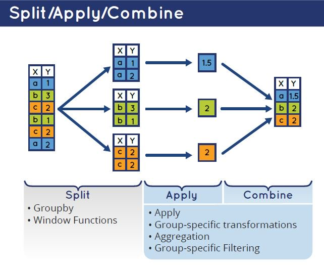

# data.table pt2 {-}
## Запись занятия {-}

Запись занятия 7 октября:

<iframe width="560" height="315" src="https://www.youtube.com/embed/sbDHNk2R8nA?si=92jh3dwAVNohxMTW" title="YouTube video player" frameborder="0" allow="accelerometer; autoplay; clipboard-write; encrypted-media; gyroscope; picture-in-picture; web-share" allowfullscreen></iframe>

## Разбор домашней работы {-}

### работа с колонками {-}

 - выделите в отдельный датасет всех погибших пассажиров, оставьте для них только значения пола, возраста и класса билета (`pclass`), переменную `pclass` переименуйте в `class`

```{r}
library(data.table)
titanic <- fread('https://gitlab.com/hse_mar/mar221s/-/raw/master/data/titanic3.csv')

titanic_not_survived <- titanic[survived == 0, list(sex, age, class = pclass)]
str(titanic_not_survived)
```


 - в полученном датасете посчитайте количество пассажиров, их средний и медианный возраст, разброс по возрасту (`sd()`)
```{r}
titanic_not_survived[, list(
  n_rows = .N,
  age_mn = mean(age, na.rm = TRUE),
  age_md = median(age, na.rm = TRUE),
  age_sd = sd(age, na.rm = TRUE))]
```

 - *в датасете titanic попробуйте построить логистическую регрессию, которая бы предсказывала вероятность выживания пассажира (`survived`). 

```{r}
lm_fit <- glm(survived ~ sex + age + pclass + fare, data = titanic, family = 'binomial')
summary(lm_fit)
```

### для тех, кто любит посложнее {-}

Создайте датасет:

 - несколько пользователей
 - по 5 сессий на каждого пользователя. 
 - поле логина, тип -- дата и время (таймстамп), все логины в интервале 1-9 сентября. В юникс-формате или просто дата и время, на ваше усмотрение.
 - для каждой сессии создайте случайную длину сессии (достаточно просто вектор длиной со всю таблицу, без учета пользователей) в секундах. Длина сессии должна варьировать в пределах 120 - 600 секунд
 - посчитайте количество пользователей, среднее количество сессий на пользователя, среднюю длину сессий. Без учета вариативности внутри пользователя, overall по всему датасету.
 
Подсказки:

- датасет лучше создавать в несколько шагов
- есть полезная функция `expand.grid()`
- для генерации времени поможет функция `as.POSIXct()`, плюс есть немного справочных материалов в учебнике: [раз](https://textbook.rintro.ru/objects.html#objects-time), [два](https://textbook.rintro.ru/manipulations.html#manipulations-time)


```{r}
my_dt <- expand.grid(
  paste0('user_', 1:3),
  1:5
)
my_dt <- as.data.table(my_dt)
setnames(my_dt, c('uid', 'sid'))
setkey(my_dt, 'uid')

time_seq <- seq(as.POSIXct("2023-09-01 00:00:00"), as.POSIXct("2023-09-09 23:59:59"), by = "s")

my_dt[, login_ts := sort(sample(time_seq, .N))]
my_dt[, session_length := sample(120:600, .N)]

head(my_dt)
```


## Применение функций {-}

### dataset  {-}

```{r}
library(data.table)

# импортируем по ссылке
sw <- fread('http://bit.ly/39aOUne')

# смотрим структуру объекта
str(sw)
```


## Применение функций {-}

### Количество строк и значений: .N, uniqueN {-}

В data.table есть пара полезных функций, которые позволяет быстро и лаконично считать количество значений и количество уникальных значений.

Считаем количество строк в табличке - для этого используется функция `.N` (в data.table есть еще несколько функций, которые начинаются с `.`, но мы их почти не будем касаться).
```{r}
sw[, .N]
```

Функция `uniqueN()` считает количество уникальных значений. Аналогична сочетанию двух функций `length()` + `unique()`, просто короче и быстрее.
```{r}
sw[, uniqueN(planet_name)]
```

### Ветвления: ifelse / fifelse {-}

В R есть два вида ветвлений с использованием if. Первое - стандартная для многих языков конструкция `if {} else{}`, она используется при создании функций и т.д. Для работы с таблицами полезнее функция `ifelse()` или ее быстрый аналог в data.table - `fifelse` (`f` от fast).

В первом аргументе функции мы указываем проверку, в результате которой можно будет сказать TRUE или FALSE. Вторым аргументом - что должно быть возвращено, если результат проверки будет TRUE (логическое утверждение из первого аргумента истинно). Третий аргумент - что должно быть возвращено, если утверждение из первого аргумента ложно. Например, мы проверяем, истинно ли, что 5 тождественно 3. Так как 5 не равно трем, результатом сравнения 5 == 3 будет FALSE (утверждение ложно), соответственно, результатом `ifelse()` будет `'значение если неверно'`.
```{r}
5 == 3
ifelse(5 == 3, 'значение если верно', 'значение если неверно')
```

Ключевое отличие `ifelse()` от классического `if {} else{}` в том, что эта функция векторизована. То есть, если в первом аргументе сравнивать вектор с каким-то значением, то проверка будет применяться к каждому элементу вектора. Соответственно, и результатов `ifelse` будет столько же, сколько элементов в векторе. 
```{r}
my_vec <- c(5, 3, 9)
ifelse(my_vec == 3, 'значение если верно', 'значение если неверно')
```

Все это позволяет использовать ifelse/fifelse для операций над колонками - например, в примере мы проверяем с помощью функции `grepl`, встречается ли в значениях ячеек в колонке `skin_color` слово `grey`. И если встречается - то в новую колонку будет проставлено значение `grey`, а если не всречается - `no grey`.
```{r}
sw[, new := fifelse(grepl('grey', skin_color), 'grey', 'no grey')]
sw[1:10, list(name, skin_color, new)]
```


## Агрегации {-}
В синтаксисе `data.table` есть конструкция `by`, которая отвечает за примененим операций над колонками отдельно для каждой группы (общая структура выглядит следующим образом: `dataset[выбор строк, операции над колонками, группировка]`).

Общая логика группировки стандартная - `split - apply - combine`. То есть, датасет разделяется на блоки по значениям группирующей переменной, к колонкам каждого сабсета применяется какое-то выражение, и результат обратно собирается в таблицу. Результатом группировки в `data.table` всегда будет таблица.



### Вычисления по одной колонке {-}
Можно использовать группировку при применении функции к таблице, но удобнее результат операции с колонкой оборачивать в `list()`, так как это дает возможность переименовать колонку. В примере ниже мы считаем количество уникальных значений в колонке `name` для каждой группы по значениям колонки `gender`:

```{r}
sw[, uniqueN(name), by = gender]
```

```{r}
sw[, list(n_chars = uniqueN(name)), by = gender]
```

### Вычисления по нескольким колонкам  {-}
Можно выполнять операции сразу с несколькими колонками:
```{r}
sw[, list(
  n_chars = uniqueN(name),
  mass_md = median(mass, na.rm = TRUE)
), by = gender]
```


### Группировка по нескольким полям  {-}
Часто возникает необходимость группировки сразу по нескольким полям - для этого колонки групп также указываются через список. В выражении ниже мы сначала фильтруем датасет и оставляем только строки, где в колонке `gender` есть значения `male` и `female`, после чего в группах по полу и цвету кожи считаем количество персонажей. Результат агрегации записываем в новый объект и выводим на печать только первые 5 строк (просто чтобы сократить вывод).
```{r}
sw_grps <- sw[gender %in% c('male', 'female'),
              list(n_chars = uniqueN(name)),
              by = list(gender, skin_color)]
sw_grps[1:5]
```


## Манипуляции с таблицами {-}
### rbind() {-}

Функция `rbind()`(от `row bind`) используется для объединение двух или более таблиц по строкам. То есть, в результате получается таблица с таким же количеством колонок, но с увеличенным числом строк - по количеству строк в объединяемых таблицах.

Нередко в объединяемых таблицах отсутствует какая-нибудь колонка или колонки перепутаны. В таких случаях необходимо использовать аргументы `use.names = TRUE` (проверка названий колонок при объединение) и `fill = TRUE` (создание колонки с `NA`-значениями). Обратите внимание, это работает только с `data.table`-объектами.
```{r 4-dt-pt1-18}
# создаем первую таблицу
dt1 <- data.table(tb = 'table_1',
                  col1 = sample(9, 3),
                  col3 = 'only in table1',
                  col2 = sample(letters, 3))

# создаем вторую таблицу
dt2 <- data.table(tb = 'table_2',
                  col4 = 'only in table2',
                  col1 = sample(9, 3),
                  col2 = sample(letters, 3))

# объединяем по строкам
rbind(dt1, dt2, fill = TRUE)
```


### cbind() {-}

Функция `cbind()` (от `columns bind`) используется для объединения нескольких векторов или таблиц равной длины. В результате получается объединённая таблица такой же длины, как каждый из объединяемых векторов. При объединении таблиц --- с таким же количеством строк, как в каждой из объединяемых таблиц, и с суммарным количеством колонок.

При использовании `cbind()` в работе с таблицами необходимо помнить, что это буквально "склейка" таблиц независимо от порядка наблюдений по строкам. В противном случае можно получить наблюдение, где часть колонок описывает характеристики этого наблюдения, а другая часть --- каких-то других наблюдений.

Другой нюанс, который также необходимо учитывать: при объединении таблиц названия колонок останутся прежними. Так что если в нескольких таблицах встречается, например, колонка `col1`, то в финальном датасете будет несколько колонок с таким названием --- по количеству объединяемых таблиц, в которых она была. В свою очередь, это усложняет задачи выбора колонки по названию и мешает понять, в какой колонке какое содержание.

```{r 07-data-manipulations-45 }
# выведем ранее созданные таблицы
print(dt1)
print(dt2)

# создадим колонки-номера строк
dt1[, indx := 1:.N]
dt2[, indx := 1:.N]

# теперь отсортируем вторую таблицу по убыванию
dt2 <- dt2[order(-indx)]

# таблица получилась, но в строках бардак
cbind(dt1, dt2)
```

В целом, `cbind()` --- весьма редко используемый способ объединения таблиц. Его стоит использовать только тогда, когда есть однозначная уверенность в структуре данных (одинаковое количество строк, разные названия колонок, идентичная сортировка и т. д.), в противном случае это место, в котором очень легко ошибиться, при этом эту ошибку будет очень сложно найти.


## Домашнее задание {-}

### level 1 (IATYTD) {-}

Импортируйте данные по Star Wars, файл по ссылке: http://bit.ly/39aOUne. Посмотрите структуру объекта. Посчитайте, сколько в таблице строк. 
```{r, echo = FALSE}
library(data.table)
sw <- fread('http://bit.ly/39aOUne')
# str(sw)
```


### level 2 (HNTR) {-}

 - создайте копию колонки `mass` с названием `mass_corrected` 
 
 - замените все NA в колонке `mass_corrected` средним значением по группе, группы выделяются по полу и планете (вам потребуется создать промежуточную колонку)


### level 3 (HMP) {-}
 
 - изучите справку по функции `ifelse()` (или `fifelse()` в data.table)

 - создайте копию колонки `gender`, назовите ее `gender_2`. Замените в ней все `n/a` и `hermaphrodite` на `other`. Посчитайте количество персонажей в зависимости от пола (`gender_2`):

```{r, echo = FALSE}
sw[, gender_2 := gender]
sw[gender_2 %in% c('n/a', 'hermaphrodite'), gender_2 := 'other']
sw[, .N, by = gender_2]
```

 - выполните предыдущее задание без создания промежуточной колонки `gender_2` 
 

### level 4 (UV) {-}

 - сделайте сводную таблицу `planet_chars` по персонажам каждой планеты, где в колонках будет количество персонажей, их средний рост и вес (оригинальный и скорректированный).
 
 - округлите значения до 1 знака после запятой

Первые 5 строк результата:
```{r, echo = FALSE}
sw[, mass_corrected := mass]
sw[, mass_mean := mean(mass, na.rm = TRUE), by = list(planet_name, gender)]
sw[is.na(mass), mass_corrected := mass_mean]
planet_chars <- sw[, list(
        n_chars = .N,
        height_mn = round(mean(height), 1),
        mass_mn = round(mean(mass, na.rm = TRUE), 1),
        mass_corrected_mn = round(mean(mass_corrected, na.rm = TRUE), 1)
), by = planet_name]
planet_chars[1:5]
```


### level 5 (N) {-}

Создайте датасет:

 - несколько пользователей (например, 100), должен быть отдельный параметр `user_type` с значениями short, medium, long
 - от 1 до 10 сессий на каждого пользователя, случайным образом. 
 - создайте поле логина, тип -- дата и время (таймстамп), все логины в интервале 1-9 сентября. В юникс-формате или просто дата и время, на ваше усмотрение.
 - создайте колонку session_num, которая будет маркировать номер сессии пользователя
 - для каждой сессии создайте случайную длину сессии в секундах. Длина сессии должна варьировать в пределах 120 - 600 секунд. Длина сессии зависит от параметра `user_type`: 
    - short: множитель к длине сессии из интервала (0, 1] (например, 0.27)
    - medium: множитель к длине сессии из интервала (1, 3] (например, 2.51)
    - long: множитель к длине сессии из интервала (5, 7] (например, 6.1)
  

Посчитайте в датасете:

  - количество пользователей
  - среднее количество сессий на пользователя
  - средний 
  - среднюю длину сессий
  - средний интервал между концом одной сессии и началом другой сессии (обратите внимание на функцию `shift`)

Расчеты в группах по `user_type` и `total` (без группировки). В итоговой таблице должно быть 4 строки и 5 колонок.


```{r, echo=FALSE, include=FALSE}
library(data.table)

my_dt <- data.table(
  user_id = paste('uid', seq_len(180), sep = '_'),
  user_type = sample(c('short', 'medium', 'long'), 180, replace = TRUE)
)

my_dt[, n_sessions := sample(10, 1), by = user_id]
my_dt_sessions <- my_dt[, list(
  login_ts = sample(
    seq(as.POSIXct("2023-09-01 00:00:00"), as.POSIXct("2023-09-09 23:59:59"), by = "s"), 
    n_sessions)
  ), by = list(user_id, user_type)]

my_dt_sessions <- my_dt_sessions[order(user_id, login_ts)]
my_dt_sessions[, session_num := seq_len(.N), by = user_id]
my_dt_sessions[, session_coeff := fcase(
  user_type == 'short', (1 + runif(1, 0.00001, 1)),
  user_type == 'medium', (1 + runif(1, 1.00001, 3)),
  user_type == 'long', (1 + runif(1, 5.00001, 7))
), by = user_id]

my_dt_sessions[, session_length := sample(120:600, .N, replace = TRUE) * session_coeff]
my_dt_sessions[, logout_ts := login_ts + session_length]
my_dt_sessions[, since_last_login := login_ts - shift(logout_ts), by = user_id]

rbind(
  my_dt_sessions[, list(
    n_users = uniqueN(user_id),
    n_session_mn = round(.N / uniqueN(user_id), 2),
    session_length_mn = round(mean(session_length)),
    since_last_login_mn = round(mean(since_last_login, na.rm = TRUE))
    ),
    by = user_type],
  my_dt_sessions[, list(
    user_type = 'total',
    n_users = uniqueN(user_id),
    n_session_mn = round(.N / uniqueN(user_id), 2),
    session_length_mn = round(mean(session_length)),
    since_last_login_mn = round(mean(since_last_login, na.rm = TRUE))
    )]  
)

```


