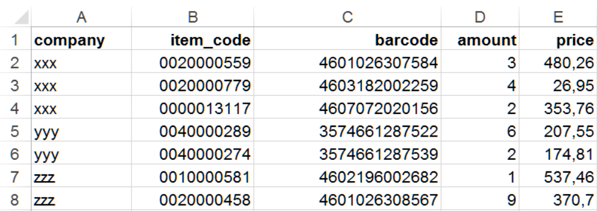
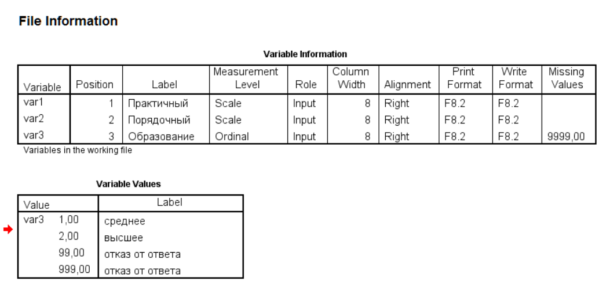

# dt + ETL{-}


## Запись занятия {-}

Запись занятия 21 октября:

<iframe width="560" height="315" src="https://www.youtube.com/embed/eaAC8ztVQ20?si=fjaeJDZl9uB_UxPg" title="YouTube video player" frameborder="0" allow="accelerometer; autoplay; clipboard-write; encrypted-media; gyroscope; picture-in-picture; web-share" allowfullscreen></iframe>
<br>

## Разбор домашней работы {-}

### level 3 (HMP) {-}

 - создайте копию колонки `gender`, назовите ее `gender_2`. Замените в ней все `n/a` и `hermaphrodite` на `other`. Посчитайте количество персонажей в зависимости от пола (`gender_2`):

```{r, message=FALSE, warning=FALSE}
library(data.table)
sw <- fread('http://bit.ly/39aOUne')

sw[, gender_2 := gender]
sw[gender_2 %in% c('n/a', 'hermaphrodite'), gender_2 := 'other']
```

 - выполните предыдущее задание без создания промежуточной колонки `gender_2` 
```{r}
# два альтернативных варианта
# sw[gender %in% c('n/a', 'hermaphrodite'), gender := 'other']
sw[, gender := fifelse(gender %in% c('n/a', 'hermaphrodite'), 'other', gender)]
```
 

### level 4 (UV) {-}

 - сделайте сводную таблицу `planet_chars` по персонажам каждой планеты, где в колонках будет количество персонажей, их средний рост и вес (оригинальный и скорректированный).
 
 - округлите значения до 1 знака после запятой

Первые 5 строк результата:
```{r}
sw[, mass_corrected := mass]
sw[, mass_mean := mean(mass, na.rm = TRUE), by = list(planet_name, gender)]
sw[is.na(mass), mass_corrected := mass_mean]
planet_chars <- sw[, list(
        n_chars = uniqueN(name), # или n_chars = .N
        height_mn = round(mean(height), 1),
        mass_mn = round(mean(mass, na.rm = TRUE), 1),
        mass_corrected_mn = round(mean(mass_corrected, na.rm = TRUE), 1)
), by = planet_name]
planet_chars[1:5]
```


## ETL

### Чтение и запись текстовых файлов {-}
В работе аналитики чаще всего сталкиваются с данными, которые хранятся в простом текстовом формате (txt, разделители строк `\n`, `\r` или `\n\r` ) и основанном на них табличных форматах csv (с разделителями `,` или `;`) или tsv (`\t`). 

<br>

#### Построчное чтение {-}
При работе с текстами проще всего читать файлы построчно - весь текст импортируется как вектор строковых значений, а элементы этого вектора - блоки текста, ограниченные переносами строк. Это удобно при импорте текстов, в которых есть смысловые блоки, как в художественных и поэтических текстах. Точно также построчное чтение может быть использовано для импорта файлов с ошибками или даже, в особо экзотических случаях, для чтения скриптов. 

Для построчного чтения обычно используется функция `readLines()` базового пакета или аналогичные ей. С помощью аргументов функции можно указать, сколько необходимо прочитать строк, задать кодировку и что делать, если в файле меньше строк, чем было задано.

Прочитаем первые несколько строк текста песни:

```{r 08-io-17 }
txt_lines <- readLines('./data/oxxy_gorgorod.txt', n = 5)
txt_lines
```

<br>

#### Чтение текстовых файлов: read.table() и fread() {-}
Для чтения текстовых файлов, которые содержат в табличном формате, в базовом R есть функция `read.table()` и функции-обертки, которые обращаются к ней, но с другими значениями аргументов по умолчанию (`read.csv()`, `read.csv2`, `read.delim()`, `read.delim2()`). Табличный формат предполагает наличие строк и колонок в файле, выделенные разделителями строк и полей соответственно, при этом формат файла может быть как txt, так и csv.

Несмотря на всю видимую простоту, при импорте табличных форматов можно столкнуться с очень большим количеством нетривиальных проблем. В немалой части это можно назвать следствием их широкой распространенности - практически все современные текстовые процессоры умеют работать с csv-файлами, экспорт из баз данных также нередко делается в csv. Ко всему прочему, текстовые форматы хорошо сжимаются при архивации. 

К наиболее частым сложностям, которые возникают при импорте текстовых файлов можно отнести следующие:

- неожиданные разделители (например, экспорт из MS Excel в csv создает файл с разделителем `;`)
- лишние или пропущенные разделители строк или колонок (`\t\t` вместо `\t`), что создает разное количество колонок в таблице
- несоответствие файла расширению или вообще отсутствие расширения
- нестандартные кодировки, в том числе проблемы их импорта при работе в Windows
- наличие embedded nuls (`\0`) или метки порядка байтов (bite order marks, BOM)
- наличие символов `""""`, `////` и прочих технических символов
- мета-данные (запись о дате и источнике данных) в первых строках файла

Большинство этих нюансов решается при настройке параметров импорта с помощью аргументов функций импорта (т.е., настройки по умолчанию не справляются). В частности, в функциях чтения таблиц можно задать разделители полей и десятичные разделители (`sep` и `dec`), кодировку файла и отображения, обработку пустых строк и т.д. Некоторые проблемы, например, импорт данных с embedded nuls постепенно решаются в новых версиях функций и пакетов. Помимо этих аргументов также очень полезны аргументы, которые позволяют прямо указать, сколько строк импортировать (или пропустить от начала), какие типы данных в колонках и какие колонки стоит пропустить, а также - надо ли конвертировать в факторы строковые значения.

Из других не очень очевидных нюансов стоит отметить, что функция `read.table()` удобна, так как обладает большим набором аргументов, а также устойчива к некоторым ошибкам в данных. Однако импорт данных с ее помощью весьма нетороплив, что ощутимо сказывается при импорте больших таблиц. Поэтому лучше использовать аналогичные функции других пакетов, в частности, `data.table::fread()`, аргументы которой очень похожи на аргументы `read.table()`.

<br>

#### Запись данных в текстовые файлы: write.table() и fwrite() {-}
Запись данных в текстовые форматы также может вестись как построчно, так и сразу всей таблицей. Для записи построчно обычно используется функция `writeLines()`.

Запись таблиц происходит аналогичным образом, с помощью функции `write.table()` или ее аналогом в других пакетах (в частности, более быстрый вариант `data.table::fwrite()`). С помощью аргументов можно задать как типы разделителей (строк, полей и десятичные разделители), так и кодировку. Обычно рекомендуется выставлять аргумент `row.names = FALSE`, чтобы в файл не были записаны отдельной колонкой названия (номера) строк.

<br>

### Чтение файлов MS Excel {-}
В отличие от простых форматов типа .csv, файлы, созданные в MS Excel импортировать не так просто. Ситуация также осложняется тем, что форматы .xls и .xlsx сильно различаются по внутренней структуре. Часть пакетов, которые обеспечивают взаимодействие с Excel-файлами, требуют установки языка Java (java development kit) в систему и соответствующих R-пакетов (rJava, в частности) - самые часто используемые пакеты тут `XLconnect` и `xlsx`. Тем не менее, в большинстве случаев необходим только прочитать файл, и тут могут быть полезны пакеты пакеты `openxlsx` и `readxl`, не требующие установки jdk. Пакет `openxlsx` к тому же умеет еще и записывать файлы в .xlsx, как `XLconnect`, в том числе и с условным форматированием ячеек.

<br>

#### Чтение файлов {-}
Пакет `readxl`, по наблюдениям, чуть быстрее читает файлы, чем `openxlsx` или пакеты, требующие Java, поэтому рассмотрим здесь его. В целом, функционал пакетов достаточно схож и то, что может `readxl`, практически всегда можно реализовать и в других пакетах, и наоборот.

Основные функции пакета - `read_xls()` для чтения файлов MS Excel, созданных в версиях до MS Excel 2007,  `read_xlsx()` - для чтения файлов, созданных в более современных версиях, также есть обобщающая функция `read_excel()`, которая по расширению файла определяет, какую из этих функций надо использовать. Пакет `readxl` принадлежит к экосистеме `tideverse`, поэтому импортированные таблицы имеют класс `tibble` и `data.frame`. Соответственно, если работать в `data.table`, необходимо их отдельно преобразовать

Вот так выглядит исходный файл в MS Excel:


Импортируем файл:

```{r 08-io-27 }
library(readxl)
# читаем файл
path <- './data/xls_example.xlsx'
xlsx_data <- read_xlsx(path)

str(xlsx_data)
xlsx_data
```

При импорте можно указать тип колонок. Делается это с помощью аргумента `col_types`, в который необходимо передать вектор такой же длины, сколько колонок, состоящий из значений `logical`, `numeric`, `date`, `text` или `list`. К сожалению, в отличие от схожего аргумента `colClasses` в функциях импорта csv/xlsx-файлов (`read.table()`, `read.csv()`, `data.table::fread()`, `openxlsx::read.xlsx` и проч.), в `readxl` названия типов не соответствуют названиям атомарных типов данных в R.

Если для `col_types` указать `NULL` или `guess`, то тип будет выбран на основе анализа минимум 1000 строк (или всех строк, если датасет меньше 1000 строк). Также можно указать вектор типов длиной не по количеству колонок, а только из одного значения, то все колонки будут импортированы в этом типе. Значение `skip` указывает, что эту колонку не надо импортировать.

```{r 08-io-28 }
# читаем файл с указанием типа text для всех колонок
xlsx_data <- read_xlsx(path, col_types = 'text')
xlsx_data
```

<br>

#### Частичное чтение файла {-}
Большинство xlsx-файлов содержит несколько непустых листов. По умолчанию функции импорта читают только первый лист, остальные же игнорируются. Пакеты типа `XLConnect` могут читать весь файл в отдельный объект. Для чтения названий листов xlsx-файла можно воспользоваться функцией `readxl::excel_sheets()` и полученный вектор потом циклом или через `lapply()` передать в функцию импорта:

```{r 08-io-31 }
# читаем список листов файла
sheets <- readxl::excel_sheets(path)
sheets

# читаем все листы в список и смотрим структуру
file_str <- lapply(sheets, function(x) read_xlsx(path, sheet = x))
str(file_str)
```

В некоторых случаях требуется импортировать только определенный диапазон ячеек со всего листа - например, когда на созданном вручную листе есть и таблица с данными, и графики, и дополнительные материалы. Для чтения определенной ячейки или диапазона ячеек используют аргумент `range`, в котором в строковом виде указывают диапазон ячеек в Excel-координатах (буквы для колонок и цифры для строк). К сожалению, на данный момент нельзя указать сразу несколько диапазонов. Во-вторых, в прочитанном диапазоне, если не указать обратное, первая строка будет по умолчанию интерпретироваться как строка заголовка. В результате приходится либо прямо задавать названия колонок, либо указывать, что заголовка нет:

```{r 08-io-32 }
read_xlsx(path, range = 'A5:B6', col_names = c('company', 'item_code'))
```

<br>

### Чтение файлов SPSS {-}
Для импорта файлов SPSS (.sav) обычно используют функции какого-либо из двух пакетов - `foreign::read.spss()`, который идет в базовом наборе пакетов R, а так же `haven::read_spss()`, авторства Хэдли Викхэма.

Исходный файл имеет такую структуру (скриншот из SPSS Output):


Функции `read_sav()` и `read_spss()` пакета `haven` обладают схожим с `foreign::read.spss()` функционалом при меньшем количестве настроек. При этом эти функции несколько быстрее, а так же не имеют проблем с длинными строками. В результате импорта получается tibble-таблица (так как `haven` принадлежит экосистеме `tidyverse`).
```{r 8-etl-pt2-7 }
library(haven)
spss_data <- read_sav('./data/spss_example.sav')
spss_data
```

Функция не имеет настроек, как импортировать значения, для которых заданы метки, и в таблице представлены числовые значения. При необходимости получить значения метки переменных или значений необходимо идти в атрибуты колонок таблицы:
```{r 8-etl-pt2-8 }
str(spss_data)
```

Пакет `haven` импортирует данные в свой формат, однако полученный объект можно преобразовать в data.table:
```{r 8-etl-pt2-9}
library(data.table)
setDT(spss_data)
class(spss_data)
```

У нас есть колонка `var3`, для которой в SPSS были заданы метки. В полученном формате метки хранятся в атрибутах колонки --- это что-то вроде мета-информации. Посмотрим все атрибуты колонки с помощью функции `attributes()` (иногда это проще делать через синтаксис списков и оператор `$`):
```{r 8-etl-pt2-10}
# смотрим атрибуты вектора-колонки var3
attributes(spss_data[, var3])

# через синтаксис списков
attributes(spss_data$var3)
```

Мы видим четыре атрибута --- метку переменной (`$label`), SPSS-формат данных (`$format.spss`), обозначение, что переменная в SPSS имеет метки значений (`$class`) и собственно вектор меток, которые используются для значений этой колонки (`$labels`).

Для того, чтобы сохранить метки значений (а не сами значения), можно создать новую колонку и в нее записать с результат применения функции `as_factor` пакета `haven` --- эта функция извлекает и сопоставляет значения и их метки.

```{r 8-etl-pt2-11}
spss_data[, var4 := as_factor(var3)]
spss_data
```

Как мы видим, для значений 1, 99, 999 были проставлены метки, и они оказались в новой переменной, а не атрибутом. Для значения 4 метки не было, поэтому оно было записано именно значением.


## Дополнительная литература {-}

- [глава](https://textbook.rintro.ru/io.html) моего учебника по R, где разбираются процессы ввода/вывода данных. 

## Домашнее задание {-}

### level 1 (IATYTD) {-}

У вас есть [xlsx-файл](https://gitlab.com/hse_mar/mar221s/raw/master/data/pinguins.xlsx) по популяции и видам пингвинов. 

- Импортируйте данные из этого файла в R. При работе постарайтесь обойтись только средствами R, не открывая файл в Excel. 

- Проверьте, что вы импортировали все листы. При необходимости, импортируйте оставшиеся и соберите все в одну таблицу.

- Проверьте класс объекта и при необходимости преобразуйте в data.table.

- Посчитайте количество пингвинов каждого типа (колонка Species).

```{r, echo = FALSE}
library(readxl)

tmp <- tempfile()
download.file('https://gitlab.com/hse_mar/mar221s/raw/master/data/pinguins.xlsx', tmp)
sheets <- readxl::excel_sheets(tmp)

pings <- rbind(
 read_excel(tmp, sheet = sheets[1]),
 read_excel(tmp, sheet = sheets[2]),
 read_excel(tmp, sheet = sheets[3])
)

setDT(pings)
# str(pings)
pings[, .N, by = Species]
```

<br>

### level 2 (HNTR) {-}


```{r, eval = FALSE, echo = FALSE}
# download.file(url_artists, './data/artists.csv')
# download.file(url_artwork, './data/artwork.csv')
```


```{r, echo=FALSE}
artwork <- fread('https://raw.githubusercontent.com/rfordatascience/tidytuesday/master/data/2021/2021-01-12/artwork.csv')
artists <- fread("https://github.com/tategallery/collection/raw/master/artist_data.csv")

# artists <- fread('artists.csv')
```

- У вас есть данные Tate Gallery по художникам и их произведениям. Импортируйте датасеты по художникам, ссылки на файлы ниже. А лучше воспользуйтесь функцией `download.file()` (не забудьте прочитать справку по функции и ее аргументам) для того, чтобы сохранить эти файлы на диск и потом загружать их уже с диска, а не из интернета.
```{r}
url_artwork <- 'https://raw.githubusercontent.com/rfordatascience/tidytuesday/master/data/2021/2021-01-12/artwork.csv'
url_artists <- "https://github.com/tategallery/collection/raw/master/artist_data.csv"
```

- С помощью функции `setnames()` пакета data.table (или `names()` из базового пакета, если вам так удобнее) переименуйте в файле по художникам колонки `yearOfBirth` в `year_of_birth`, колонки `yearOFDeath`, `placeOfBirth` и `placeOfDeath` аналогично. 

- посчитайте, сколько художников из списка живы в настоящий момент. 

- посчитайте, сколько среди живущих в настоящий момент художников мужчин и сколько женщин.

```{r, echo=FALSE}
artists[is.na(yearOfDeath), .N]
artists[is.na(yearOfDeath), .N, by = gender]
```

<br>

### level 3 (HMP) {-}

 - подумайте и покажите решение, как можно узнать структуру файла `artwork`, однако полностью импортировать вы его не можете (предположим, что он настолько большой, что повесит систему намертво). 
 
```{r, echo = FALSE}
# artwork <- fread('./data/artwork.csv')
# artists <- fread(url_artists)
```

 - импортируйте только те колонки, которые позволят вам идентифицировать художника, название работы и ее формат (колонка `medium`).

```{r, echo = FALSE}
artwork <- fread('https://gitlab.com/hse_mar/mar221s/raw/master/data/artwork.csv', select = c('artist', 'artistId', 'artistRole', 'medium'))
```

 - посчитайте, сколько в галерее работ от художников-мужчин и сколько от женщин. Отдельной колонкой выведите статистики по живущим на данный момент художникам.

```{r, echo = FALSE}
artwork <- merge(artwork, 
                 artists[, list(artistId = id, gender, year_of_death = yearOfDeath)],
                 by = 'artistId', all.x = TRUE)
artwork[, list(n_works = uniqueN(artist), 
               n_works_alive = uniqueN(artist[is.na(year_of_death)])), 
        by = gender]
```

 - посчитайте, сколько работ разных форматов сделали художницы, умершие до 1800 года (каждый формат -- отдельная колонка, форматы даны в колонке `medium`). Вам потребуется функция `dcast()`. 
 
```{r, echo = FALSE}
dcast(artwork[gender == 'Female' & year_of_death < 1800], artist ~ medium, fun.aggregate = length)
```

<br>

### level 4 (UV) {-}

Импортируйте файл [txt_example.txt](https://gitlab.com/hse_mar/mar221s/raw/master/data/txt_example.txt). Перед импортом можете скачать файл и импортировать его локально (это рекомендация, не более).

```{r, echo=FALSE}
path <- 'https://gitlab.com/hse_mar/mar221s/raw/master/data/txt_example.txt'
txt_data <- read.table(path, header = TRUE, fileEncoding = 'UTF-16', sep = '\t', dec = ',')
txt_data
```

<br>

### level 5 (N) {-}

Импортируйте файл [extr'version.xls](https://gitlab.com/hse_mar/mar211s/raw/main/data/extr_version.xls). Решение должно уметь импортировать не только этот конкретный файл, но и другие файлы с такими особенностями. Перед импортом надо скачать файл и импортировать его локально (read_excel не умеет импортировать по ссылке).

```{r, echo=FALSE}
library(readxl)
tmp <- tempfile()
download.file("https://gitlab.com/hse_mar/mar221s/raw/master/data/extr_version.xls", tmp)
x <- read_excel(tmp, sheet = 1L)
setDT(x)

tmp <- tempfile()
fwrite(x, tmp, sep = "\t", dec = ",", eol = "\r", quote = FALSE)
x <- readLines(tmp, encoding = 'UTF-8')
x <- paste(x, collapse = "\n")
x <- gsub("\t+\n", "\n", x)
x <- fread(input = x, sep = "\t", dec = ",", encoding = 'UTF-8')
```

```{r}
print(x)
```

