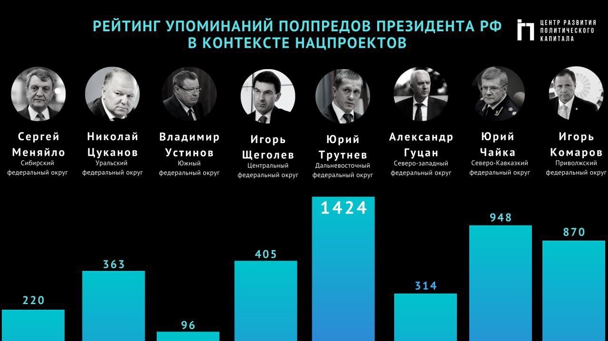

# Dataviz {.unnumbered}

## Запись занятия {.unnumbered}

<iframe width="560" height="315" src="https://www.youtube.com/embed/mVRjviG58Qk?si=gHlgPChHW4gYhosM&amp;start=4474" title="YouTube video player" frameborder="0" allow="accelerometer; autoplay; clipboard-write; encrypted-media; gyroscope; picture-in-picture; web-share" allowfullscreen></iframe>

<br>

```{r, echo=FALSE, message=FALSE, warning=FALSE}
# knitr::opts_chunk$set(cache = FALSE)

library(data.table)
library(plotly)
library(leaflet)
library(palmerpenguins)
library(sf)
# devtools::install_github("RamiKrispin/coronavirus")
# install.packages('coronavirus')
# library(coronavirus)

# covid <- fread('https://covid.ourworldindata.org/data/owid-covid-data.csv')
# fwrite(covid, './data/covid.csv', row.names = FALSE)
# # covid <- fread('./data/covid.csv')
# covid_rus <- covid[location == 'Russia']

# countries_region <- fread('https://raw.githubusercontent.com/owid/owid-datasets/master/datasets/OWID%20country%20to%20WHO%20regions/OWID%20country%20to%20WHO%20regions.csv')
# fwrite(countries_region, './data/countries_region.csv', row.names = FALSE)
# countries_region <- fread('./data/countries_region.csv')
# countries_region <- unique(countries_region)
# setnames(countries_region, c('location', 'year', 'region'))
# hdi <- fread('https://raw.githubusercontent.com/owid/covid-19-data/master/scripts/input/un/human_development_index.csv')
# hdi <- merge(hdi, countries_region, by = 'location', all.x = TRUE)
# covid <- merge(covid, countries_region, by = 'location', all.x = TRUE)
# covid_last <- covid[!is.na(total_cases) & continent != '', .SD[date == Sys.Date() - 2], by = location]

# data("coronavirus")
# coronavirus_dt <- as.data.table(coronavirus)
# coronavirus_dt <- fread('https://github.com/RamiKrispin/coronavirus/raw/master/csv/coronavirus.csv')
# fwrite(coronavirus_dt, './data/coronavirus_dt.csv', row.names = FALSE)
coronavirus_dt <- fread('./data/coronavirus_dt.csv')


diamonds_sample <- as.data.table(diamonds)
diamonds_sample <- diamonds_sample[sample(.N, 1000)]
diamonds_sample <- diamonds_sample[carat <= 3]
```

<br>

## Intro {.unnumbered}

Цели визуализации и, в общем виде, визуального формата хранения материалов:

**Record information - photographs, seismographs etc**- Часть информации сложно представима в числовом виде - например, медицинские снимки, фотографии, записи датчиков и т.д.

**Analyze data to support reasoning** - Представление данных в визуальном виде (графики и т.д.) может быть использовано как минимум в двух напарвлениях:

-   Develop and assess hypotheses (visual exploration) - анализ и интепретация процессов. Например, интерпретация ЭЭГ/ЭКГ, или же резкие изменения в тренде. Впрочем, наивный анализ трендов так же вполне может быть основан на анализе графиков. Также подкрепление выводов, дополнительная аргументация.

-   Find patterns and discover errors in data - нередко визуальный анализ позволяет сделать вывод о каких-то паттернах в данных, которые достаточно сложно найти, оперируя только таблицами данных. Например, лакуны в данных или паттерны пропусков в опросах.

**Communicate information to others (visual explanation)** - презентация в понятном графическом виде результатов исследования или описания какого-то феномена через художественно представленные данные (инфографика, дата-сторителлинг)

[*(с) cs171 Visualization*](https://www.cs171.org/2019/index.html)

<br>

## Инфографика {.unnumbered}

В общем виде инфографика - это это графический способ подачи информации, данных и знаний, целью которого является быстро и чётко преподносить сложную информацию ([wiki](https://ru.wikipedia.org/wiki/%D0%98%D0%BD%D1%84%D0%BE%D0%B3%D1%80%D0%B0%D1%84%D0%B8%D0%BA%D0%B0))

Один из подходов, в котором обычно работают исследователи, аналитики, BI, продакт-менеджеры и т.д. предполагает донесение до целевой аудитории необходимой информации максимально точно. Это минималистичный подход, в котором ценны чистота, прозрачность, семантическая насыщенность всех элементов визуализации. Обычно аналитики используют спец.пакеты и языки программирования для создания графических презентаций своих данных. Далее я буду говорить про визуализацию именно в этом ключе.

Второй подход - донесение до целевой аудитории информации через сюжет, через создание привлекательных образов, иллюстративность и выразительность дизайна. Обычно в таком ключе работают дата-журналисты и дизайнеры рекламных и маркетинговых материалов.

Пример такого поясняющего подхода - место простого графика двух значений, в иллюстрации создается контекст (практика использования стиральной машинки), синий цвет для "actually washing" хорошо обыгрывает идею воды в стиральной машине и доли времени. При этом, на графике нет чисел - визуального соотношения площади желтого и синего цветов достаточно, чтобы донести основную мысль.


<br>

## Типы графиков {.unnumbered}

```{r, echo=FALSE, message=FALSE, warning=FALSE}
library(data.table)
library(plotly)
library(lubridate)
payments <- fread('./data/payments_custom.csv')
payments[, week := floor_date(pay_dt, unit = 'week', week_start = 1)]
```

### scatter plot {.unnumbered}

Самый простой график - scatter plot, он же точечный график или, в некоторых случаях, диаграмма рассеяния. По оси OX обычно интервальные данные (степень выраженности признака), в редких случаях категории или линия времени. По OY, как правило, интервальные данные.

График полезен, когда надо хотя бы бегло оценить взаимосвязь признаков (возможные группировки и скопления).

Например, график связи замера бриллианта и его цены, с группировкой по качеству огранки. Даже не таком простом графике видно, что чем больше камень, тем он дороже, но и среди дорогих камней встречаются камни с неидеальной огранкой.

```{r, echo=FALSE}
plot_ly(diamonds_sample, x = ~carat, y = ~price, color = ~cut, type = 'scatter', mode = 'markers') %>%
  config(displayModeBar = FALSE)
```

Второй простой пример -- график рассеяния, визуализация связи веса пингвинов и длины плавника, цветом выделены разные виды.

```{r, echo=FALSE, message=FALSE, warning=FALSE, fig.width=10}
plot_ly(
  penguins, x = ~flipper_length_mm, y = ~body_mass_g, color = ~species, 
  type = 'scatter', mode = 'markers') %>%
  config(displayModeBar = FALSE)
```

<br>

### line chart {.unnumbered}

Линейный график - по сути, расширение точечного графика (объединение точек линиями). Обычно такие графики используют для визуализации трендов, динамики цен и прочей хронологической информации. Они более удобны, чем просто точечные графики, так как лучше позволяют видеть резкие скачки значений и т.д.

```{r, echo=FALSE, message=FALSE, warning=FALSE, fig.width=10}
payments[, list(gross = sum(gross)), keyby = pay_dt] %>%
  plot_ly(x = ~pay_dt, y = ~gross, type = 'scatter', mode = 'lines') %>%
  layout(title = 'Платежи по дням', 
         yaxis = list(rangemode = 'tozero')) %>%
  config(displayModeBar = FALSE)
```

<br>

### bar chart {.unnumbered}

Второй по популярности график - bar chart, он же столбиковая диаграмма. По оси OX обычно указывают категорию, в некоторых случаях - упорядоченные категории (этапы, года и т.д.). По оси OY, как правило, указано количество или доля.

Гистограмма близкий вид графиков, с единственным отличием - в гистограмме по оси OX указываются группы интервальных значений, а не каждое значение. Притом размер группы выбирается произвольно. Гистограммы обычно используются для отображения формы распределения признака.

```{r, message=FALSE, warning=FALSE, echo=FALSE, fig.width=10}
payments[, list(gross = sum(gross)), keyby = week] %>%
  plot_ly(x = ~week, y = ~gross, type = 'bar') %>%
  layout(title = 'Платежи по неделям', 
         yaxis = list(rangemode = 'tozero')) %>%
  config(displayModeBar = FALSE)
```

Вариация с категориями по оси OX:

```{r, message=FALSE, warning=FALSE, echo=FALSE, fig.width=10}
payments[, list(gross = sum(gross)), keyby = offer_type] %>%
  plot_ly(x = ~offer_type, y = ~gross, type = 'bar') %>%
  layout(title = 'Платежи по типам', 
         yaxis = list(rangemode = 'tozero')) %>%
  config(displayModeBar = FALSE)
```

<br>

### grouped bar chart {.unnumbered}

Вариация барчарта, в которой используется группирующая переменная --- таким образом, можно сравнивать группы в рамках одной категории. Естественно, деление по группам и категориям зависит от решения аналитика и целей визуализации.

```{r}
 payments[, list(gross = sum(gross)), keyby = list(week, offer_type)]%>%
  plot_ly(x = ~offer_type, y = ~gross, color = ~as.character(week), type = 'bar') %>%
  # plot_ly(x = ~week, y = ~gross, color = ~offer_type, type = 'bar') %>%
  layout(
    barmode = 'group',
    title = 'Динамика платежей по типам', 
    yaxis = list(rangemode = 'tozero')) %>%
  config(displayModeBar = FALSE)
```

<br>

### stacked bar chart {.unnumbered}

Вторая вариация барчарта с группировкой, только бары группы в одной категории указываются "стопкой", одним баром с цветовым делением групп. Обычно таким образом визуализируют структуру - например, структуру прибыли по разным источникам. На русском языке иногда называют "накопительной столбиковой диаграммой" / "столбиковой диаграммой с накоплением".

```{r, echo=FALSE, message=FALSE, warning=FALSE, fig.width=10}
payments[, list(gross = sum(gross)), keyby = list(week, offer_type)] %>%
  plot_ly(x = ~week, y = ~gross, type = 'bar', color = ~offer_type) %>%
  layout(
    barmode='stack',
    title = 'Структура недельных платежей', 
    yaxis = list(rangemode = 'tozero')) %>%
  config(displayModeBar = FALSE)
```

<br>

### area plot {.unnumbered}

Это вид графика является совмещением линейного графика (таймлайна) и барчарта с группами "стопкой". С помощью такого графика можно отслеживать изменения в структуре наблюдаемого процесса, например, в структуре прибыли или аудитории.

```{r, echo=FALSE, message=FALSE, warning=FALSE, fig.width=10}
payments[, list(gross = sum(gross)), keyby = list(pay_dt, offer_type)] %>%
  plot_ly(x = ~pay_dt, y = ~gross, type = 'scatter', color = ~offer_type,
          mode = 'none', stackgroup = 'one') %>%
  layout(
    title = 'Структура платежей по дням, абсолютные значения', 
    yaxis = list(rangemode = 'tozero')) %>%
  config(displayModeBar = FALSE)
```

<br>

### area plot (percentiles) {.unnumbered}

Area-плот можно делать не только по абсолютным значениям, но и по долям от общей суммы. Например, изменение доли заболевших с разбивкой по странам.

```{r, echo=FALSE, message=FALSE, warning=FALSE, fig.width=10}
payments[, list(gross = sum(gross)), keyby = list(pay_dt, offer_type)] %>%
  .[, share := gross / sum(gross), keyby = pay_dt] %>%
  plot_ly(x = ~pay_dt, y = ~share, type = 'scatter', color = ~offer_type,
          mode = 'none', stackgroup = 'one') %>%
  layout(
    title = 'Структура платежей по дням, доли', 
    yaxis = list(rangemode = 'tozero')) %>%
  config(displayModeBar = FALSE)
```

<br>

### boxplot {.unnumbered}

Визуализация распределения параметра, квартили, медиана и усы - полуторный межквартильный размах.

Боксплоты на данных diamonds:

```{r, echo=FALSE, message=FALSE, warning=FALSE, fig.width=10}
plot_ly(diamonds_sample, x = ~cut, y = ~price, color = ~cut ,type = 'box') %>%
  config(displayModeBar = FALSE)
```

<!-- Распределение платежей по платформам: -->

<!-- ```{r, echo=FALSE, message=FALSE, warning=FALSE, fig.width=10} -->

<!-- payments[, list(user_pseudo_id, mobile_model_name, device_category, platform, gross)] %>% -->

<!--   .[, list(gross = sum(gross)), by = list(user_pseudo_id, platform)] %>% -->

<!--   plot_ly(x = ~platform, y = ~gross, type = 'box') %>% -->

<!--   layout( -->

<!--     title = 'Распределение платежей пользователей' -->

<!--     # yaxis = list(range = c(0, 110)) -->

<!--   ) %>% -->

<!--   config(displayModeBar = FALSE) -->

<!-- ``` -->

<br>

### violin plot {.unnumbered}

Расширение боксплотов, кривыми отражается еще распределение признака, а не только квартили.

```{r, echo=FALSE, include=TRUE, fig.width=10}
plot_ly(diamonds_sample, x = ~cut, y = ~price, color = ~cut ,type = 'violin', box = list(visible = TRUE)) %>%
  config(displayModeBar = FALSE)
```

<!-- ```{r, echo=FALSE, include=TRUE, fig.width=10} -->

<!-- payments[, list(user_pseudo_id, mobile_model_name, device_category, platform, gross)] %>% -->

<!--   .[, list(gross = sum(gross)), by = list(user_pseudo_id, platform)] %>% -->

<!--   plot_ly(x = ~platform, y = ~gross,  -->

<!--           type = 'violin', -->

<!--           box = list(visible = TRUE)) %>% -->

<!--   layout( -->

<!--     title = 'Распределение платежей пользователей' -->

<!--     # yaxis = list(range = c(0, 110)) -->

<!--   ) %>% -->

<!--   config(displayModeBar = FALSE) -->

<!-- ``` -->

<br>

### heatmap {.unnumbered}

Тепловая карта, обычно используется в ситуациях, когда надо как-то отразить три измерения - например, количество пользователей, которые заходят на сайт в зависимости от дня недели и времени суток. Аналогично можно построить контурную карту, например, карту, куда и сколько времени смотрят пользователи при работе с сайтом (по данным айтрекера)

На графике - топографическая информация о вулканах в районе Окленда. Стоит отметить, что для топологических данных контурные карты даже более подходящий тип графиков, чем тепловая карта.

```{r, echo=FALSE, include=TRUE}
plot_ly(z = volcano, type = "heatmap") %>%
  config(displayModeBar = FALSE)
```

<br>

<!-- ### geo plots: choropleth {.unnumbered} -->

<!-- Нередко используют визуализацию с подложкой в виде какой-либо контурной карты (карты мира, страны или региона). Простой хороплет (фоновая диаграмма) один из таких часто используемых форматов --- на нем насыщенность цвета указывает степень выраженности признака. Здесь цветом показано население той или иной страны мира, к тому же используется нелинейная цветовая шкала. -->

<!-- ```{r, eval=FALSE, include=FALSE} -->
<!-- # Download the shapefile. (note that I store it in a folder called DATA. You have to change that if needed.) -->
<!-- download.file("http://thematicmapping.org/downloads/TM_WORLD_BORDERS_SIMPL-0.3.zip" , destfile="data/world_shape_file.zip") -->
<!-- # You now have it in your current working directory, have a look! -->

<!-- # Unzip this file. You can do it with R (as below), or clicking on the object you downloaded. -->
<!-- system("unzip data/world_shape_file.zip") -->
<!-- #  -- > You now have 4 files. One of these files is a .shp file! (TM_WORLD_BORDERS_SIMPL-0.3.shp) -->

<!-- unlink('data/world_shape_file.zip') -->
<!-- ``` -->

<!-- ```{r, echo=FALSE, warning=FALSE, message=FALSE} -->
<!-- # world_spdf <- readOGR(  -->
<!-- #   dsn= "data" ,  -->
<!-- #   layer="TM_WORLD_BORDERS_SIMPL-0.3", -->
<!-- #   verbose=FALSE -->
<!-- # ) -->
<!-- world_spdf <- st_read("TM_WORLD_BORDERS_SIMPL-0.3.shp") -->
<!-- # Clean the data object -->
<!-- library(dplyr) -->
<!-- world_spdf@data$POP2005[ which(world_spdf@data$POP2005 == 0)] = NA -->
<!-- world_spdf@data$POP2005 <- as.numeric(as.character(world_spdf@data$POP2005)) / 1000000 %>% round(2) -->
<!-- ``` -->

<!-- ```{r, echo=FALSE, message=FALSE, warning=FALSE, fig.width=10, cache=FALSE} -->
<!-- # Create a color palette with handmade bins. -->
<!-- library(RColorBrewer) -->
<!-- mybins <- c(0, 10, 20, 50, 100, 500, Inf) -->
<!-- mypalette <- colorBin( palette="YlOrBr", domain=world_spdf@data$POP2005, na.color="transparent", bins=mybins) -->

<!-- # Prepare the text for tooltips: -->
<!-- mytext <- paste( -->
<!--     "Country: ", world_spdf@data$NAME,"<br/>",  -->
<!--     "Area: ", world_spdf@data$AREA, "<br/>",  -->
<!--     "Population: ", round(world_spdf@data$POP2005, 2),  -->
<!--     sep="") %>% -->
<!--   lapply(htmltools::HTML) -->

<!-- # Final Map -->
<!-- leaflet(world_spdf) %>%  -->
<!--   addTiles()  %>%  -->
<!--   setView( lat=10, lng=0 , zoom=2) %>% -->
<!--   addPolygons(  -->
<!--     fillColor = ~mypalette(POP2005),  -->
<!--     stroke=TRUE,  -->
<!--     fillOpacity = 0.9,  -->
<!--     color="white",  -->
<!--     weight=0.3, -->
<!--     label = mytext, -->
<!--     labelOptions = labelOptions(  -->
<!--       style = list("font-weight" = "normal", padding = "3px 8px"),  -->
<!--       textsize = "13px",  -->
<!--       direction = "auto" -->
<!--     ) -->
<!--   ) %>% -->
<!--   addLegend( -->
<!--     pal = mypalette, -->
<!--     values =  ~ POP2005, -->
<!--     opacity = 0.9, -->
<!--     title = "Population (M)", -->
<!--     position = "bottomleft" -->
<!--   ) -->

<!-- ``` -->

### geo plots: leaflet map {.unnumbered}

Однако можно что-то рисовать на картах и с помощью координат (широты и долготы), в таких картах в качестве подложки обычно используются карты городов, географические карты и т.д. (слои бывают весьма разные). 

Тут простое количество случаев коронавируса на карте Китая, с группировкой при уменьшении масштаба.

```{r, echo=FALSE, message=FALSE, warning=FALSE, fig.width=10}
leaflet(
  coronavirus_dt[type == "confirmed" & country == "China"][, list(total = sum(cases)), by = list(province, lat, long)]) %>%
  addTiles() %>%
  addMarkers(lng = ~long,
             lat = ~lat,
             label = ~as.character(total),
             clusterOptions = markerClusterOptions()) %>%
  config(displayModeBar = FALSE)
```

<br>

## d3 (Data-Driven Documents) {.unnumbered}

d3 - open source технология для построения сложных интерактивных визуализаций, использует javascript. В RStudio встроены инструменты для работы с d3-визуализациями (в том числе пакет r2d3) , однако в целом это нечастый инструмент для аналитиков - как правило, они пользуются готовыми решениями типа plotly и/или highcharts.

Галерея и вики проекта: <https://github.com/d3/d3/wiki/Gallery>

Новая версия галереи: [https://observablehq.com/\@d3/gallery](https://observablehq.com/@d3/gallery){.uri}

Пример d3-визуализации, Hierarchical Edge Bundling:

::: {#observablehq-5d0845d6 style="width:50%;height:50%;margin:auto"}
```{=html}
<script type="module">
import {Runtime, Inspector} from "https://cdn.jsdelivr.net/npm/@observablehq/runtime@4/dist/runtime.js";
import define from "https://api.observablehq.com/@d3/hierarchical-edge-bundling.js?v=3";
const inspect = Inspector.into("#observablehq-5d0845d6");
(new Runtime).module(define, name => (name === "chart") && inspect());
</script>
```
:::

<br>

## Dashboards {.unnumbered}

Дашборды - группы графиков, которые позволяют быстро отслеживать динамику ключевых показателей проекта.

Дашборд Яндекса по статистике заболеваний COVID-19: <https://datalens.yandex/7o7is1q6ikh23?tab=X1&state=6177dceb304>

<br>

## Focuses {.unnumbered}

Иногда мало нарисовать график, нередко требуется акцентировать внимание пользователя на какой-либо части графика. Например, на этом графике выделяется дом Таргариенов:

\

<br>

## Data looks better naked {.unnumbered}

Один из принципов Эдварта Тафта (data-ink ration) требует, чтобы на графике не было визуального мусора или другой информации, не требуемой для представления данных.

### the data-ink ratio {.unnumbered}

Прмер очистки графика от визуального мусора (смена слайдов по клику или стрелочками):

<iframe class="speakerdeck-iframe" frameborder="0" src="http://speakerdeck.com/player/87bb9f00ec1e01308020727faa1f9e72" allowfullscreen="true" mozallowfullscreen="true" webkitallowfullscreen="true" style="border: 0px; background: padding-box rgba(0, 0, 0, 0.1); margin: 0px; padding: 0px; border-radius: 6px; box-shadow: rgba(0, 0, 0, 0.2) 0px 5px 40px; width: 800px; height: 550px;">

</iframe>

<br>

### clear-off-the-table {.unnumbered}

Прмер очистки таблиц: <iframe class="speakerdeck-iframe" frameborder="0" src="http://speakerdeck.com/player/04a96e5097fe0131f14f22e87661b21d" allowfullscreen="true" mozallowfullscreen="true" webkitallowfullscreen="true" style="border: 0px; background: padding-box rgba(0, 0, 0, 0.1); margin: 0px; padding: 0px; border-radius: 6px; box-shadow: rgba(0, 0, 0, 0.2) 0px 5px 40px; width: 800px; height: 550px;"></iframe>

<br>

## Principles {.unnumbered}

Несколько базовых идей, которым следуют аналитики при подготовке визуализаций:

-   Если график не помогает донести мысль -- он не нужен

-   Всегда надо помнить, что, кому и как мы будем доносить

-   Меньше визуального мусора

-   Визуализация должна быть честной

-   Необязательно быть художником или дата-сатанистом

<br>

## Misleading charts {.unnumbered}

### Плохой дизайн {.unnumbered}

Сочетание разных категорий в одном горизонтальном баре контринтуитивно и не позволяет сопоставлять года друг с другом, как и анализировать динамику показателей. Ко всему прочему, график просто некорректен - нельзя складывать и автоаварии, и смерти.


<br>

Вроде как неплохая идея визуализировать рост убийств в виде увеличившихся потеков "крови" и инвертированной оси OY не читается, красный цвет воспринимается как фон. В результате получается обратный результат - у читателя создается впечатление, что после введения закона 'Stand your ground' количество убийств снизилось.


<br>

### Арифметические ошибки {.unnumbered}

Классика.


<br>

Еще одна распространенная ошибка - при множественных вариантах ответов выбирать пайчарт нельзя, так как сумма может быть больше 100%. Впрочем, пайчартами в целом нельзя пользоваться.


<br>

### Манипуляция вниманием {.unnumbered}

Из-за разных интервалов по оси OX создается впечатление стремительного линейного роста.


На деле же динамика была не совсем такой, и прямой линейный тренд маскирует резкий скачок в марте 2009 года.

```{r, echo = FALSE, fig.width = 6}
data <- data.table(year = c('2007-12-01',
                            '2008-09-01',
                            '2009-03-01',
                            '2010-06-01'),
                   value = c(7, 9, 13.5, 15))
data[, year := as.Date(year)]
plot_ly(data, x = ~year, y = ~value, type = 'scatter', mode = 'lines', name = 'real') %>%
  add_trace(data = data[c(1, 4)], name = 'trend') %>%
  layout(title = 'Job loss by quarter',
         xaxis = list(title = 'year')) %>% 
  config(displayModeBar = FALSE)
```

<br>

Отличный пример, как можно манипулировать восприятием графика - объемный пайчарт и так сложно корректно интерпретировать, а тут еще и перспектива выстроена так, что синий сектор немного больше зеленого и в два раза больше коричневого.


<br>

### Неверный масштаб {.unnumbered}

Классическая ошибка/манипуляция, когда из-за неверного масштаба (ось OY начинается не от 0), различия преувиличиваются.


<br>

Вок как реально выглядят значения со слайда - бар за 2017 год не на треть больше 2016, а примерно на десятую часть. То есть, рост преувеличен в три раза.

```{r, echo = FALSE, fig.width=6}
library(data.table)
data <- data.table(year = c('2016', '2017'), value = c(89, 98))
plot_ly(data, x = ~year, y = ~value, type = 'bar') %>% 
  config(displayModeBar = FALSE)
```

<br>

Еще один пример некорректного масштаба (или даже это просто несоответствие графиков цифрам) - различие в 2% между Мегафоном и Билайном в первом квартале 2012 года чуть ли не в 4 раза больше различия в 5% между Билайном и МТС. 

<br>

### Несоответствие графиков цифрам {.unnumbered}

Иллюстрация из газеты "Правда", которую Тафт приводит в свей книге - во-первых, площадь кругов не соответствует значениям (вряд ли в самом правом круге можно уместить 537 самых левых кругов). Во-вторых, такие значения по годам не укладываются в линейный тренд.


```{r, echo = FALSE, fig.width=6}
data <- data.table(year = c('1922-01-01',
                            '1940-01-01',
                            '1970-01-01',
                            '1981-01-01',
                            '1982-01-01'),
                   value = c(1, 24, 279, 514, 537))
data[, year := as.Date(year)]

plot_ly(data, x = ~year, y = ~value, 
        type = 'scatter', mode = 'markers', 
        marker = list(size = ~value / 10)) %>%
  layout(title = 'Job loss by quarter',
         showlegend = FALSE,
         xaxis = list(title = 'year')) %>% 
  config(displayModeBar = FALSE)
```

<br>

Тут, мне кажется, коментарии просто излишни.



```{r, echo = FALSE, fig.width = 6}
data <- data.table(
  polpred = c('Сергей Меняйло',
              'Николай Цуканов',
              'Владимир Устинов',
              'Игорь Щеголев',
              'Юрий Трутнев',
              'Александр Гуцан',
              'Юрий Чайка',
              'Игорь Комаров'),
  values = c(220, 363, 96, 405, 1424, 314, 948, 870)
)
data[, polpred := gsub('\\s', '<br>', polpred)]
data[, polpred := factor(polpred, levels = polpred)]

plot_ly(data, x =  ~polpred, y = ~values, type = 'bar') %>% 
  config(displayModeBar = FALSE)
```

<br>

## Полезные материалы {.unnumbered}

[Чартомойка](https://t.me/chartomojka) - "О графиках: плохих, хороших и других. От восхищения до ненависти --- один chart"

[Датавиз-чат](https://t.me/joinchat/CxZg5goGc6rlWGjcvOYrpA) - ссылка-инвайт в телеграм чат тех, кто занимается инфографикой

[Ссылки и материалы](http://www.cs171.org/2019/resources/) для тех, кто проходит гарвардский курс cs171 (Visualization), хорош набором ссылок на англоязычные книги и инструменты.

[Графики, которые убеждают всех](http://visualthink.ru/book/) - книга по визуализации от ведущего канала "Чартомойка". Буквально недавно вышла в печатном виде, есть и электронная версия.

[Постер для выбора графиков](https://www.notion.so/6c5ae8ceb8b5411e907c93c9b5e6a44e) - приложение к книге "Графики, которые убеждают всех".

[Джин Желязны "Говори на языке диаграмм"](https://infogra.ru/books/govori-na-yazy-ke-diagramm) - одна из базовых книг-введений в инфографику. По ссылке более подробная аннотация, саму книгу, при желании, также можно найти.

[Flowingdata](https://flowingdata.com/) - один из самых известных англоязычных ресурсов, посвященных инфографике. Блог ведет Нейтан Яу, автор книги «Искусство визуализации в бизнесе» (перевод и издание МИФ).

[Галерея](https://datavizproject.com/) разных типов графиков.

[Moscow Dataviz Awards](https://moscowdatavizawards.com/) конкурс на лучшую инфографику, есть очень красивые и интересные работы.
