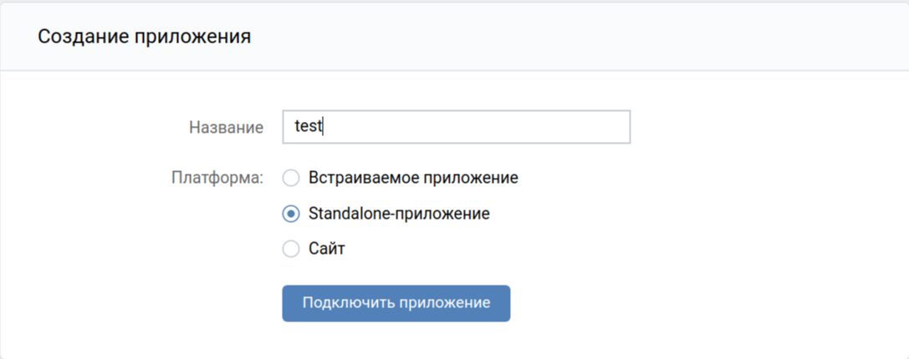
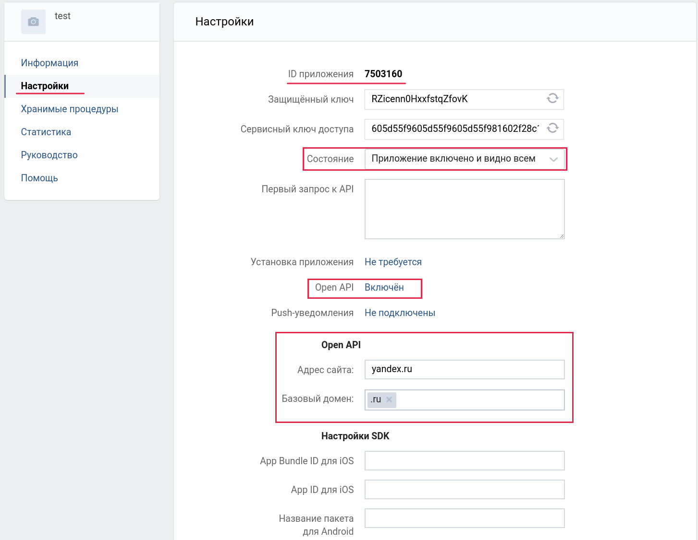
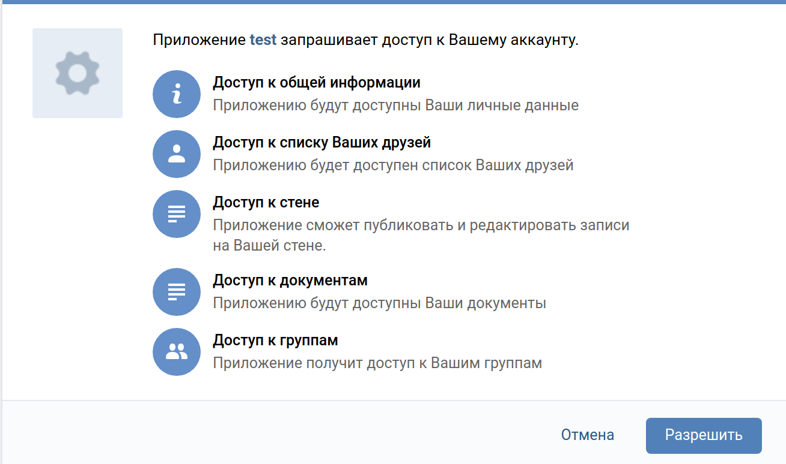
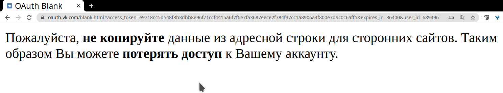

# VK API {-}

## Запись занятия {-}

Запись занятия, которое было 13 мая, можно найти здесь:

<iframe width="560" height="315" src="https://www.youtube.com/embed/W6Krs2vRcSQ" title="YouTube video player" frameborder="0" allow="accelerometer; autoplay; clipboard-write; encrypted-media; gyroscope; picture-in-picture; web-share" allowfullscreen></iframe>

<br>

## VK API  {-}

### Авторизация {-}

В API VK возможно несколько вариантов авторизации. Мы будем использовать *Implicit flow*. Это самый короткий и простой вариант, который использует идентификатор приложения и требует интерактивного подтверждения прав приложения в браузере.

К API VK нельзя подключиться просто так, сразу из R - доступ выдается для приложений или VK-виджетов сайтов. То есть, для начала работы нам надо создать приложение и зарегистрировать его в VK API, потом получить для него access token и уже с этим токеном работать в R (создавать запросы к API).

<br>

#### Создание приложения {-}

Для создания приложения надо перейти по ссылке https://vk.com/apps?act=manage и нажать там на кнопку "Создать приложение". После этого появится окно с описанием, что это за приложение. Необходимо ввести название (любое, например, `test`) выбрать тип `Standalone` и нажать "Подключить приложение". Возможно VK после этого попросит подтвердить создание / привязать к аккаунту (авторизация звонком или смс-кодом).

После этого появится окно настроек приложения. В левой панели надо перейти в раздел "Настройки".
Самое первое, что нам потребуется - ID приложения. Это тот самый client_id, который мы будем использовать при получении access token.

Кроме этого необходимо выставить несколько дополнительных настроек.

- В меню "Состояние" выбрать "приложение включено и видно всем" - если приложение будет выключено, то мы просто не получим токен.

- В меню "Open API" выбрать "Включен", после этого появятся настройки протокола авторизации. 

- В "Адрес сайта" можно указать любой сайт (так как мы делаем это в учебных целях), при работе с нормальным приложением указывают сайт приложения / компании. Я указал `yandex.ru`, точно также можно указать "hse.ru", адрес сайта не участвует в процессе авторизации.

- В "Базовый домен" указываем домен сайта (в нашем случае `.ru`)



<br>

#### access token {-}

Для того, чтобы получить токен, необходимо в сфоромировать и вставить в адресную строку запрос вот такой структуры:

```
https://oauth.vk.com/authorize?client_id=MY_CLIENT_ID&display=page&redirect_uri=https://oauth.vk.com/blank.html&scope=friends&response_type=token&v=5.21
```

В нем есть несколько частей:

- `https://oauth.vk.com/authorize?` это блок, который в целом отвечает за вызов метода авторизации (то есть, этой ccылкой мы запускаем процесс авторизации)

- `client_id=MY_CLIENT_ID` это параметр, в котором мы как раз указываем полученный ранее идентификатор приложения

- `display=page&redirect_uri=https://oauth.vk.com/blank.html` - технический параметр, который задает, что именно нужно сделать после авторизации и как показать результат

- `scope=friends` - еще один параметр, который требует настройки. С помощью этого параметра указываем, к каким разделам мы хотим получить доступ (точнее, дать доступ приложению). Список разделов можно посмотреть [здесь](https://vk.com/dev/permissions). Разделы указываются через запятую, без пробелов. Например: `friends,wall,docs`. Общая практика и требование к разработчикам приложений (мобильных, в частности) --- запрашивать только те права, которые реально нужны для работы, не надо просить лишнего.

- `response_type=token&v=5.131` - Два технических параметра, первый задает тип ответа на запрос об авторизации, второй указывает, какую версию API предполагается использовать. Есть [список](https://vk.com/dev/versions) версий, однако он, кажется, не очень актуален.

Таким образом, мы должны модифицировать этот запрос и указать в нем идентификатор приложения и набор разделов, с которыми будем работать. Это можно сделать как просто в текстовом редакторе, так и кодом. **Важно! В ссылке не должно быть пробелов, а пары параметр=значение объединяются через &** 
```{r}
client_id <- 8172745
scopes <- 'friends,docs,wall,groups'

access_url <- paste(
  'https://oauth.vk.com/authorize?client_id=', client_id,
  '&display=page&redirect_uri=https://oauth.vk.com/blank.html&scope=', scopes,
  '&response_type=token&v=5.131',
  sep = ''
)

# просто печатаем ссылку, чтобы потом вставить в адресную строку
access_url
```

Переходим по полученной ссылке. Если права доступа приложению выдаются первый раз или же список разделов менялся, то вам предложат подтвердить, что это приложение имеет доступ к этим разделам. 

**Важно!** 
Приложение запрашивает доступ к нашему аккаунту, к тем разделам, которые мы указали. Это имеет два следствия. 

Во-первых, через это приложение мы будем иметь доступ только к тем данным, к которым мы сами имеем как  пользователи. То есть, если группа закрытая, а мы в ней не состоим, то мы не сможем получить список участников группы. Аналогично, если пользователь скрыл от всех список своих друзей (либо некоторых друзей из своего списка), то приложение также не будет иметь к нему доступ. Доступ к личным сообщениям имеют только те приложения, которые были отсмотрены представителями VK.

Во-вторых, кому-то может не понравиться, что приложение имеет к чему-то доступ в вашем аккаунте. Это можно решить несколькими путями - никому не давать свой токен (хотя он истекает через сутки и жестко привязан к IP-адресу, с которого был получен). Либо после завершения работы надо выключить или даже удалить приложение. Если удалите приложение, то в следующий раз для получения ID придется заново создавать приложение.



После подтверждения прав мы перейдем на вот такую страницую Самое важное в ней - текст ссылки в адресной строке:


Вот так выглядит текст в адресной строке:
```
https://oauth.vk.com/blank.html#access_token=e9718c45d548f8b3dbb8e96f71ccf4415a6f7f6e7fa3687eece2f784f37cc1a8906a4f800e7d9c0c6aff5&expires_in=86400&user_id=689496
```

Нас интересует то, что находится между `access_token=` и `&expires_in`. Это и есть токен, который мы будем использовать в наших запросах к API VK. Запишем его в отдельный объект.

```{r}
token <- 'vk1.a.ru-deB10Lpz23gsWUzgeoljiKp4giQyOryhe4nkPSwCyI9VWF5vCPB3rwkDmxyq9g7MMAKRvXJflWWbxr-KuKQUZm86NF-6VN6ulyXgsMOfOoO4awG50AUWBfNLf-KCKzNAze-5O8ddx4T-rZhafwJuxTk4KAgrNYNRRpInbf5olDf7mMRXsctLrTBQxWJ4fRve5bQUuCQFVooTQ1KSRpw'
```

<br>

### Методы VK API

После получения токена, можно формировать запросы к API для сбора интересующих данных. Общая структура запроса выглядит следующим образом:
```
https://api.vk.com/method/friends.getOnline?v=5.21&access_token=
```

- `https://api.vk.com/method/` - неизменная часть запроса, указание, что мы обращаемся к какому-то методу API

- `friends.getOnline` - название метода. Обычно сочетает через точку название раздела и название действия, которое необходимо сделать. Указанный в примере метод возвращает список друзей онлайн. Списки разделов и методов можно посмотреть [*здесь*](https://vk.com/dev/methods).

 - `?v=5.81&access_token=` - после `?` идет перечисление параметров запроса. Неизменны в каждом запросе параметры версии (`v`) и токена, также здесь можно указать другие параметры. Список параметров и их  возможные значения надо смотреть на странице соответствующего метода. Пары параметр=значение объединяются через &.

<br>

### Правила сервиса {-}

При работе со всеми API следует соблюдать правила сервиса, в противном случае приложение будет заблокировано. Правила API VK можно прочитать [*здесь*](https://vk.com/dev/rules)

<br>

## Сеть друзей {-}

Для примера работы с VK API попробуем построить сеть наших друзей (кто из друзей также является друзьями в VK). Для этого нам надо иметь доступ к разделу `friends` и работать с методом `friends.get`. Вот так выглядит запрос на список друзей (а также их город и ссылку на фото аватарки в размере 50*50 пикселей и прочие параметры). По умолчанию метод отдает только id друзей, список дополнительных данных о друзьях задается с помощью параметра `fields` (что можно указать в этом параметре - надо смотреть в документации метода). Если не указан параметр `user_id`, то по умолчанию возвращается список друзей того пользователя, кто создал приложение, токен которого используется в запросе (то есть наших друзей).

```{r}
method_name <- 'friends.get'
fields <- 'city,country,sceen_name,sex,education,photo_50'

request_url <- paste(
  'https://api.vk.com/method/', method_name,
  '?access_token=', token,
  '&fields=', fields,
  # '&count=1&order=random',
  '&v=5.81',
  sep = ''
)

request_url
```

Далее эту ссылку используем в функции `GET()` пакета `httr` и разбираем результат с помощью `content()`. При этом можно проверить результат запроса, вызвав элемент `status_code` результата функции `GET()`. В норме должен был статус 200 (впрочем, если у приложения нет доступа к какому-то разделу, все равно будет код 200, но в ответе сервера будет текст, что доступ запрещен). Прочие коды надо либо смотреть в общей [*таблице*](https://ru.wikipedia.org/wiki/%D0%A1%D0%BF%D0%B8%D1%81%D0%BE%D0%BA_%D0%BA%D0%BE%D0%B4%D0%BE%D0%B2_%D1%81%D0%BE%D1%81%D1%82%D0%BE%D1%8F%D0%BD%D0%B8%D1%8F_HTTP) кодов ответов либо в [*списке*](https://vk.com/dev/errors) API VK, так как могут быть специальные коды именно этого API.

```{r, message=FALSE, warning=FALSE, eval=FALSE}
library(httr)
library(data.table)

# импортируем список друзей
my_friends <- GET(request_url)

# смотрим код ответа
my_friends$status_code

# извлекаем содержание в многоуровневый список
my_friends <- content(my_friends)
```

Вот так выглядит структура результата, если выгружать только одного пользователя (закомментированная мной строчка в запросе):

```{r, eval=FALSE}
str(my_friends)
```

```{r, eval=FALSE}
List of 1
 $ response:List of 2
  ..$ count: int 775
  ..$ items:List of 1
  .. ..$ :List of 16
  .. .. ..$ id              : int 999999
  .. .. ..$ first_name      : chr "Петр"
  .. .. ..$ last_name       : chr "Петров"
  .. .. ..$ sex             : int 2
  .. .. ..$ city            :List of 2
  .. .. .. ..$ id   : int 969
  .. .. .. ..$ title: chr "City"
  .. .. ..$ country         :List of 2
  .. .. .. ..$ id   : int 139
  .. .. .. ..$ title: chr "Country"
  .. .. ..$ photo_50        : chr "photo_url"
  .. .. ..$ university      : int 999
  .. .. ..$ university_name : chr "unicersity"
  .. .. ..$ faculty         : int 999
  .. .. ..$ faculty_name    : chr "faculty"
  .. .. ..$ graduation      : int 999
  .. .. ..$ education_form  : chr "form"
  .. .. ..$ education_status: chr "status"
  .. .. ..$ online          : int 0
  .. .. ..$ track_code      : chr "track_code"
```

Результат - список, состоящий из одного подсписка `result`, который сам является список двух элементов - значения `count` (это общее количество моих друзей) `items` - это список друзей, где каждый подсписок содержит информацию по одному другу.

Для того, чтобы можно было работать с этим объектом, его надо каким-то образом переконвертировать в табличный вид. Проще всего это сделать с помощью связки `lapply()` + `rbindlist()`. Итерироваться будем по подспискам списка `items.` Так как не у всех может быть указан город, в `rbindlist()` используем `fill = TRUE`, чтобы пропущенные были заменены на NA, и таблички склеились нормально.
```{r, eval=FALSE}
my_friends_table <- lapply(my_friends$response$items, function(x) {
  res <- data.table(
    id = x$id,
    city = x$city$title,
    url = x$photo_50
  )
  return(res)
})
my_friends_table <- rbindlist(my_friends_table, fill = TRUE)
```

Смотрим табличку:
```{r, eval=FALSE}
my_friends_table[1:5]
```

|   id|city            |url                             |
|----:|:---------------|:-------------------------------|
|  999|Санкт-Петербург |https://sun1-20.userapi.com/....|
| 1000|London          |https://sun1-30.userapi.com/....|
| 1001|Санкт-Петербург |https://sun1-91.userapi.com/....|
| 1002|NA              |https://sun9-18.userapi.com/....|
| 1003|Санкт-Петербург |https://sun9-7.userapi.com/.....|


Для того, чтобы не делать граф друзей очень большим (все-таки задача учебная), отфильтруем список друзей таким образом, чтобы осталось где-то несколько десятков пользователей, которые могут быть связаны друг с другом. Например, можно отфильтровать по городу, по вузу или по факультету - в зависимости от вашей структуры контактов.

Сокращенный список назовем `friends_vertices`, так как эти люди будут вершинами графа на графике.

```{r, eval=FALSE}
friends_vertices <- my_friends_table[city == 'Барнаул']
```

Так как мы хотим посмотреть, как дружат наши друзья друг с другом, то теперь нам надо импортировать список друзей наших друзей, и удалить оттуда тех, кого нет у нас в друзьях. Процедура в целом схожая с получением списка друзей, только здесь достаточно будет просто импортировать идентификаторы, плюс в параметрах запроса надо буде указывать, по какому пользователю мы импортируем друзей.
**Важно** - если этот пользователь скрыл от нас каких-то друзей или вообще всех друзей, то мы получим пустой список для него.


Сразу в цикле пробегаем по нашему списку друзей и используем идентификатор в запросе (`'&user_id=', x`). Импортируем только идентификаторы друзей указанного пользователя, поэтому параметра `fields` в запросе нет. Для того, чтобы API VK не блочил слишком быстрые запросы (лимит в 3 запроса в секунду), вставляем примитивный замедлитель на 0.3 секунды (`Sys.sleep(0.3)`). Результат разбираем в табличку. Так как список `items` содержит один элемент для каждого пользователя, можно просто воспользоваться функцией `unlist`, которая превращает список в вектор (когда много элементов по пользователю, так не получится, все превратится в мешанину значений и в табличку разобрать будет сложно).
```{r, eval=FALSE}
friends_of_friends <- lapply(friends_vertices[, id], function(x) {
  request_url_fof <- paste(
    'https://api.vk.com/method/', method_name,
    '?access_token=', token,
    '&user_id=', x,
    '&v=5.81',
    sep = ''
  )
  res <- GET(request_url_fof)
  Sys.sleep(0.3)
  res <- content(res)
  res <- data.table(
    from = x,
    to = unlist(res$response$items)
  )
  res
})
friends_of_friends <- rbindlist(friends_of_friends)
```

Мы получили таблицу, в которой в колонке `from` - список наших друзей. В колонке `to` - идентификаторы друзей, с которыми дружат наши друзья. Если мы хотим посмотреть именно сеть, как связаны наши друзья из семпла, из колонки `to` следует удалить идентификаторы всех людей, кроме тех, кто есть в `from`. Результат можно проверить, посчитав количество уникальных идентификаторов в `from` и `to` - во второй колонке их должно столько же, сколько в `from`. В целом, эта таблица описывает связи наших друзей (каждая строчка описывает одну связь), если кто-то из наших друзей, по кому мы хотим нарисовать граф связей, ни с кем из наших друзей не связан, то его не должно быть в таблице после фильтраций.

```{r, echo=FALSE, eval=FALSE}
fwrite(friends_vertices, './data/friends_vertices.csv', row.names = FALSE)
fwrite(friends_edges, './data/friends_edges.csv', row.names = FALSE)
```


```{r, eval=FALSE}
# удаляем незнакомых людей и оставляем только связи друзей
friends_edges <- friends_of_friends[to %in% friends_vertices[, id]]
```

```{r, echo=FALSE}
library(data.table)
friends_vertices <- fread('https://gitlab.com/upravitelev/mar191s/raw/master/data/friends_vertices.csv')
friends_edges <- fread('https://gitlab.com/upravitelev/mar191s/raw/master/data/friends_edges.csv')
```

```{r}
# считаем, сколько наших друзей ни с кем другим из наших друзей не связан
friends_vertices[, uniqueN(id)] - friends_edges[, uniqueN(from)]
```


График связей строится с помощью пакета `igraph`. Этот пакет, по сути, state-of-the-art в визуализации сетей в R. Однако это большой и сложный пакет, изучать его можно долго, поэтому ограничимся примерами из мануалов.

Попробуем нарисовать сеть, при этом внесем некоторую кастомизацию. Во-первых, можно вместо идентификаторов пользователей и безличных кружочков вершин указать аватарки пользователей (именно для этого мы импортировали ссылки на их аватарки), во-вторых, можно попробовать выделить цветом группы друзей.

Первым делом формируем igraph-объект, описывающий вершины социального графа и связи между ними.


```{r, message=FALSE, warning=FALSE}
library(igraph)
# из списка друзей и таблицы связей формируем объект
# аргумент directed = FALSE означает, что у нас нет направления связи
# (пример направленной связи - родитель - ребенок, учител - ученик и т.д.)
net <- graph_from_data_frame(d = friends_edges,
                             vertices = friends_vertices,
                             directed = FALSE)
# упрощаем объект
net <- simplify(net, remove.multiple = TRUE, remove.loops = TRUE)
```

Если мы хотим отрисовать аватарки вместо лейблов, то нам потребуется пакет `magick` (на *nix машинах и MacOS может потребовать дополнительные системные библиотеки):
```{r, eval=FALSE}
library(magick)
# brew imagemagick@6

# импортируем аватарки по ссылке в R-объект
friends_photos <- lapply(friends_vertices[, url], image_read)

# добавляем в описание вершин графа имопртированный список фотографий
V(net)$raster <- unlist(friends_photos)
```

Для кластеризации в `igraph` есть свои собственные функции (если интересен алогоритм - то лучше читать справку и гуглить, как они работают, я просто воспользовался примером из туториала). Создаем объект кластеров:

```{r}
# кластеризация
clp <- cluster_fast_greedy(net)
```

После этого рисуем граф связей. Я не стал отрисовывать фотографии, поэтому мой код такой:
```{r}
plot.igraph(
  # объект-описание сети
  x = net,

  # кластеры
  mark.groups = clp,

  # скрываем подписи с вершин
  vertex.label	= NA
)
```

Для отрисовки графа с фотографиями следует воспользоваться этим кодом:
```{r, eval=FALSE}
plot(
  x = net,
  mark.groups = clp,
  vertex.label	= NA,

  # указываем, что при  отрисовке вершин используем
  # параметр raster, заданный ранее
  vertex.shape = "raster"
)
```

<br>

## vkR package {-}

В CRAN есть пакет `vkR`, который предназначен для работы с API VK. Этот пакет, в целом, имеет функции, которые мы только что написали руками - авторизацию, сбор информации по некоторым методам (друзьям, группам и т.д.).

Авторизация осуществляется в пакете таким же образом, как и у нас - через создание приложение, получение ID и ссылку в браузере. В пакете есть костыль для неинтерактивной работы (можно указать логин и пароль, и тогда не надо будет копировать из браузера токен), но сделан он грязновато.

В целом, я не рекомендую пользоваться этим пакетом - он был написан четыре года назад и с тех пор не обновлялся. За это время часть методов API VK существенно изменилась и легко можно получить ситуацию, когда что-то не работает или работает неправильно.

<br>

## Дополнительные материалы {-}

- [*Знакомство с API VK*](https://dev.vk.com/api/getting-started) - официальная документация, весьма подробная и понятная

- Наверное, лучший [*туториал*](https://kateto.net/network-visualization) по визуализации сетей. Почти половина туториала посвящена разным аспектам пакета `igraph`. С интерактивными визуализациями рекомендую быть осторожнее - на больших датасетах они нередко могут подвисать и крашить сессию.
