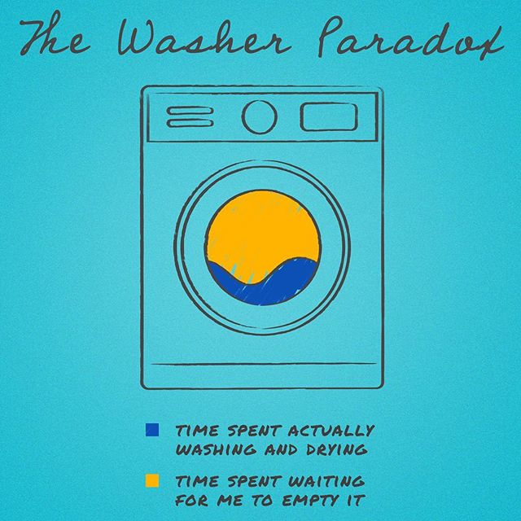
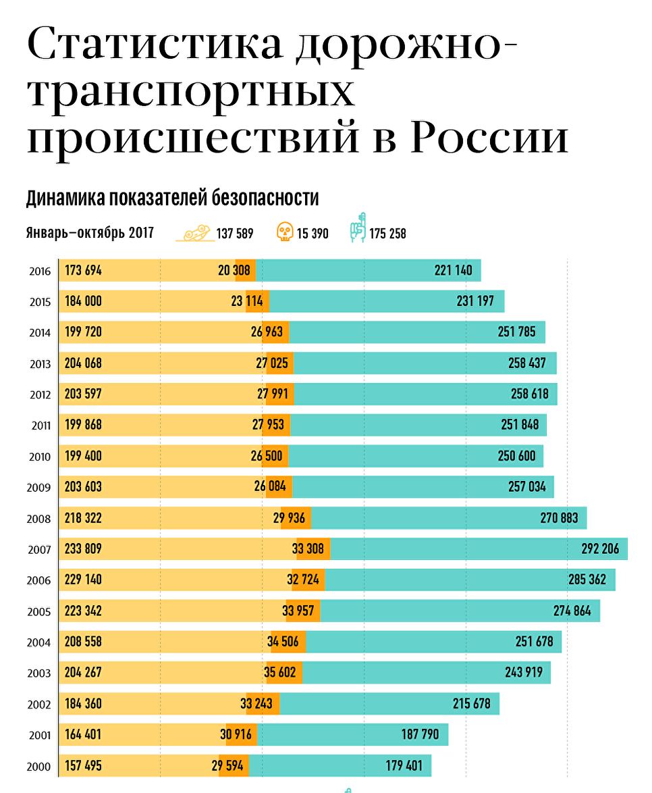
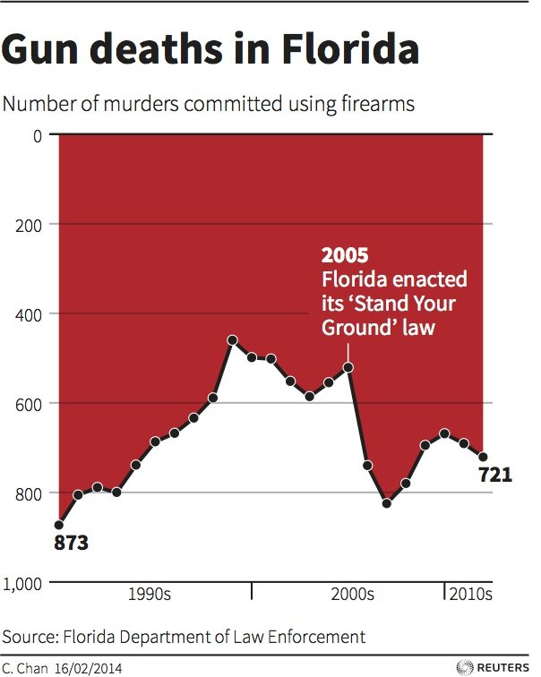
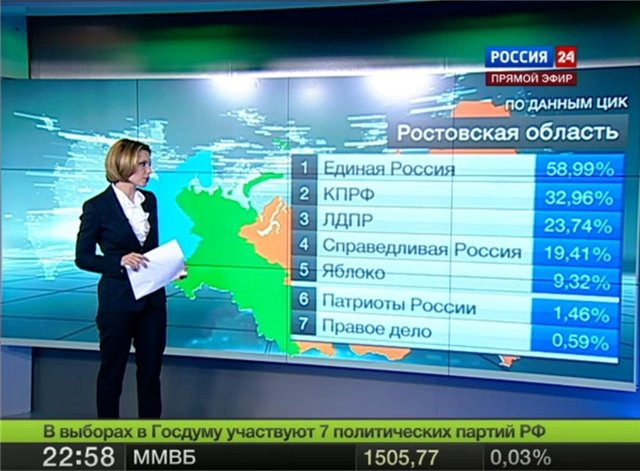
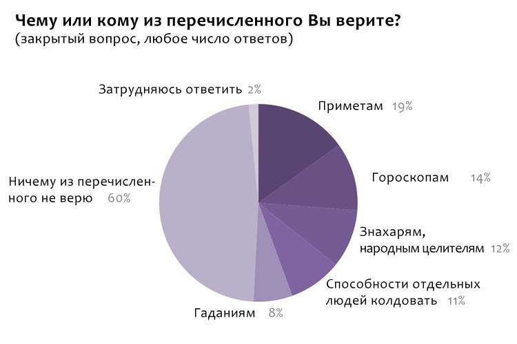
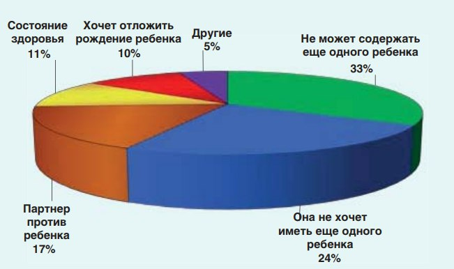
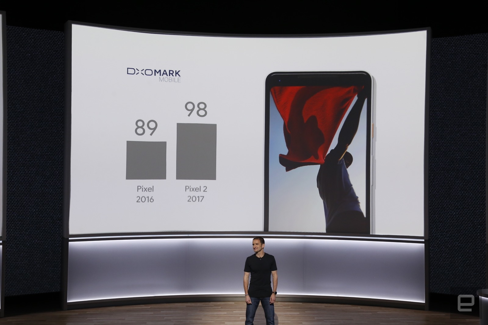
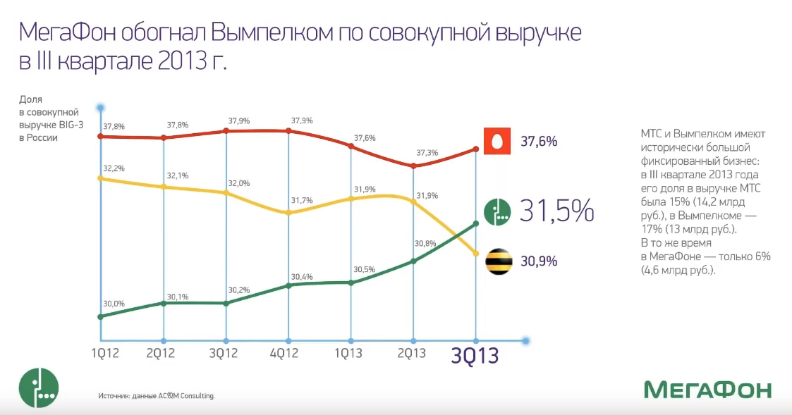
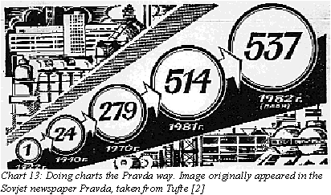
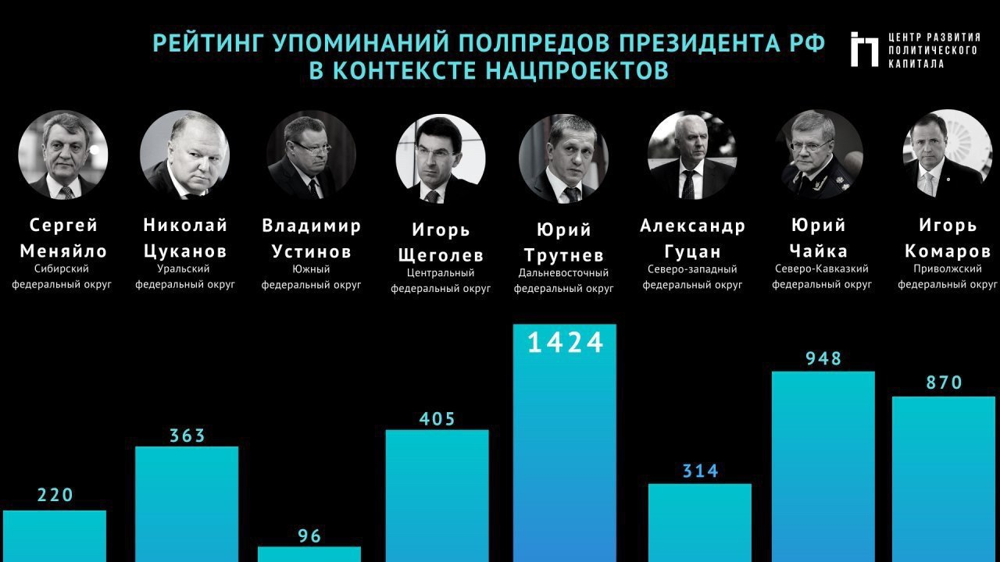

# Dataviz {.unnumbered}

## Запись занятия {.unnumbered}

<iframe width="560" height="315" src="https://www.youtube.com/embed/mVRjviG58Qk?si=gHlgPChHW4gYhosM&amp;start=4474" title="YouTube video player" frameborder="0" allow="accelerometer; autoplay; clipboard-write; encrypted-media; gyroscope; picture-in-picture; web-share" allowfullscreen></iframe>

<br>


<br>

## Intro {.unnumbered}

Цели визуализации и, в общем виде, визуального формата хранения материалов:

**Record information - photographs, seismographs etc**- Часть информации сложно представима в числовом виде - например, медицинские снимки, фотографии, записи датчиков и т.д.

**Analyze data to support reasoning** - Представление данных в визуальном виде (графики и т.д.) может быть использовано как минимум в двух напарвлениях:

-   Develop and assess hypotheses (visual exploration) - анализ и интепретация процессов. Например, интерпретация ЭЭГ/ЭКГ, или же резкие изменения в тренде. Впрочем, наивный анализ трендов так же вполне может быть основан на анализе графиков. Также подкрепление выводов, дополнительная аргументация.

-   Find patterns and discover errors in data - нередко визуальный анализ позволяет сделать вывод о каких-то паттернах в данных, которые достаточно сложно найти, оперируя только таблицами данных. Например, лакуны в данных или паттерны пропусков в опросах.

**Communicate information to others (visual explanation)** - презентация в понятном графическом виде результатов исследования или описания какого-то феномена через художественно представленные данные (инфографика, дата-сторителлинг)

[*(с) cs171 Visualization*](https://www.cs171.org/2019/index.html)

<br>

## Инфографика {.unnumbered}

В общем виде инфографика - это это графический способ подачи информации, данных и знаний, целью которого является быстро и чётко преподносить сложную информацию ([wiki](https://ru.wikipedia.org/wiki/%D0%98%D0%BD%D1%84%D0%BE%D0%B3%D1%80%D0%B0%D1%84%D0%B8%D0%BA%D0%B0))

Один из подходов, в котором обычно работают исследователи, аналитики, BI, продакт-менеджеры и т.д. предполагает донесение до целевой аудитории необходимой информации максимально точно. Это минималистичный подход, в котором ценны чистота, прозрачность, семантическая насыщенность всех элементов визуализации. Обычно аналитики используют спец.пакеты и языки программирования для создания графических презентаций своих данных. Далее я буду говорить про визуализацию именно в этом ключе.

Второй подход - донесение до целевой аудитории информации через сюжет, через создание привлекательных образов, иллюстративность и выразительность дизайна. Обычно в таком ключе работают дата-журналисты и дизайнеры рекламных и маркетинговых материалов.

Пример такого поясняющего подхода - место простого графика двух значений, в иллюстрации создается контекст (практика использования стиральной машинки), синий цвет для "actually washing" хорошо обыгрывает идею воды в стиральной машине и доли времени. При этом, на графике нет чисел - визуального соотношения площади желтого и синего цветов достаточно, чтобы донести основную мысль.



<br>

## Типы графиков {.unnumbered}


### scatter plot {.unnumbered}

Самый простой график - scatter plot, он же точечный график или, в некоторых случаях, диаграмма рассеяния. По оси OX обычно интервальные данные (степень выраженности признака), в редких случаях категории или линия времени. По OY, как правило, интервальные данные.

График полезен, когда надо хотя бы бегло оценить взаимосвязь признаков (возможные группировки и скопления).

Например, график связи замера бриллианта и его цены, с группировкой по качеству огранки. Даже не таком простом графике видно, что чем больше камень, тем он дороже, но и среди дорогих камней встречаются камни с неидеальной огранкой.


```{=html}
<div class="plotly html-widget html-fill-item-overflow-hidden html-fill-item" id="htmlwidget-94d58c21da844cf2edc3" style="width:672px;height:480px;"></div>
<script type="application/json" data-for="htmlwidget-94d58c21da844cf2edc3">{"x":{"visdat":{"9440060714b26":["function () ","plotlyVisDat"]},"cur_data":"9440060714b26","attrs":{"9440060714b26":{"x":{},"y":{},"mode":"markers","color":{},"alpha_stroke":1,"sizes":[10,100],"spans":[1,20],"type":"scatter"}},"layout":{"margin":{"b":40,"l":60,"t":25,"r":10},"xaxis":{"domain":[0,1],"automargin":true,"title":"carat"},"yaxis":{"domain":[0,1],"automargin":true,"title":"price"},"hovermode":"closest","showlegend":true},"source":"A","config":{"modeBarButtonsToAdd":["hoverclosest","hovercompare"],"showSendToCloud":false,"displayModeBar":false},"data":[{"x":[0.32000000000000001,0.31,0.25,0.69999999999999996,0.52000000000000002,0.40999999999999998,0.31,0.79000000000000004,0.5,0.5,1.3300000000000001,0.29999999999999999,0.33000000000000002,0.32000000000000001,0.81000000000000005,1.3,0.31,0.34000000000000002,0.46000000000000002,0.26000000000000001,0.32000000000000001,0.92000000000000004,0.29999999999999999,0.29999999999999999,1.05,0.60999999999999999,0.42999999999999999,0.40000000000000002,1.2,0.34999999999999998,0.42999999999999999,0.71999999999999997,0.42999999999999999,1.1599999999999999,1,0.34999999999999998,0.29999999999999999,0.29999999999999999,0.41999999999999998,0.5,0.37,0.31,1,1.04,0.29999999999999999,0.87,0.38,0.32000000000000001,0.33000000000000002,0.41999999999999998,1.55,0.34999999999999998,0.38,2.2000000000000002,0.23999999999999999,0.70999999999999996,0.58999999999999997,0.32000000000000001,0.5,1.54,0.54000000000000004,1.5700000000000001,0.35999999999999999,0.31,0.29999999999999999,0.40999999999999998,1.01,0.72999999999999998,0.32000000000000001,0.73999999999999999,1.22,0.71999999999999997,1.1100000000000001,0.72999999999999998,0.54000000000000004,0.41999999999999998,0.40999999999999998,0.32000000000000001,0.29999999999999999,0.52000000000000002,0.41999999999999998,1.3700000000000001,0.31,1.6599999999999999,0.70999999999999996,0.72999999999999998,0.32000000000000001,1.54,0.70999999999999996,1.22,0.37,1.51,0.32000000000000001,0.51000000000000001,0.52000000000000002,0.82999999999999996,0.32000000000000001,1.0800000000000001,0.77000000000000002,0.95999999999999996,0.55000000000000004,0.40999999999999998,1.04,0.32000000000000001,0.40000000000000002,1.51,1.0700000000000001,0.51000000000000001,0.53000000000000003,0.29999999999999999,0.26000000000000001,0.31,0.63,0.54000000000000004,0.32000000000000001,0.51000000000000001,0.29999999999999999,0.72999999999999998,0.32000000000000001,0.56999999999999995,1.0900000000000001,0.39000000000000001,1.02,1.51,0.33000000000000002,1.25,1.51,0.29999999999999999,0.34000000000000002,0.35999999999999999,1.3100000000000001,1.52,1.22,1.6200000000000001,0.32000000000000001,0.34999999999999998,0.29999999999999999,0.69999999999999996,1,0.54000000000000004,0.45000000000000001,0.44,0.56999999999999995,0.29999999999999999,0.33000000000000002,0.40000000000000002,0.51000000000000001,0.39000000000000001,0.29999999999999999,0.40999999999999998,0.40000000000000002,1.26,1.02,1.7,0.46000000000000002,0.31,1.02,0.29999999999999999,1.02,0.31,0.90000000000000002,0.56999999999999995,1.27,1.04,0.95999999999999996,1.01,0.56000000000000005,0.31,0.29999999999999999,0.79000000000000004,1.6699999999999999,0.78000000000000003,0.31,0.32000000000000001,0.52000000000000002,0.40999999999999998,0.40999999999999998,0.58999999999999997,0.70999999999999996,0.42999999999999999,0.72999999999999998,0.91000000000000003,0.31,0.35999999999999999,0.32000000000000001,1.5900000000000001,0.53000000000000003,0.44,1.5700000000000001,0.73999999999999999,0.29999999999999999,0.72999999999999998,1.02,0.5,0.5,1.22,0.31,0.34999999999999998,0.81000000000000005,1.21,0.69999999999999996,0.37,1.01,0.38,0.57999999999999996,0.31,1.02,0.76000000000000001,0.38,1.0700000000000001,0.56000000000000005,0.32000000000000001,0.56000000000000005,0.27000000000000002,0.31,1.0900000000000001,1.1000000000000001,0.54000000000000004,0.40999999999999998,0.31,1.8600000000000001,0.90000000000000002,0.64000000000000001,1.1200000000000001,0.40000000000000002,0.53000000000000003,1.1699999999999999,0.31,0.33000000000000002,0.40999999999999998,0.81999999999999995,1.01,0.87,0.38,0.78000000000000003,0.26000000000000001,0.55000000000000004,0.29999999999999999,0.5,0.52000000000000002,0.52000000000000002,0.40999999999999998,0.31,0.33000000000000002,1.01,0.32000000000000001,1.6200000000000001,1.7,0.28000000000000003,0.78000000000000003,0.40000000000000002,0.69999999999999996,0.55000000000000004,0.55000000000000004,0.33000000000000002,1.2,1.04,0.40999999999999998,0.53000000000000003,1.05,0.57999999999999996,0.51000000000000001,0.31,0.32000000000000001,0.40999999999999998,0.51000000000000001,0.34999999999999998,0.90000000000000002,0.35999999999999999,0.53000000000000003,0.38,0.35999999999999999,0.40999999999999998,1.01,0.25,1.1699999999999999,0.40999999999999998,1.01,0.32000000000000001,0.38,1.23,1.2,0.34999999999999998,0.55000000000000004,1.1200000000000001,0.35999999999999999,0.60999999999999999,0.32000000000000001,0.56999999999999995,0.70999999999999996,0.45000000000000001,0.82999999999999996,1.01,0.90000000000000002,0.33000000000000002,0.32000000000000001,0.69999999999999996,0.56000000000000005,0.29999999999999999,1.6200000000000001,1.21,0.70999999999999996,1.23,0.41999999999999998,0.39000000000000001,0.25,0.52000000000000002,1.51,1.5700000000000001,0.31,0.46999999999999997,0.29999999999999999,0.92000000000000004,1.52,0.54000000000000004,0.92000000000000004,0.31,0.29999999999999999,0.66000000000000003,1,1.1100000000000001,0.69999999999999996,0.5,0.70999999999999996,0.81000000000000005,0.70999999999999996,0.42999999999999999,0.69999999999999996,0.29999999999999999,1.0600000000000001,0.40000000000000002,1.01,0.40999999999999998,0.40999999999999998,0.40999999999999998,0.80000000000000004,0.46999999999999997,0.70999999999999996,0.42999999999999999,2.02,0.38,0.34000000000000002,1.0600000000000001,1.01,0.41999999999999998,1.54,0.70999999999999996,0.27000000000000002,0.33000000000000002,1.1000000000000001,0.70999999999999996,0.29999999999999999,0.29999999999999999,0.5,0.71999999999999997,1.2,0.31,1.53,0.41999999999999998,1.1599999999999999,1.01,1.02,0.69999999999999996,0.27000000000000002,1.04],"y":[1140,840,535,3253,1682,1055,609,4046,1746,1306,15031,405,1002,720,2673,11853,562,895,1338,545,842,5023,790,601,9784,2166,1358,855,4659,706,1250,2650,1093,5001,4466,767,675,838,984,1337,649,732,4133,5199,693,2816,1245,756,727,1040,6805,747,1069,14691,678,3116,2175,645,1854,15059,1772,11702,851,802,413,1151,4680,2490,898,2410,4974,2626,4969,2583,1745,1087,1019,905,425,1354,970,12455,802,6377,2226,3164,1067,13794,2376,8485,741,10588,477,1781,1936,2565,477,5791,2642,5666,1940,999,7294,561,1323,13115,5280,1687,1624,675,545,871,2817,1981,918,1557,863,3880,936,2110,9650,1170,6614,11465,968,6944,12100,789,686,1059,10957,9405,6469,16507,645,644,735,2375,7849,1723,888,1040,1998,473,928,1200,1826,1008,1120,1144,873,8238,4662,15756,1306,789,4118,984,4832,907,4678,1949,12576,4515,4355,6159,1698,907,641,2442,11678,2365,802,434,1383,1157,1076,4208,3773,1304,3209,4284,652,817,602,11437,1639,1253,15301,3746,731,3509,7192,1629,1331,7738,734,706,2901,9873,2390,601,4825,1096,1805,436,9598,3306,626,7577,2118,918,1605,760,734,4383,5583,1381,863,687,10312,4008,2790,7616,917,1383,9110,571,666,1439,3012,2896,3118,1070,2799,635,1809,1131,1239,1401,1774,1076,421,781,5534,936,8075,8758,514,3056,629,2384,1228,1702,1129,9032,6255,1007,1683,12315,1899,1331,891,730,1295,1656,614,6230,851,1601,882,821,1295,5698,740,4617,791,3739,814,983,5030,5050,522,1580,6774,713,3212,918,2974,3527,790,3171,11400,3418,1021,592,3345,2281,776,15318,6834,2764,8541,838,828,445,1822,12071,12004,846,884,447,4791,11033,1786,4309,625,838,1712,7056,8129,2614,1104,3199,2725,2717,1053,3672,609,11209,873,4078,1153,1107,953,3732,1400,2432,1207,16397,1026,596,5613,6066,1289,8923,2965,534,521,6344,3191,742,670,1035,2420,5535,732,8062,1024,11120,6019,4684,2110,760,8012],"mode":"markers","type":"scatter","name":"Ideal","marker":{"color":"rgba(253,231,37,1)","line":{"color":"rgba(253,231,37,1)"}},"textfont":{"color":"rgba(253,231,37,1)"},"error_y":{"color":"rgba(253,231,37,1)"},"error_x":{"color":"rgba(253,231,37,1)"},"line":{"color":"rgba(253,231,37,1)"},"xaxis":"x","yaxis":"y","frame":null},{"x":[2.04,0.77000000000000002,0.91000000000000003,1.05,1.04,0.26000000000000001,0.29999999999999999,1,2,0.5,0.73999999999999999,0.91000000000000003,1.0900000000000001,1.5800000000000001,0.29999999999999999,0.92000000000000004,0.29999999999999999,1.01,2.0699999999999998,1.02,1.51,0.92000000000000004,1.51,0.40999999999999998,1,1.05,0.31,2.21,0.90000000000000002,0.59999999999999998,1.5,0.37,1.76,1.1200000000000001,1.04,0.69999999999999996,0.91000000000000003,0.38,1.21,1.02,1,1.1000000000000001,0.97999999999999998,0.37,0.37,0.69999999999999996,1.03,0.52000000000000002,1.5,0.34000000000000002,0.40000000000000002,0.72999999999999998,1.3500000000000001,2.0099999999999998,0.69999999999999996,0.33000000000000002,0.41999999999999998,0.42999999999999999,0.56999999999999995,0.70999999999999996,0.44,2.3799999999999999,0.31,1.01,1.76,0.32000000000000001,0.51000000000000001,0.59999999999999998,0.31,0.72999999999999998,0.51000000000000001,0.32000000000000001,0.39000000000000001,0.40999999999999998,0.55000000000000004,1.22,0.32000000000000001,2.0099999999999998,2.04,0.33000000000000002,1.5,0.51000000000000001,1.51,0.51000000000000001,1.0700000000000001,0.31,1.21,1.02,1.1799999999999999,1.5800000000000001,0.31,1.05,0.41999999999999998,1.7,1.2,0.33000000000000002,2.0099999999999998,0.40999999999999998,1.0700000000000001,1.2,2,0.75,0.56999999999999995,0.52000000000000002,0.90000000000000002,1.5,0.53000000000000003,0.40999999999999998,2.0099999999999998,0.33000000000000002,1.01,1.02,0.90000000000000002,0.53000000000000003,1.21,2.2400000000000002,0.44,0.5,1.26,1,1,0.40999999999999998,1.0700000000000001,1.1399999999999999,0.5,0.31,0.70999999999999996,0.40000000000000002,1,1.05,1.7,0.52000000000000002,0.69999999999999996,1.7,0.90000000000000002,1,0.56000000000000005,0.40000000000000002,0.31,0.32000000000000001,1.54,2.04,0.42999999999999999,0.32000000000000001,1.3100000000000001,0.69999999999999996,1.03,0.54000000000000004,1,0.32000000000000001,0.52000000000000002,1.01,0.40000000000000002,0.32000000000000001,0.20999999999999999,1.72,0.70999999999999996,2.0099999999999998,1.6000000000000001,1.2,0.69999999999999996,0.33000000000000002,0.40000000000000002,2.5600000000000001,0.92000000000000004,0.29999999999999999,1.1200000000000001,0.40000000000000002,1,1.0800000000000001,0.35999999999999999,0.35999999999999999,1.1699999999999999,0.40999999999999998,0.32000000000000001,1.01,0.34000000000000002,1.52,1.21,0.75,0.34000000000000002,1.7,0.40000000000000002,0.69999999999999996,0.54000000000000004,1.0600000000000001,0.56000000000000005,1.01,1.01,0.31,0.34999999999999998,1,0.52000000000000002,0.95999999999999996,1.1599999999999999,0.31,0.32000000000000001,0.20999999999999999,0.56000000000000005,0.29999999999999999,0.90000000000000002,1.27,0.51000000000000001,1.5,2.0099999999999998,0.40999999999999998,0.29999999999999999,0.76000000000000001,1.8600000000000001,0.31,0.70999999999999996,1.01,0.40999999999999998,0.70999999999999996,1.02,0.54000000000000004,0.69999999999999996,0.31,0.70999999999999996,1.51,0.48999999999999999,1.03,1.04,0.31,0.40000000000000002,0.51000000000000001,1,1,1.03,0.5,0.55000000000000004,1.04,0.35999999999999999,0.38,1.1299999999999999,0.51000000000000001,2.75,1.01,0.57999999999999996,0.73999999999999999,0.70999999999999996,0.81000000000000005,0.51000000000000001,1.3100000000000001,1.52,0.29999999999999999,0.34999999999999998,0.90000000000000002,0.33000000000000002,1.1100000000000001,1.02,0.69999999999999996,0.70999999999999996,0.58999999999999997,0.38,0.29999999999999999,1.5,0.29999999999999999,1.7,1.22,0.52000000000000002,1.52,1,1.01,0.75,0.29999999999999999,1.6000000000000001,0.91000000000000003,1.1399999999999999,1,0.96999999999999997,1.6000000000000001,0.69999999999999996,0.51000000000000001,1.51,1.51,0.38,0.33000000000000002,0.70999999999999996,2.02],"y":[17379,2005,4123,4116,6890,382,684,3528,11200,1629,2206,3781,7422,14855,574,3910,776,4054,13786,7797,13771,3725,6342,1007,7822,6146,537,13369,2947,835,11638,746,13626,5952,4467,2352,4357,812,4841,3513,10752,5958,3485,749,454,1890,5849,1600,10940,537,737,2882,6254,9658,2838,1207,1179,1264,1320,2317,1063,18559,558,7032,12063,936,956,1385,465,3311,1974,730,1095,791,1415,3156,936,16778,18115,743,7518,2203,8828,1381,5091,544,6963,7197,6542,13014,802,2881,1040,13417,5376,668,12541,827,4830,3830,11106,2122,1608,975,3175,10090,1631,1061,18188,668,4525,4113,4833,1607,4268,16656,1023,1838,6085,5000,6640,719,4075,5650,1279,802,2572,855,8888,5323,18342,1385,1971,17323,4334,6720,1698,737,573,756,10758,8408,1131,612,5759,2648,3634,3194,4758,591,1138,3971,945,874,386,17605,2572,16733,8333,10169,2705,521,772,17186,3377,473,5329,842,6720,4627,770,932,4324,1295,828,4497,765,6367,7611,2394,956,10662,1080,1814,1760,7130,1441,3674,3749,816,788,3881,1577,4274,4872,802,702,386,1930,776,3704,7005,1177,8820,16733,1192,540,2814,10572,698,2790,3665,784,2072,4207,1709,2657,907,2498,12319,1084,4885,3832,523,666,1749,5967,4514,5710,1715,1708,4368,473,700,5316,1781,15415,5780,2036,2744,2803,2313,1402,6095,14105,737,767,4234,694,6534,5312,2268,2428,1550,633,844,14675,1026,9596,7816,1092,11105,4816,4154,2760,394,8852,4241,5273,3528,4561,12210,2196,1781,14156,13474,812,743,2839,14238],"mode":"markers","type":"scatter","name":"Premium","marker":{"color":"rgba(93,200,99,1)","line":{"color":"rgba(93,200,99,1)"}},"textfont":{"color":"rgba(93,200,99,1)"},"error_y":{"color":"rgba(93,200,99,1)"},"error_x":{"color":"rgba(93,200,99,1)"},"line":{"color":"rgba(93,200,99,1)"},"xaxis":"x","yaxis":"y","frame":null},{"x":[1,0.29999999999999999,1.5,0.52000000000000002,0.35999999999999999,0.57999999999999996,1.1699999999999999,0.71999999999999997,0.73999999999999999,1.4399999999999999,0.71999999999999997,0.58999999999999997,0.29999999999999999,1.6299999999999999,2.0099999999999998,0.29999999999999999,0.70999999999999996,0.29999999999999999,1.0900000000000001,0.32000000000000001,1.71,0.58999999999999997,1.27,0.82999999999999996,0.83999999999999997,0.70999999999999996,1.5900000000000001,1.3200000000000001,1.26,0.28999999999999998,0.31,1.22,0.23000000000000001,0.91000000000000003,0.34000000000000002,2,0.70999999999999996,1.21,0.45000000000000001,0.28999999999999998,0.23000000000000001,0.92000000000000004,1.54,0.51000000000000001,0.90000000000000002,1.71,0.23000000000000001,0.51000000000000001,1.29,0.80000000000000004,0.69999999999999996,0.23000000000000001,0.5,0.76000000000000001,0.5,1.1299999999999999,0.32000000000000001,0.28999999999999998,0.90000000000000002,1.5900000000000001,0.33000000000000002,1,0.40999999999999998,1.5700000000000001,0.70999999999999996,1,1.01,1.21,0.80000000000000004,1.5,1.1000000000000001,0.69999999999999996,0.64000000000000001,1.71,0.71999999999999997,0.94999999999999996,0.90000000000000002,0.37,0.40999999999999998,1.01,0.5,0.70999999999999996,0.23000000000000001,0.42999999999999999,0.71999999999999997,0.60999999999999999,1.0700000000000001,0.29999999999999999,0.26000000000000001,0.41999999999999998,0.32000000000000001,1.1599999999999999,0.90000000000000002,0.58999999999999997,0.40999999999999998,0.23000000000000001,0.91000000000000003,1.22,0.70999999999999996,0.52000000000000002,0.29999999999999999,0.51000000000000001,0.54000000000000004,0.29999999999999999,0.29999999999999999,0.93999999999999995,1.0900000000000001,1.5,1,0.29999999999999999,0.70999999999999996,1.0600000000000001,0.63,1.01,0.70999999999999996,1.0600000000000001,0.46999999999999997,0.32000000000000001,1.1000000000000001,1.3,0.54000000000000004,0.23000000000000001,0.80000000000000004,0.76000000000000001,1.5,1.2,0.51000000000000001,1.02,0.32000000000000001,0.42999999999999999,0.90000000000000002,0.56999999999999995,0.37,1.01,0.31,1.6299999999999999,0.70999999999999996,0.23000000000000001,0.69999999999999996,2.0299999999999998,0.5,0.29999999999999999,1.51,1.51,0.82999999999999996,1.01,0.51000000000000001,0.29999999999999999,1.5,0.52000000000000002,0.83999999999999997,0.69999999999999996,0.56999999999999995,0.34000000000000002,0.44,1.01,2.0099999999999998,0.93999999999999995,0.40000000000000002,0.23000000000000001,0.5,1.52,0.38,0.29999999999999999,0.77000000000000002,0.71999999999999997,2.0099999999999998,1.03,0.5,0.35999999999999999,0.91000000000000003,0.23000000000000001,0.42999999999999999,0.29999999999999999,2,1.03,1.1000000000000001,0.57999999999999996,0.23000000000000001,0.40000000000000002,1.21,1.0900000000000001,0.29999999999999999,0.55000000000000004,0.33000000000000002,0.90000000000000002,0.34999999999999998,0.29999999999999999,0.52000000000000002,0.41999999999999998,0.57999999999999996,0.52000000000000002,0.71999999999999997,0.59999999999999998,0.29999999999999999,2,0.40000000000000002,0.62,0.54000000000000004,0.53000000000000003,0.34999999999999998,1.02,2.0800000000000001,0.33000000000000002,0.31,1.21,0.90000000000000002,1.51,0.31,1.3100000000000001,0.71999999999999997,0.40000000000000002,0.40999999999999998,0.29999999999999999,0.29999999999999999,0.69999999999999996,1.51,1.01,0.56000000000000005,2,0.69999999999999996,0.69999999999999996,1.1000000000000001,0.29999999999999999,0.34999999999999998,1.5,1.5,0.40000000000000002,0.52000000000000002],"y":[7367,680,15013,1659,968,2082,10681,2246,2550,7128,3219,2200,789,11990,12084,737,2887,620,5035,497,12493,1878,6031,3774,3392,2690,10309,7283,5736,609,907,5160,530,4066,626,11189,3332,10009,764,522,472,4168,7877,1108,3160,8896,362,1628,10780,4002,2872,530,1624,3415,1197,13111,477,664,4068,11018,739,4830,845,9407,2630,10113,9089,5190,2481,7722,4938,1856,2060,10428,2337,4098,3368,844,1376,4559,1187,3340,505,1051,1814,1971,7118,670,486,921,660,4455,3881,1561,778,485,3881,6421,2764,1694,457,1008,1194,949,682,4902,3418,10372,6022,581,2745,4769,2149,5703,2895,4224,1133,449,9257,6307,1662,353,3209,3162,17279,4785,1569,6863,918,858,3105,1072,613,6152,625,9556,2404,478,3276,13063,1755,658,7557,4600,3276,6239,1438,675,9282,1605,4869,3622,1315,640,711,5443,12639,4661,951,485,1202,12038,866,658,2001,1698,15819,5455,1077,753,4008,478,943,605,17247,3640,4682,1265,499,622,6229,10663,776,1587,795,4126,798,956,1170,790,1219,1446,2393,1984,421,15745,963,1624,1065,1267,706,5598,12637,781,628,6194,4939,9150,707,4714,2688,707,908,394,684,2804,10546,4472,2037,16380,1894,2496,5914,638,644,10584,9987,798,1665],"mode":"markers","type":"scatter","name":"Very Good","marker":{"color":"rgba(33,144,140,1)","line":{"color":"rgba(33,144,140,1)"}},"textfont":{"color":"rgba(33,144,140,1)"},"error_y":{"color":"rgba(33,144,140,1)"},"error_x":{"color":"rgba(33,144,140,1)"},"line":{"color":"rgba(33,144,140,1)"},"xaxis":"x","yaxis":"y","frame":null},{"x":[0.40999999999999998,0.29999999999999999,0.47999999999999998,0.62,1.5,1.02,1.01,1.01,0.90000000000000002,0.69999999999999996,1.55,0.71999999999999997,1.04,1.01,1.01,0.46999999999999997,0.90000000000000002,2.25,0.70999999999999996,1.1699999999999999,0.68999999999999995,1.01,0.51000000000000001,0.90000000000000002,1,0.44,0.90000000000000002,1,1,0.5,0.90000000000000002,0.40000000000000002,0.29999999999999999,0.53000000000000003,0.90000000000000002,0.69999999999999996,0.67000000000000004,1.77,1.3100000000000001,0.92000000000000004,0.45000000000000001,1.02,0.5,0.46000000000000002,0.90000000000000002,0.40000000000000002,0.90000000000000002,0.83999999999999997,1.01,2.0099999999999998,0.55000000000000004,0.69999999999999996,1.01,1,0.90000000000000002,1.3999999999999999,0.28999999999999998,0.69999999999999996,0.40000000000000002,1.3300000000000001,0.69999999999999996,1,1.02,0.29999999999999999,0.40999999999999998,0.5,0.90000000000000002,1.1299999999999999,1.01,0.79000000000000004,1.04,0.58999999999999997,0.72999999999999998,1,0.90000000000000002,1.01,1.01,1,0.51000000000000001,0.69999999999999996,1.04,0.42999999999999999,3,1.01,0.51000000000000001,0.90000000000000002,1.01,0.90000000000000002,0.5,2.0099999999999998,1.6200000000000001,0.69999999999999996],"y":[659,675,1199,1893,9278,5598,4032,7137,5201,2394,4965,1969,4191,4355,7059,1690,2982,15287,2511,4826,2202,3768,1029,6124,4389,970,4381,4389,4427,1077,3734,655,456,1607,5855,2386,2270,8109,6455,4404,1548,3940,1436,2139,3780,1080,4223,1749,4171,11703,1400,2569,4619,4445,4268,8624,504,2264,891,7090,2032,6163,4633,526,638,1090,2226,3127,4221,3436,6653,1361,3466,5242,3303,3897,5147,3651,1312,2271,3285,669,10863,4692,1436,3024,4666,2889,1155,13849,6112,2459],"mode":"markers","type":"scatter","name":"Good","marker":{"color":"rgba(59,82,139,1)","line":{"color":"rgba(59,82,139,1)"}},"textfont":{"color":"rgba(59,82,139,1)"},"error_y":{"color":"rgba(59,82,139,1)"},"error_x":{"color":"rgba(59,82,139,1)"},"line":{"color":"rgba(59,82,139,1)"},"xaxis":"x","yaxis":"y","frame":null},{"x":[0.90000000000000002,0.5,0.69999999999999996,1,0.97999999999999998,0.90000000000000002,1,0.81999999999999995,1.01,0.5,0.69999999999999996,1.73,1,1.29,0.90000000000000002,0.91000000000000003,0.5,1.01,2,1,1,2.02,0.91000000000000003,0.5,0.31,2.0699999999999998,1.22,1.51,0.59999999999999998,0.90000000000000002,0.69999999999999996,1,0.90000000000000002,1],"y":[3062,1367,1949,5242,2958,4309,3634,2358,2287,1136,2092,6007,6210,4824,3629,4256,1431,4634,5667,3696,3199,9095,3816,1031,581,6503,4705,10553,2167,3145,2710,7083,1758,3265],"mode":"markers","type":"scatter","name":"Fair","marker":{"color":"rgba(68,1,84,1)","line":{"color":"rgba(68,1,84,1)"}},"textfont":{"color":"rgba(68,1,84,1)"},"error_y":{"color":"rgba(68,1,84,1)"},"error_x":{"color":"rgba(68,1,84,1)"},"line":{"color":"rgba(68,1,84,1)"},"xaxis":"x","yaxis":"y","frame":null}],"highlight":{"on":"plotly_click","persistent":false,"dynamic":false,"selectize":false,"opacityDim":0.20000000000000001,"selected":{"opacity":1},"debounce":0},"shinyEvents":["plotly_hover","plotly_click","plotly_selected","plotly_relayout","plotly_brushed","plotly_brushing","plotly_clickannotation","plotly_doubleclick","plotly_deselect","plotly_afterplot","plotly_sunburstclick"],"base_url":"https://plot.ly"},"evals":[],"jsHooks":[]}</script>
```

Второй простой пример -- график рассеяния, визуализация связи веса пингвинов и длины плавника, цветом выделены разные виды.


```{=html}
<div class="plotly html-widget html-fill-item-overflow-hidden html-fill-item" id="htmlwidget-71ee5722dce5a2e76fb1" style="width:960px;height:480px;"></div>
<script type="application/json" data-for="htmlwidget-71ee5722dce5a2e76fb1">{"x":{"visdat":{"9440034182e67":["function () ","plotlyVisDat"]},"cur_data":"9440034182e67","attrs":{"9440034182e67":{"x":{},"y":{},"mode":"markers","color":{},"alpha_stroke":1,"sizes":[10,100],"spans":[1,20],"type":"scatter"}},"layout":{"margin":{"b":40,"l":60,"t":25,"r":10},"xaxis":{"domain":[0,1],"automargin":true,"title":"flipper_length_mm"},"yaxis":{"domain":[0,1],"automargin":true,"title":"body_mass_g"},"hovermode":"closest","showlegend":true},"source":"A","config":{"modeBarButtonsToAdd":["hoverclosest","hovercompare"],"showSendToCloud":false,"displayModeBar":false},"data":[{"x":[181,186,195,193,190,181,195,193,190,186,180,182,191,198,185,195,197,184,194,174,180,189,185,180,187,183,187,172,180,178,178,188,184,195,196,190,180,181,184,182,195,186,196,185,190,182,179,190,191,186,188,190,200,187,191,186,193,181,194,185,195,185,192,184,192,195,188,190,198,190,190,196,197,190,195,191,184,187,195,189,196,187,193,191,194,190,189,189,190,202,205,185,186,187,208,190,196,178,192,192,203,183,190,193,184,199,190,181,197,198,191,193,197,191,196,188,199,189,189,187,198,176,202,186,199,191,195,191,210,190,197,193,199,187,190,191,200,185,193,193,187,188,190,192,185,190,184,195,193,187,201],"y":[3750,3800,3250,3450,3650,3625,4675,3475,4250,3300,3700,3200,3800,4400,3700,3450,4500,3325,4200,3400,3600,3800,3950,3800,3800,3550,3200,3150,3950,3250,3900,3300,3900,3325,4150,3950,3550,3300,4650,3150,3900,3100,4400,3000,4600,3425,2975,3450,4150,3500,4300,3450,4050,2900,3700,3550,3800,2850,3750,3150,4400,3600,4050,2850,3950,3350,4100,3050,4450,3600,3900,3550,4150,3700,4250,3700,3900,3550,4000,3200,4700,3800,4200,3350,3550,3800,3500,3950,3600,3550,4300,3400,4450,3300,4300,3700,4350,2900,4100,3725,4725,3075,4250,2925,3550,3750,3900,3175,4775,3825,4600,3200,4275,3900,4075,2900,3775,3350,3325,3150,3500,3450,3875,3050,4000,3275,4300,3050,4000,3325,3500,3500,4475,3425,3900,3175,3975,3400,4250,3400,3475,3050,3725,3000,3650,4250,3475,3450,3750,3700,4000],"mode":"markers","type":"scatter","name":"Adelie","marker":{"color":"rgba(102,194,165,1)","line":{"color":"rgba(102,194,165,1)"}},"textfont":{"color":"rgba(102,194,165,1)"},"error_y":{"color":"rgba(102,194,165,1)"},"error_x":{"color":"rgba(102,194,165,1)"},"line":{"color":"rgba(102,194,165,1)"},"xaxis":"x","yaxis":"y","frame":null},{"x":[192,196,193,188,197,198,178,197,195,198,193,194,185,201,190,201,197,181,190,195,181,191,187,193,195,197,200,200,191,205,187,201,187,203,195,199,195,210,192,205,210,187,196,196,196,201,190,212,187,198,199,201,193,203,187,197,191,203,202,194,206,189,195,207,202,193,210,198],"y":[3500,3900,3650,3525,3725,3950,3250,3750,4150,3700,3800,3775,3700,4050,3575,4050,3300,3700,3450,4400,3600,3400,2900,3800,3300,4150,3400,3800,3700,4550,3200,4300,3350,4100,3600,3900,3850,4800,2700,4500,3950,3650,3550,3500,3675,4450,3400,4300,3250,3675,3325,3950,3600,4050,3350,3450,3250,4050,3800,3525,3950,3650,3650,4000,3400,3775,4100,3775],"mode":"markers","type":"scatter","name":"Chinstrap","marker":{"color":"rgba(252,141,98,1)","line":{"color":"rgba(252,141,98,1)"}},"textfont":{"color":"rgba(252,141,98,1)"},"error_y":{"color":"rgba(252,141,98,1)"},"error_x":{"color":"rgba(252,141,98,1)"},"line":{"color":"rgba(252,141,98,1)"},"xaxis":"x","yaxis":"y","frame":null},{"x":[211,230,210,218,215,210,211,219,209,215,214,216,214,213,210,217,210,221,209,222,218,215,213,215,215,215,216,215,210,220,222,209,207,230,220,220,213,219,208,208,208,225,210,216,222,217,210,225,213,215,210,220,210,225,217,220,208,220,208,224,208,221,214,231,219,230,214,229,220,223,216,221,221,217,216,230,209,220,215,223,212,221,212,224,212,228,218,218,212,230,218,228,212,224,214,226,216,222,203,225,219,228,215,228,216,215,210,219,208,209,216,229,213,230,217,230,217,222,214,215,222,212,213],"y":[4500,5700,4450,5700,5400,4550,4800,5200,4400,5150,4650,5550,4650,5850,4200,5850,4150,6300,4800,5350,5700,5000,4400,5050,5000,5100,4100,5650,4600,5550,5250,4700,5050,6050,5150,5400,4950,5250,4350,5350,3950,5700,4300,4750,5550,4900,4200,5400,5100,5300,4850,5300,4400,5000,4900,5050,4300,5000,4450,5550,4200,5300,4400,5650,4700,5700,4650,5800,4700,5550,4750,5000,5100,5200,4700,5800,4600,6000,4750,5950,4625,5450,4725,5350,4750,5600,4600,5300,4875,5550,4950,5400,4750,5650,4850,5200,4925,4875,4625,5250,4850,5600,4975,5500,4725,5500,4700,5500,4575,5500,5000,5950,4650,5500,4375,5850,4875,6000,4925,4850,5750,5200,5400],"mode":"markers","type":"scatter","name":"Gentoo","marker":{"color":"rgba(141,160,203,1)","line":{"color":"rgba(141,160,203,1)"}},"textfont":{"color":"rgba(141,160,203,1)"},"error_y":{"color":"rgba(141,160,203,1)"},"error_x":{"color":"rgba(141,160,203,1)"},"line":{"color":"rgba(141,160,203,1)"},"xaxis":"x","yaxis":"y","frame":null}],"highlight":{"on":"plotly_click","persistent":false,"dynamic":false,"selectize":false,"opacityDim":0.20000000000000001,"selected":{"opacity":1},"debounce":0},"shinyEvents":["plotly_hover","plotly_click","plotly_selected","plotly_relayout","plotly_brushed","plotly_brushing","plotly_clickannotation","plotly_doubleclick","plotly_deselect","plotly_afterplot","plotly_sunburstclick"],"base_url":"https://plot.ly"},"evals":[],"jsHooks":[]}</script>
```

<br>

### line chart {.unnumbered}

Линейный график - по сути, расширение точечного графика (объединение точек линиями). Обычно такие графики используют для визуализации трендов, динамики цен и прочей хронологической информации. Они более удобны, чем просто точечные графики, так как лучше позволяют видеть резкие скачки значений и т.д.


```{=html}
<div class="plotly html-widget html-fill-item-overflow-hidden html-fill-item" id="htmlwidget-9682c03f75bf3f4be8c1" style="width:960px;height:480px;"></div>
<script type="application/json" data-for="htmlwidget-9682c03f75bf3f4be8c1">{"x":{"visdat":{"9440020963fd0":["function () ","plotlyVisDat"]},"cur_data":"9440020963fd0","attrs":{"9440020963fd0":{"x":{},"y":{},"mode":"lines","alpha_stroke":1,"sizes":[10,100],"spans":[1,20],"type":"scatter"}},"layout":{"margin":{"b":40,"l":60,"t":25,"r":10},"title":"Платежи по дням","yaxis":{"domain":[0,1],"automargin":true,"rangemode":"tozero","title":"gross"},"xaxis":{"domain":[0,1],"automargin":true,"title":"pay_dt"},"hovermode":"closest","showlegend":false},"source":"A","config":{"modeBarButtonsToAdd":["hoverclosest","hovercompare"],"showSendToCloud":false,"displayModeBar":false},"data":[{"x":["2022-06-01","2022-06-02","2022-06-03","2022-06-04","2022-06-05","2022-06-06","2022-06-07","2022-06-08","2022-06-09","2022-06-10","2022-06-11","2022-06-12","2022-06-13","2022-06-14","2022-06-15","2022-06-16","2022-06-17","2022-06-18","2022-06-19","2022-06-20","2022-06-21","2022-06-22","2022-06-23","2022-06-24","2022-06-25","2022-06-26","2022-06-27","2022-06-28","2022-06-29","2022-06-30","2022-07-01","2022-07-02","2022-07-03","2022-07-04","2022-07-05","2022-07-06","2022-07-07","2022-07-08","2022-07-09","2022-07-10","2022-07-11","2022-07-12","2022-07-13","2022-07-14","2022-07-15","2022-07-16","2022-07-17","2022-07-18","2022-07-19","2022-07-20","2022-07-21","2022-07-22","2022-07-23","2022-07-24","2022-07-25","2022-07-26","2022-07-27","2022-07-28","2022-07-29","2022-07-30","2022-07-31"],"y":[6930.4399999998896,5394.7899999999254,4892.079999999929,4926.5899999999228,6242.8099999999113,5930.5199999999277,6397.3399999998946,7447.6299999998537,5710.9299999999075,5297.8499999999185,6228.0999999998867,5780.5199999999095,5274.0799999999163,5049.1999999999298,4899.289999999939,8808.2599999998565,6039.6199999999017,5424.0799999999172,5411.7899999999254,4915.0199999999277,4561.4499999999489,4807.5199999999386,4619.7599999999475,4406.5299999999424,4670.5299999999397,4298.9499999999434,3851.8299999999626,4372.0599999999431,3382.6999999999712,3333.5699999999792,7870.0399999998817,7126.1399999998903,6873.9799999998895,5667.7799999999261,4414.9199999999473,4760.2099999999346,4487.9899999999525,4617.3799999999346,5484.7099999999118,4364.4199999999364,4020.6599999999539,3375.9199999999819,3438.7099999999732,4482.0899999999328,3150.8099999999731,6957.9499999999016,4983.559999999934,3583.7499999999673,3296.9499999999757,3398.0799999999826,3351.0599999999818,3459.7899999999772,3821.1599999999644,3052.9099999999835,3081.1199999999862,2879.4599999999896,3312.3899999999876,2873.5199999999891,2869.3699999999872,3030.2199999999866,4341.299999999952],"mode":"lines","type":"scatter","marker":{"color":"rgba(31,119,180,1)","line":{"color":"rgba(31,119,180,1)"}},"error_y":{"color":"rgba(31,119,180,1)"},"error_x":{"color":"rgba(31,119,180,1)"},"line":{"color":"rgba(31,119,180,1)"},"xaxis":"x","yaxis":"y","frame":null}],"highlight":{"on":"plotly_click","persistent":false,"dynamic":false,"selectize":false,"opacityDim":0.20000000000000001,"selected":{"opacity":1},"debounce":0},"shinyEvents":["plotly_hover","plotly_click","plotly_selected","plotly_relayout","plotly_brushed","plotly_brushing","plotly_clickannotation","plotly_doubleclick","plotly_deselect","plotly_afterplot","plotly_sunburstclick"],"base_url":"https://plot.ly"},"evals":[],"jsHooks":[]}</script>
```

<br>

### bar chart {.unnumbered}

Второй по популярности график - bar chart, он же столбиковая диаграмма. По оси OX обычно указывают категорию, в некоторых случаях - упорядоченные категории (этапы, года и т.д.). По оси OY, как правило, указано количество или доля.

Гистограмма близкий вид графиков, с единственным отличием - в гистограмме по оси OX указываются группы интервальных значений, а не каждое значение. Притом размер группы выбирается произвольно. Гистограммы обычно используются для отображения формы распределения признака.


```{=html}
<div class="plotly html-widget html-fill-item-overflow-hidden html-fill-item" id="htmlwidget-5f20fcafc4273ccd94b8" style="width:960px;height:480px;"></div>
<script type="application/json" data-for="htmlwidget-5f20fcafc4273ccd94b8">{"x":{"visdat":{"944006e68029":["function () ","plotlyVisDat"]},"cur_data":"944006e68029","attrs":{"944006e68029":{"x":{},"y":{},"alpha_stroke":1,"sizes":[10,100],"spans":[1,20],"type":"bar"}},"layout":{"margin":{"b":40,"l":60,"t":25,"r":10},"title":"Платежи по неделям","yaxis":{"domain":[0,1],"automargin":true,"rangemode":"tozero","title":"gross"},"xaxis":{"domain":[0,1],"automargin":true,"title":"week"},"hovermode":"closest","showlegend":false},"source":"A","config":{"modeBarButtonsToAdd":["hoverclosest","hovercompare"],"showSendToCloud":false,"displayModeBar":false},"data":[{"x":["2022-05-30","2022-06-06","2022-06-13","2022-06-20","2022-06-27","2022-07-04","2022-07-11","2022-07-18","2022-07-25"],"y":[28386.710000001422,42792.890000001018,40906.320000001157,32279.760000002301,36810.320000001841,33797.410000002237,30409.700000001842,23963.700000000386,22387.380000000245],"type":"bar","marker":{"color":"rgba(31,119,180,1)","line":{"color":"rgba(31,119,180,1)"}},"error_y":{"color":"rgba(31,119,180,1)"},"error_x":{"color":"rgba(31,119,180,1)"},"xaxis":"x","yaxis":"y","frame":null}],"highlight":{"on":"plotly_click","persistent":false,"dynamic":false,"selectize":false,"opacityDim":0.20000000000000001,"selected":{"opacity":1},"debounce":0},"shinyEvents":["plotly_hover","plotly_click","plotly_selected","plotly_relayout","plotly_brushed","plotly_brushing","plotly_clickannotation","plotly_doubleclick","plotly_deselect","plotly_afterplot","plotly_sunburstclick"],"base_url":"https://plot.ly"},"evals":[],"jsHooks":[]}</script>
```

Вариация с категориями по оси OX:


```{=html}
<div class="plotly html-widget html-fill-item-overflow-hidden html-fill-item" id="htmlwidget-2db87c113cf17d7d5fc0" style="width:960px;height:480px;"></div>
<script type="application/json" data-for="htmlwidget-2db87c113cf17d7d5fc0">{"x":{"visdat":{"9440012d97455":["function () ","plotlyVisDat"]},"cur_data":"9440012d97455","attrs":{"9440012d97455":{"x":{},"y":{},"alpha_stroke":1,"sizes":[10,100],"spans":[1,20],"type":"bar"}},"layout":{"margin":{"b":40,"l":60,"t":25,"r":10},"title":"Платежи по типам","yaxis":{"domain":[0,1],"automargin":true,"rangemode":"tozero","title":"gross"},"xaxis":{"domain":[0,1],"automargin":true,"title":"offer_type","type":"category","categoryorder":"array","categoryarray":["category_1","category_2","custom_offer","other"]},"hovermode":"closest","showlegend":false},"source":"A","config":{"modeBarButtonsToAdd":["hoverclosest","hovercompare"],"showSendToCloud":false,"displayModeBar":false},"data":[{"x":["category_1","category_2","custom_offer","other"],"y":[17133.709999999515,163211.49000003361,26197.700000001161,85191.290000001289],"type":"bar","marker":{"color":"rgba(31,119,180,1)","line":{"color":"rgba(31,119,180,1)"}},"error_y":{"color":"rgba(31,119,180,1)"},"error_x":{"color":"rgba(31,119,180,1)"},"xaxis":"x","yaxis":"y","frame":null}],"highlight":{"on":"plotly_click","persistent":false,"dynamic":false,"selectize":false,"opacityDim":0.20000000000000001,"selected":{"opacity":1},"debounce":0},"shinyEvents":["plotly_hover","plotly_click","plotly_selected","plotly_relayout","plotly_brushed","plotly_brushing","plotly_clickannotation","plotly_doubleclick","plotly_deselect","plotly_afterplot","plotly_sunburstclick"],"base_url":"https://plot.ly"},"evals":[],"jsHooks":[]}</script>
```

<br>

### grouped bar chart {.unnumbered}

Вариация барчарта, в которой используется группирующая переменная --- таким образом, можно сравнивать группы в рамках одной категории. Естественно, деление по группам и категориям зависит от решения аналитика и целей визуализации.


```r
 payments[, list(gross = sum(gross)), keyby = list(week, offer_type)]%>%
  plot_ly(x = ~offer_type, y = ~gross, color = ~as.character(week), type = 'bar') %>%
  # plot_ly(x = ~week, y = ~gross, color = ~offer_type, type = 'bar') %>%
  layout(
    barmode = 'group',
    title = 'Динамика платежей по типам', 
    yaxis = list(rangemode = 'tozero')) %>%
  config(displayModeBar = FALSE)
```

```
## Warning in RColorBrewer::brewer.pal(N, "Set2"): n too large, allowed maximum for palette Set2 is 8
## Returning the palette you asked for with that many colors

## Warning in RColorBrewer::brewer.pal(N, "Set2"): n too large, allowed maximum for palette Set2 is 8
## Returning the palette you asked for with that many colors
```

```{=html}
<div class="plotly html-widget html-fill-item-overflow-hidden html-fill-item" id="htmlwidget-0a81bfc58c3b3c0c30e2" style="width:672px;height:480px;"></div>
<script type="application/json" data-for="htmlwidget-0a81bfc58c3b3c0c30e2">{"x":{"visdat":{"94400f198b0d":["function () ","plotlyVisDat"]},"cur_data":"94400f198b0d","attrs":{"94400f198b0d":{"x":{},"y":{},"color":{},"alpha_stroke":1,"sizes":[10,100],"spans":[1,20],"type":"bar"}},"layout":{"margin":{"b":40,"l":60,"t":25,"r":10},"barmode":"group","title":"Динамика платежей по типам","yaxis":{"domain":[0,1],"automargin":true,"rangemode":"tozero","title":"gross"},"xaxis":{"domain":[0,1],"automargin":true,"title":"offer_type","type":"category","categoryorder":"array","categoryarray":["category_1","category_2","custom_offer","other"]},"hovermode":"closest","showlegend":true},"source":"A","config":{"modeBarButtonsToAdd":["hoverclosest","hovercompare"],"showSendToCloud":false,"displayModeBar":false},"data":[{"x":["category_1","category_2","custom_offer","other"],"y":[1194.9400000000014,13751.089999999716,1997.220000000003,11443.459999999801],"type":"bar","name":"2022-05-30","marker":{"color":"rgba(102,194,165,1)","line":{"color":"rgba(102,194,165,1)"}},"textfont":{"color":"rgba(102,194,165,1)"},"error_y":{"color":"rgba(102,194,165,1)"},"error_x":{"color":"rgba(102,194,165,1)"},"xaxis":"x","yaxis":"y","frame":null},{"x":["category_1","category_2","custom_offer","other"],"y":[2196.5200000000013,24270.749999999949,5450.689999999875,10874.929999999782],"type":"bar","name":"2022-06-06","marker":{"color":"rgba(239,150,106,1)","line":{"color":"rgba(239,150,106,1)"}},"textfont":{"color":"rgba(239,150,106,1)"},"error_y":{"color":"rgba(239,150,106,1)"},"error_x":{"color":"rgba(239,150,106,1)"},"xaxis":"x","yaxis":"y","frame":null},{"x":["category_1","category_2","custom_offer","other"],"y":[2228.8300000000017,21865.439999999893,3591.0599999999677,13220.989999999758],"type":"bar","name":"2022-06-13","marker":{"color":"rgba(178,156,177,1)","line":{"color":"rgba(178,156,177,1)"}},"textfont":{"color":"rgba(178,156,177,1)"},"error_y":{"color":"rgba(178,156,177,1)"},"error_x":{"color":"rgba(178,156,177,1)"},"xaxis":"x","yaxis":"y","frame":null},{"x":["category_1","category_2","custom_offer","other"],"y":[2062.7300000000014,20314.299999999756,2615.6599999999921,7287.0699999998596],"type":"bar","name":"2022-06-20","marker":{"color":"rgba(201,148,198,1)","line":{"color":"rgba(201,148,198,1)"}},"textfont":{"color":"rgba(201,148,198,1)"},"error_y":{"color":"rgba(201,148,198,1)"},"error_x":{"color":"rgba(201,148,198,1)"},"xaxis":"x","yaxis":"y","frame":null},{"x":["category_1","category_2","custom_offer","other"],"y":[1656.330000000002,18518.239999999678,2702.9399999999846,13932.809999999763],"type":"bar","name":"2022-06-27","marker":{"color":"rgba(205,180,144,1)","line":{"color":"rgba(205,180,144,1)"}},"textfont":{"color":"rgba(205,180,144,1)"},"error_y":{"color":"rgba(205,180,144,1)"},"error_x":{"color":"rgba(205,180,144,1)"},"xaxis":"x","yaxis":"y","frame":null},{"x":["category_1","category_2","custom_offer","other"],"y":[2121.6900000000023,20491.969999999747,3169.5599999999831,8014.1899999998486],"type":"bar","name":"2022-07-04","marker":{"color":"rgba(202,217,72,1)","line":{"color":"rgba(202,217,72,1)"}},"textfont":{"color":"rgba(202,217,72,1)"},"error_y":{"color":"rgba(202,217,72,1)"},"error_x":{"color":"rgba(202,217,72,1)"},"xaxis":"x","yaxis":"y","frame":null},{"x":["category_1","category_2","custom_offer","other"],"y":[2011.7700000000027,17799.009999999646,2331.3999999999983,8267.5199999998513],"type":"bar","name":"2022-07-11","marker":{"color":"rgba(250,212,80,1)","line":{"color":"rgba(250,212,80,1)"}},"textfont":{"color":"rgba(250,212,80,1)"},"error_y":{"color":"rgba(250,212,80,1)"},"error_x":{"color":"rgba(250,212,80,1)"},"xaxis":"x","yaxis":"y","frame":null},{"x":["category_1","category_2","custom_offer","other"],"y":[1767.9300000000023,13466.779999999719,2216.5999999999999,6512.3899999998848],"type":"bar","name":"2022-07-18","marker":{"color":"rgba(223,194,152,1)","line":{"color":"rgba(223,194,152,1)"}},"textfont":{"color":"rgba(223,194,152,1)"},"error_y":{"color":"rgba(223,194,152,1)"},"error_x":{"color":"rgba(223,194,152,1)"},"xaxis":"x","yaxis":"y","frame":null},{"x":["category_1","category_2","custom_offer","other"],"y":[1892.9700000000023,12733.909999999732,2122.5700000000011,5637.929999999913],"type":"bar","name":"2022-07-25","marker":{"color":"rgba(179,179,179,1)","line":{"color":"rgba(179,179,179,1)"}},"textfont":{"color":"rgba(179,179,179,1)"},"error_y":{"color":"rgba(179,179,179,1)"},"error_x":{"color":"rgba(179,179,179,1)"},"xaxis":"x","yaxis":"y","frame":null}],"highlight":{"on":"plotly_click","persistent":false,"dynamic":false,"selectize":false,"opacityDim":0.20000000000000001,"selected":{"opacity":1},"debounce":0},"shinyEvents":["plotly_hover","plotly_click","plotly_selected","plotly_relayout","plotly_brushed","plotly_brushing","plotly_clickannotation","plotly_doubleclick","plotly_deselect","plotly_afterplot","plotly_sunburstclick"],"base_url":"https://plot.ly"},"evals":[],"jsHooks":[]}</script>
```

<br>

### stacked bar chart {.unnumbered}

Вторая вариация барчарта с группировкой, только бары группы в одной категории указываются "стопкой", одним баром с цветовым делением групп. Обычно таким образом визуализируют структуру - например, структуру прибыли по разным источникам. На русском языке иногда называют "накопительной столбиковой диаграммой" / "столбиковой диаграммой с накоплением".


```{=html}
<div class="plotly html-widget html-fill-item-overflow-hidden html-fill-item" id="htmlwidget-e053aa2e37b7e2388fee" style="width:960px;height:480px;"></div>
<script type="application/json" data-for="htmlwidget-e053aa2e37b7e2388fee">{"x":{"visdat":{"9440037e55018":["function () ","plotlyVisDat"]},"cur_data":"9440037e55018","attrs":{"9440037e55018":{"x":{},"y":{},"color":{},"alpha_stroke":1,"sizes":[10,100],"spans":[1,20],"type":"bar"}},"layout":{"margin":{"b":40,"l":60,"t":25,"r":10},"barmode":"stack","title":"Структура недельных платежей","yaxis":{"domain":[0,1],"automargin":true,"rangemode":"tozero","title":"gross"},"xaxis":{"domain":[0,1],"automargin":true,"title":"week"},"hovermode":"closest","showlegend":true},"source":"A","config":{"modeBarButtonsToAdd":["hoverclosest","hovercompare"],"showSendToCloud":false,"displayModeBar":false},"data":[{"x":["2022-05-30","2022-06-06","2022-06-13","2022-06-20","2022-06-27","2022-07-04","2022-07-11","2022-07-18","2022-07-25"],"y":[1194.9400000000014,2196.5200000000013,2228.8300000000017,2062.7300000000014,1656.330000000002,2121.6900000000023,2011.7700000000027,1767.9300000000023,1892.9700000000023],"type":"bar","name":"category_1","marker":{"color":"rgba(102,194,165,1)","line":{"color":"rgba(102,194,165,1)"}},"textfont":{"color":"rgba(102,194,165,1)"},"error_y":{"color":"rgba(102,194,165,1)"},"error_x":{"color":"rgba(102,194,165,1)"},"xaxis":"x","yaxis":"y","frame":null},{"x":["2022-05-30","2022-06-06","2022-06-13","2022-06-20","2022-06-27","2022-07-04","2022-07-11","2022-07-18","2022-07-25"],"y":[13751.089999999716,24270.749999999949,21865.439999999893,20314.299999999756,18518.239999999678,20491.969999999747,17799.009999999646,13466.779999999719,12733.909999999732],"type":"bar","name":"category_2","marker":{"color":"rgba(252,141,98,1)","line":{"color":"rgba(252,141,98,1)"}},"textfont":{"color":"rgba(252,141,98,1)"},"error_y":{"color":"rgba(252,141,98,1)"},"error_x":{"color":"rgba(252,141,98,1)"},"xaxis":"x","yaxis":"y","frame":null},{"x":["2022-05-30","2022-06-06","2022-06-13","2022-06-20","2022-06-27","2022-07-04","2022-07-11","2022-07-18","2022-07-25"],"y":[1997.220000000003,5450.689999999875,3591.0599999999677,2615.6599999999921,2702.9399999999846,3169.5599999999831,2331.3999999999983,2216.5999999999999,2122.5700000000011],"type":"bar","name":"custom_offer","marker":{"color":"rgba(141,160,203,1)","line":{"color":"rgba(141,160,203,1)"}},"textfont":{"color":"rgba(141,160,203,1)"},"error_y":{"color":"rgba(141,160,203,1)"},"error_x":{"color":"rgba(141,160,203,1)"},"xaxis":"x","yaxis":"y","frame":null},{"x":["2022-05-30","2022-06-06","2022-06-13","2022-06-20","2022-06-27","2022-07-04","2022-07-11","2022-07-18","2022-07-25"],"y":[11443.459999999801,10874.929999999782,13220.989999999758,7287.0699999998596,13932.809999999763,8014.1899999998486,8267.5199999998513,6512.3899999998848,5637.929999999913],"type":"bar","name":"other","marker":{"color":"rgba(231,138,195,1)","line":{"color":"rgba(231,138,195,1)"}},"textfont":{"color":"rgba(231,138,195,1)"},"error_y":{"color":"rgba(231,138,195,1)"},"error_x":{"color":"rgba(231,138,195,1)"},"xaxis":"x","yaxis":"y","frame":null}],"highlight":{"on":"plotly_click","persistent":false,"dynamic":false,"selectize":false,"opacityDim":0.20000000000000001,"selected":{"opacity":1},"debounce":0},"shinyEvents":["plotly_hover","plotly_click","plotly_selected","plotly_relayout","plotly_brushed","plotly_brushing","plotly_clickannotation","plotly_doubleclick","plotly_deselect","plotly_afterplot","plotly_sunburstclick"],"base_url":"https://plot.ly"},"evals":[],"jsHooks":[]}</script>
```

<br>

### area plot {.unnumbered}

Это вид графика является совмещением линейного графика (таймлайна) и барчарта с группами "стопкой". С помощью такого графика можно отслеживать изменения в структуре наблюдаемого процесса, например, в структуре прибыли или аудитории.


```{=html}
<div class="plotly html-widget html-fill-item-overflow-hidden html-fill-item" id="htmlwidget-be0b3d6f0a2dc16b46f4" style="width:960px;height:480px;"></div>
<script type="application/json" data-for="htmlwidget-be0b3d6f0a2dc16b46f4">{"x":{"visdat":{"944001228ce91":["function () ","plotlyVisDat"]},"cur_data":"944001228ce91","attrs":{"944001228ce91":{"x":{},"y":{},"mode":"none","stackgroup":"one","color":{},"alpha_stroke":1,"sizes":[10,100],"spans":[1,20],"type":"scatter"}},"layout":{"margin":{"b":40,"l":60,"t":25,"r":10},"title":"Структура платежей по дням, абсолютные значения","yaxis":{"domain":[0,1],"automargin":true,"rangemode":"tozero","title":"gross"},"xaxis":{"domain":[0,1],"automargin":true,"title":"pay_dt"},"hovermode":"closest","showlegend":true},"source":"A","config":{"modeBarButtonsToAdd":["hoverclosest","hovercompare"],"showSendToCloud":false,"displayModeBar":false},"data":[{"x":["2022-06-01","2022-06-02","2022-06-03","2022-06-04","2022-06-05","2022-06-06","2022-06-07","2022-06-08","2022-06-09","2022-06-10","2022-06-11","2022-06-12","2022-06-13","2022-06-14","2022-06-15","2022-06-16","2022-06-17","2022-06-18","2022-06-19","2022-06-20","2022-06-21","2022-06-22","2022-06-23","2022-06-24","2022-06-25","2022-06-26","2022-06-27","2022-06-28","2022-06-29","2022-06-30","2022-07-01","2022-07-02","2022-07-03","2022-07-04","2022-07-05","2022-07-06","2022-07-07","2022-07-08","2022-07-09","2022-07-10","2022-07-11","2022-07-12","2022-07-13","2022-07-14","2022-07-15","2022-07-16","2022-07-17","2022-07-18","2022-07-19","2022-07-20","2022-07-21","2022-07-22","2022-07-23","2022-07-24","2022-07-25","2022-07-26","2022-07-27","2022-07-28","2022-07-29","2022-07-30","2022-07-31"],"y":[144.66999999999996,185.71999999999994,184.62999999999997,291.4700000000002,388.45000000000016,356.50000000000017,344.53000000000026,447.54000000000019,268.44000000000017,249.58000000000004,258.42000000000013,271.51000000000022,338.4200000000003,542.44000000000028,343.52000000000015,126.70999999999995,325.61000000000013,144.59999999999994,407.5300000000002,304.70000000000016,201.54000000000008,305.55000000000001,334.45000000000016,388.50000000000028,282.46000000000026,245.53000000000011,182.63,230.49999999999994,382.52000000000004,180.60999999999996,207.74000000000015,250.6100000000001,221.72000000000003,208.69999999999996,286.61000000000001,422.47000000000025,310.50000000000023,286.43000000000018,269.5100000000001,337.47000000000031,244.55000000000015,231.58000000000001,370.50000000000017,462.43000000000046,266.51000000000022,279.52000000000004,156.68000000000001,138.69999999999993,279.57999999999998,281.51000000000016,372.44000000000011,262.48000000000002,280.52000000000004,152.69999999999996,186.56999999999994,218.59000000000017,388.41000000000014,321.51999999999998,256.56,257.63000000000005,263.69],"mode":"none","stackgroup":"one","type":"scatter","name":"category_1","marker":{"color":"rgba(102,194,165,1)","line":{"color":"rgba(102,194,165,1)"}},"textfont":{"color":"rgba(102,194,165,1)"},"error_y":{"color":"rgba(102,194,165,1)"},"error_x":{"color":"rgba(102,194,165,1)"},"line":{"color":"rgba(102,194,165,1)"},"xaxis":"x","yaxis":"y","frame":null},{"x":["2022-06-01","2022-06-02","2022-06-03","2022-06-04","2022-06-05","2022-06-06","2022-06-07","2022-06-08","2022-06-09","2022-06-10","2022-06-11","2022-06-12","2022-06-13","2022-06-14","2022-06-15","2022-06-16","2022-06-17","2022-06-18","2022-06-19","2022-06-20","2022-06-21","2022-06-22","2022-06-23","2022-06-24","2022-06-25","2022-06-26","2022-06-27","2022-06-28","2022-06-29","2022-06-30","2022-07-01","2022-07-02","2022-07-03","2022-07-04","2022-07-05","2022-07-06","2022-07-07","2022-07-08","2022-07-09","2022-07-10","2022-07-11","2022-07-12","2022-07-13","2022-07-14","2022-07-15","2022-07-16","2022-07-17","2022-07-18","2022-07-19","2022-07-20","2022-07-21","2022-07-22","2022-07-23","2022-07-24","2022-07-25","2022-07-26","2022-07-27","2022-07-28","2022-07-29","2022-07-30","2022-07-31"],"y":[2696.8499999999949,2394.1900000000005,2593.0699999999979,2470.7899999999981,3596.1899999999846,3788.3499999999904,3443.5199999999927,3614.1199999999858,2955.6899999999955,2958.4699999999953,3889.7799999999643,3620.8199999999729,3208.189999999985,2955.6999999999939,3683.0299999999802,3528.3399999999774,2689.6999999999939,2863.8199999999883,2936.6599999999949,2999.7799999999938,2755.9399999999982,3162.5799999999908,2884.6399999999971,2586.4999999999973,2935.469999999993,2989.3899999999926,2720.9899999999975,2879.6199999999926,2316.7500000000014,2151.1500000000015,2861.239999999998,2654.1699999999951,2934.3199999999879,3343.5999999999935,2810.579999999994,3020.5999999999926,3019.6599999999962,2568.849999999999,3121.1499999999928,2607.5299999999952,2714.429999999998,2361.3400000000006,2244.1900000000014,2926.929999999983,2070.1700000000019,3034.819999999997,2447.1300000000006,1628.9800000000014,1882.6500000000017,1886.9700000000016,1660.1300000000015,2009.600000000002,2423.9100000000012,1974.5400000000018,2019.560000000002,1623.9700000000016,2019.9800000000016,1806.9100000000017,1736.0100000000016,1884.6900000000019,1642.7900000000018],"mode":"none","stackgroup":"one","type":"scatter","name":"category_2","marker":{"color":"rgba(252,141,98,1)","line":{"color":"rgba(252,141,98,1)"}},"textfont":{"color":"rgba(252,141,98,1)"},"error_y":{"color":"rgba(252,141,98,1)"},"error_x":{"color":"rgba(252,141,98,1)"},"line":{"color":"rgba(252,141,98,1)"},"xaxis":"x","yaxis":"y","frame":null},{"x":["2022-06-01","2022-06-02","2022-06-03","2022-06-04","2022-06-05","2022-06-06","2022-06-07","2022-06-08","2022-06-09","2022-06-10","2022-06-11","2022-06-12","2022-06-13","2022-06-14","2022-06-15","2022-06-16","2022-06-17","2022-06-18","2022-06-19","2022-06-20","2022-06-21","2022-06-22","2022-06-23","2022-06-24","2022-06-25","2022-06-26","2022-06-27","2022-06-28","2022-06-29","2022-06-30","2022-07-01","2022-07-02","2022-07-03","2022-07-04","2022-07-05","2022-07-06","2022-07-07","2022-07-08","2022-07-09","2022-07-10","2022-07-11","2022-07-12","2022-07-13","2022-07-14","2022-07-15","2022-07-16","2022-07-17","2022-07-18","2022-07-19","2022-07-20","2022-07-21","2022-07-22","2022-07-23","2022-07-24","2022-07-25","2022-07-26","2022-07-27","2022-07-28","2022-07-29","2022-07-30","2022-07-31"],"y":[386.23000000000036,384.2500000000004,342.28000000000037,358.32000000000028,526.14000000000044,387.23000000000036,503.00000000000057,1244.9900000000016,1126.1100000000013,808.73000000000093,799.66000000000088,580.97000000000071,709.92000000000075,493.21000000000038,433.20000000000039,561.9600000000006,411.31000000000046,488.1800000000004,493.28000000000043,450.23000000000042,351.37000000000029,366.3600000000003,301.4200000000003,377.44000000000028,440.35000000000036,328.49000000000018,270.5800000000001,391.46000000000026,188.73000000000002,466.28000000000043,541.15000000000055,442.35000000000031,402.39000000000027,242.72000000000006,283.66000000000008,273.69000000000005,231.68000000000006,619.37000000000035,1005.0000000000007,513.44000000000028,390.55000000000024,268.68000000000006,263.72000000000008,291.68000000000012,418.5900000000002,343.56000000000012,354.62000000000012,251.7000000000001,249.71000000000006,370.62000000000018,433.56000000000023,269.68000000000006,328.69000000000011,312.64000000000016,212.74000000000004,333.60000000000014,295.71000000000009,248.68000000000009,274.63000000000011,407.60000000000019,349.61000000000013],"mode":"none","stackgroup":"one","type":"scatter","name":"custom_offer","marker":{"color":"rgba(141,160,203,1)","line":{"color":"rgba(141,160,203,1)"}},"textfont":{"color":"rgba(141,160,203,1)"},"error_y":{"color":"rgba(141,160,203,1)"},"error_x":{"color":"rgba(141,160,203,1)"},"line":{"color":"rgba(141,160,203,1)"},"xaxis":"x","yaxis":"y","frame":null},{"x":["2022-06-01","2022-06-02","2022-06-03","2022-06-04","2022-06-05","2022-06-06","2022-06-07","2022-06-08","2022-06-09","2022-06-10","2022-06-11","2022-06-12","2022-06-13","2022-06-14","2022-06-15","2022-06-16","2022-06-17","2022-06-18","2022-06-19","2022-06-20","2022-06-21","2022-06-22","2022-06-23","2022-06-24","2022-06-25","2022-06-26","2022-06-27","2022-06-28","2022-06-29","2022-06-30","2022-07-01","2022-07-02","2022-07-03","2022-07-04","2022-07-05","2022-07-06","2022-07-07","2022-07-08","2022-07-09","2022-07-10","2022-07-11","2022-07-12","2022-07-13","2022-07-14","2022-07-15","2022-07-16","2022-07-17","2022-07-18","2022-07-19","2022-07-20","2022-07-21","2022-07-22","2022-07-23","2022-07-24","2022-07-25","2022-07-26","2022-07-27","2022-07-28","2022-07-29","2022-07-30","2022-07-31"],"y":[3702.6899999999723,2430.6299999999974,1772.1000000000015,1806.0100000000016,1732.0300000000016,1398.4400000000012,2106.2900000000031,2140.9800000000014,1360.6900000000016,1281.0700000000013,1280.2400000000014,1307.2200000000012,1017.5500000000011,1057.8500000000008,439.5400000000003,4591.2499999999536,2612.9999999999927,1927.4800000000016,1574.3200000000013,1160.3100000000013,1252.600000000001,973.030000000001,1099.2500000000009,1054.0900000000011,1012.2500000000009,735.54000000000076,677.63000000000045,870.4800000000007,494.70000000000039,535.53000000000065,4259.909999999958,3779.0099999999698,3315.549999999977,1872.7600000000016,1034.0700000000006,1043.450000000001,926.15000000000077,1142.7300000000012,1089.0500000000013,905.98000000000093,671.13000000000056,514.32000000000039,560.30000000000052,801.05000000000086,395.54000000000042,3300.0499999999774,2025.1300000000017,1564.3700000000013,885.01000000000067,858.9800000000007,884.93000000000075,918.03000000000088,788.04000000000076,613.03000000000065,662.25000000000057,703.30000000000052,608.29000000000042,496.41000000000042,602.17000000000053,480.30000000000035,2085.2100000000009],"mode":"none","stackgroup":"one","type":"scatter","name":"other","marker":{"color":"rgba(231,138,195,1)","line":{"color":"rgba(231,138,195,1)"}},"textfont":{"color":"rgba(231,138,195,1)"},"error_y":{"color":"rgba(231,138,195,1)"},"error_x":{"color":"rgba(231,138,195,1)"},"line":{"color":"rgba(231,138,195,1)"},"xaxis":"x","yaxis":"y","frame":null}],"highlight":{"on":"plotly_click","persistent":false,"dynamic":false,"selectize":false,"opacityDim":0.20000000000000001,"selected":{"opacity":1},"debounce":0},"shinyEvents":["plotly_hover","plotly_click","plotly_selected","plotly_relayout","plotly_brushed","plotly_brushing","plotly_clickannotation","plotly_doubleclick","plotly_deselect","plotly_afterplot","plotly_sunburstclick"],"base_url":"https://plot.ly"},"evals":[],"jsHooks":[]}</script>
```

<br>

### area plot (percentiles) {.unnumbered}

Area-плот можно делать не только по абсолютным значениям, но и по долям от общей суммы. Например, изменение доли заболевших с разбивкой по странам.


```{=html}
<div class="plotly html-widget html-fill-item-overflow-hidden html-fill-item" id="htmlwidget-ba64edec9a7e95daaa91" style="width:960px;height:480px;"></div>
<script type="application/json" data-for="htmlwidget-ba64edec9a7e95daaa91">{"x":{"visdat":{"94400e039811":["function () ","plotlyVisDat"]},"cur_data":"94400e039811","attrs":{"94400e039811":{"x":{},"y":{},"mode":"none","stackgroup":"one","color":{},"alpha_stroke":1,"sizes":[10,100],"spans":[1,20],"type":"scatter"}},"layout":{"margin":{"b":40,"l":60,"t":25,"r":10},"title":"Структура платежей по дням, доли","yaxis":{"domain":[0,1],"automargin":true,"rangemode":"tozero","title":"share"},"xaxis":{"domain":[0,1],"automargin":true,"title":"pay_dt"},"hovermode":"closest","showlegend":true},"source":"A","config":{"modeBarButtonsToAdd":["hoverclosest","hovercompare"],"showSendToCloud":false,"displayModeBar":false},"data":[{"x":["2022-06-01","2022-06-02","2022-06-03","2022-06-04","2022-06-05","2022-06-06","2022-06-07","2022-06-08","2022-06-09","2022-06-10","2022-06-11","2022-06-12","2022-06-13","2022-06-14","2022-06-15","2022-06-16","2022-06-17","2022-06-18","2022-06-19","2022-06-20","2022-06-21","2022-06-22","2022-06-23","2022-06-24","2022-06-25","2022-06-26","2022-06-27","2022-06-28","2022-06-29","2022-06-30","2022-07-01","2022-07-02","2022-07-03","2022-07-04","2022-07-05","2022-07-06","2022-07-07","2022-07-08","2022-07-09","2022-07-10","2022-07-11","2022-07-12","2022-07-13","2022-07-14","2022-07-15","2022-07-16","2022-07-17","2022-07-18","2022-07-19","2022-07-20","2022-07-21","2022-07-22","2022-07-23","2022-07-24","2022-07-25","2022-07-26","2022-07-27","2022-07-28","2022-07-29","2022-07-30","2022-07-31"],"y":[0.020874576505965081,0.034425807121315197,0.037740592958414414,0.059162625670088273,0.062223582008743013,0.060112772573062842,0.053855196065864946,0.06009159960954033,0.047004603453378035,0.047109676566909245,0.041492590035484576,0.046969822784109626,0.064166641385796405,0.10743088013942818,0.070116282155169726,0.014385361013412517,0.053912332232822734,0.026658898836300387,0.075304104556902687,0.061993643972964592,0.044183318900788145,0.06355667787133501,0.072395535698824245,0.088164610248880726,0.060477076477402053,0.057113946428779233,0.047413826674593658,0.05272114289373895,0.11308126644396484,0.054179153280117062,0.026396308023847567,0.035167706500293473,0.032254967282418799,0.036822177289873657,0.064918503619544723,0.088750286226868313,0.0691846461333471,0.062033014393443928,0.049138422997752,0.077322989079877877,0.06082334741062418,0.068597597099457314,0.1077438923317174,0.10317285016588289,0.084584598880922679,0.040172752031848613,0.031439372657297182,0.038702476456225973,0.084799587497535536,0.082843841227987547,0.11114095241505667,0.075865876252604866,0.073412262244972701,0.050017851820066697,0.060552656176974536,0.075913539344182587,0.11725974296504937,0.11189064283526814,0.089413355544945339,0.085020229554289728,0.060739870545689037],"mode":"none","stackgroup":"one","type":"scatter","name":"category_1","marker":{"color":"rgba(102,194,165,1)","line":{"color":"rgba(102,194,165,1)"}},"textfont":{"color":"rgba(102,194,165,1)"},"error_y":{"color":"rgba(102,194,165,1)"},"error_x":{"color":"rgba(102,194,165,1)"},"line":{"color":"rgba(102,194,165,1)"},"xaxis":"x","yaxis":"y","frame":null},{"x":["2022-06-01","2022-06-02","2022-06-03","2022-06-04","2022-06-05","2022-06-06","2022-06-07","2022-06-08","2022-06-09","2022-06-10","2022-06-11","2022-06-12","2022-06-13","2022-06-14","2022-06-15","2022-06-16","2022-06-17","2022-06-18","2022-06-19","2022-06-20","2022-06-21","2022-06-22","2022-06-23","2022-06-24","2022-06-25","2022-06-26","2022-06-27","2022-06-28","2022-06-29","2022-06-30","2022-07-01","2022-07-02","2022-07-03","2022-07-04","2022-07-05","2022-07-06","2022-07-07","2022-07-08","2022-07-09","2022-07-10","2022-07-11","2022-07-12","2022-07-13","2022-07-14","2022-07-15","2022-07-16","2022-07-17","2022-07-18","2022-07-19","2022-07-20","2022-07-21","2022-07-22","2022-07-23","2022-07-24","2022-07-25","2022-07-26","2022-07-27","2022-07-28","2022-07-29","2022-07-30","2022-07-31"],"y":[0.38913113741696159,0.443796700149589,0.53005470065902394,0.50152133625895357,0.57605309147643324,0.63878884145066461,0.53827372001488039,0.48527115337362237,0.51754968105019605,0.5584284190756621,0.62455323453380407,0.62638309356251487,0.60829376877104502,0.5853798621563806,0.75174770221807541,0.4005717360750029,0.44534258777870123,0.52798262562498965,0.54264115939458046,0.61032915430659418,0.60418068815837034,0.65784021699337625,0.62441338944014368,0.58696979255786252,0.62850897007405937,0.6953767780504535,0.70641487293052885,0.65864146420680347,0.68488189907470376,0.64529918375795314,0.36356104924498656,0.37245549484012497,0.42687351432503484,0.58993115470254609,0.6366094968878252,0.63455183699878714,0.67283126744934774,0.5563436407659752,0.56906381558915531,0.597451665971652,0.67512050260404977,0.69946562714756266,0.65262554853418864,0.65302794009044729,0.6570278753717298,0.43616582470411663,0.49104054129979363,0.45454621555633068,0.57102776808868805,0.55530476033524823,0.49540443919237498,0.58084450212296135,0.63433878717457526,0.64677307880022672,0.65546294853819398,0.5639842192633342,0.60982553382904803,0.6288141373646261,0.60501434112714647,0.62196474183392636,0.3784096929491168],"mode":"none","stackgroup":"one","type":"scatter","name":"category_2","marker":{"color":"rgba(252,141,98,1)","line":{"color":"rgba(252,141,98,1)"}},"textfont":{"color":"rgba(252,141,98,1)"},"error_y":{"color":"rgba(252,141,98,1)"},"error_x":{"color":"rgba(252,141,98,1)"},"line":{"color":"rgba(252,141,98,1)"},"xaxis":"x","yaxis":"y","frame":null},{"x":["2022-06-01","2022-06-02","2022-06-03","2022-06-04","2022-06-05","2022-06-06","2022-06-07","2022-06-08","2022-06-09","2022-06-10","2022-06-11","2022-06-12","2022-06-13","2022-06-14","2022-06-15","2022-06-16","2022-06-17","2022-06-18","2022-06-19","2022-06-20","2022-06-21","2022-06-22","2022-06-23","2022-06-24","2022-06-25","2022-06-26","2022-06-27","2022-06-28","2022-06-29","2022-06-30","2022-07-01","2022-07-02","2022-07-03","2022-07-04","2022-07-05","2022-07-06","2022-07-07","2022-07-08","2022-07-09","2022-07-10","2022-07-11","2022-07-12","2022-07-13","2022-07-14","2022-07-15","2022-07-16","2022-07-17","2022-07-18","2022-07-19","2022-07-20","2022-07-21","2022-07-22","2022-07-23","2022-07-24","2022-07-25","2022-07-26","2022-07-27","2022-07-28","2022-07-29","2022-07-30","2022-07-31"],"y":[0.055729506351689384,0.071226127430354197,0.069966149367958086,0.072731849007122623,0.084279354969957684,0.065294442983077516,0.078626429109598814,0.16716593063833776,0.19718504691880334,0.15265249110488241,0.12839549782437745,0.10050479887622622,0.13460546673543111,0.097680820724075273,0.088420975284174252,0.063799206653755117,0.068101966680023135,0.090002359847200133,0.09114913919424085,0.091602882592543025,0.077030330267787717,0.07620561120910592,0.065245813635340447,0.085654698821975656,0.094282661710769641,0.076411681922330027,0.070247129286598903,0.089536740117930877,0.055792709965412225,0.13987406894110521,0.068760768687326057,0.062074278641733462,0.058538139476693604,0.042824527416378239,0.064250314841492129,0.057495362599549266,0.051622218409577612,0.1341388406412295,0.18323667067174046,0.11764220675370397,0.097135793625922201,0.079587194009336712,0.07669155002893524,0.06507678337561297,0.13285155245793934,0.04937661236427416,0.071157967396800678,0.070233693756539914,0.075739698812538822,0.10906747339674165,0.12937995738661792,0.077946927414669631,0.086018381852631123,0.10240721148019427,0.069046320818403645,0.1158550561563626,0.089273907963736118,0.086541941590801488,0.095710905181276687,0.13451168562018595,0.080531177297122961],"mode":"none","stackgroup":"one","type":"scatter","name":"custom_offer","marker":{"color":"rgba(141,160,203,1)","line":{"color":"rgba(141,160,203,1)"}},"textfont":{"color":"rgba(141,160,203,1)"},"error_y":{"color":"rgba(141,160,203,1)"},"error_x":{"color":"rgba(141,160,203,1)"},"line":{"color":"rgba(141,160,203,1)"},"xaxis":"x","yaxis":"y","frame":null},{"x":["2022-06-01","2022-06-02","2022-06-03","2022-06-04","2022-06-05","2022-06-06","2022-06-07","2022-06-08","2022-06-09","2022-06-10","2022-06-11","2022-06-12","2022-06-13","2022-06-14","2022-06-15","2022-06-16","2022-06-17","2022-06-18","2022-06-19","2022-06-20","2022-06-21","2022-06-22","2022-06-23","2022-06-24","2022-06-25","2022-06-26","2022-06-27","2022-06-28","2022-06-29","2022-06-30","2022-07-01","2022-07-02","2022-07-03","2022-07-04","2022-07-05","2022-07-06","2022-07-07","2022-07-08","2022-07-09","2022-07-10","2022-07-11","2022-07-12","2022-07-13","2022-07-14","2022-07-15","2022-07-16","2022-07-17","2022-07-18","2022-07-19","2022-07-20","2022-07-21","2022-07-22","2022-07-23","2022-07-24","2022-07-25","2022-07-26","2022-07-27","2022-07-28","2022-07-29","2022-07-30","2022-07-31"],"y":[0.53426477972538389,0.45055136529874162,0.3622385570146035,0.36658418906383555,0.27744397154486605,0.23580394299319504,0.32924465480965592,0.28747131637849954,0.23826066857762257,0.24180941325254621,0.20555867760633389,0.22614228477714926,0.19293412310772753,0.20950843698011601,0.089715040342580668,0.52124369625782951,0.4326431133084529,0.35535611569150993,0.29090559685427597,0.23607431912789822,0.27460566267305375,0.20239749392618284,0.23794526122569165,0.23921089837128109,0.21673129173776898,0.17109759359843726,0.1759241711082786,0.1991006527815268,0.14624412451591928,0.1606475940208246,0.54128187404383987,0.53030252001784817,0.48233337891585282,0.33042214059120206,0.23422168465113793,0.2192025141747953,0.2063618680077276,0.24748450419935134,0.19856109074135231,0.20758313819476623,0.16692035635940386,0.1523495817436433,0.16293900910515866,0.17872242636805677,0.12553597328940816,0.47428481089976066,0.40636211864610855,0.43651761423090341,0.26843294560123748,0.25278392504002262,0.26407465100595034,0.26534269420976425,0.20623056872782095,0.20080185789951233,0.21493807446642779,0.24424718523612066,0.18364081524216655,0.17275327820930428,0.20986139814663152,0.15850334299159796,0.48031925920807123],"mode":"none","stackgroup":"one","type":"scatter","name":"other","marker":{"color":"rgba(231,138,195,1)","line":{"color":"rgba(231,138,195,1)"}},"textfont":{"color":"rgba(231,138,195,1)"},"error_y":{"color":"rgba(231,138,195,1)"},"error_x":{"color":"rgba(231,138,195,1)"},"line":{"color":"rgba(231,138,195,1)"},"xaxis":"x","yaxis":"y","frame":null}],"highlight":{"on":"plotly_click","persistent":false,"dynamic":false,"selectize":false,"opacityDim":0.20000000000000001,"selected":{"opacity":1},"debounce":0},"shinyEvents":["plotly_hover","plotly_click","plotly_selected","plotly_relayout","plotly_brushed","plotly_brushing","plotly_clickannotation","plotly_doubleclick","plotly_deselect","plotly_afterplot","plotly_sunburstclick"],"base_url":"https://plot.ly"},"evals":[],"jsHooks":[]}</script>
```

<br>

### boxplot {.unnumbered}

Визуализация распределения параметра, квартили, медиана и усы - полуторный межквартильный размах.

Боксплоты на данных diamonds:


```{=html}
<div class="plotly html-widget html-fill-item-overflow-hidden html-fill-item" id="htmlwidget-4dcf56aef28a4fdc171e" style="width:960px;height:480px;"></div>
<script type="application/json" data-for="htmlwidget-4dcf56aef28a4fdc171e">{"x":{"visdat":{"944005b184c34":["function () ","plotlyVisDat"]},"cur_data":"944005b184c34","attrs":{"944005b184c34":{"x":{},"y":{},"color":{},"alpha_stroke":1,"sizes":[10,100],"spans":[1,20],"type":"box"}},"layout":{"margin":{"b":40,"l":60,"t":25,"r":10},"xaxis":{"domain":[0,1],"automargin":true,"title":"cut","type":"category","categoryorder":"array","categoryarray":["Fair","Good","Very Good","Premium","Ideal"]},"yaxis":{"domain":[0,1],"automargin":true,"title":"price"},"hovermode":"closest","showlegend":true},"source":"A","config":{"modeBarButtonsToAdd":["hoverclosest","hovercompare"],"showSendToCloud":false,"displayModeBar":false},"data":[{"fillcolor":"rgba(253,231,37,0.5)","x":["Ideal","Ideal","Ideal","Ideal","Ideal","Ideal","Ideal","Ideal","Ideal","Ideal","Ideal","Ideal","Ideal","Ideal","Ideal","Ideal","Ideal","Ideal","Ideal","Ideal","Ideal","Ideal","Ideal","Ideal","Ideal","Ideal","Ideal","Ideal","Ideal","Ideal","Ideal","Ideal","Ideal","Ideal","Ideal","Ideal","Ideal","Ideal","Ideal","Ideal","Ideal","Ideal","Ideal","Ideal","Ideal","Ideal","Ideal","Ideal","Ideal","Ideal","Ideal","Ideal","Ideal","Ideal","Ideal","Ideal","Ideal","Ideal","Ideal","Ideal","Ideal","Ideal","Ideal","Ideal","Ideal","Ideal","Ideal","Ideal","Ideal","Ideal","Ideal","Ideal","Ideal","Ideal","Ideal","Ideal","Ideal","Ideal","Ideal","Ideal","Ideal","Ideal","Ideal","Ideal","Ideal","Ideal","Ideal","Ideal","Ideal","Ideal","Ideal","Ideal","Ideal","Ideal","Ideal","Ideal","Ideal","Ideal","Ideal","Ideal","Ideal","Ideal","Ideal","Ideal","Ideal","Ideal","Ideal","Ideal","Ideal","Ideal","Ideal","Ideal","Ideal","Ideal","Ideal","Ideal","Ideal","Ideal","Ideal","Ideal","Ideal","Ideal","Ideal","Ideal","Ideal","Ideal","Ideal","Ideal","Ideal","Ideal","Ideal","Ideal","Ideal","Ideal","Ideal","Ideal","Ideal","Ideal","Ideal","Ideal","Ideal","Ideal","Ideal","Ideal","Ideal","Ideal","Ideal","Ideal","Ideal","Ideal","Ideal","Ideal","Ideal","Ideal","Ideal","Ideal","Ideal","Ideal","Ideal","Ideal","Ideal","Ideal","Ideal","Ideal","Ideal","Ideal","Ideal","Ideal","Ideal","Ideal","Ideal","Ideal","Ideal","Ideal","Ideal","Ideal","Ideal","Ideal","Ideal","Ideal","Ideal","Ideal","Ideal","Ideal","Ideal","Ideal","Ideal","Ideal","Ideal","Ideal","Ideal","Ideal","Ideal","Ideal","Ideal","Ideal","Ideal","Ideal","Ideal","Ideal","Ideal","Ideal","Ideal","Ideal","Ideal","Ideal","Ideal","Ideal","Ideal","Ideal","Ideal","Ideal","Ideal","Ideal","Ideal","Ideal","Ideal","Ideal","Ideal","Ideal","Ideal","Ideal","Ideal","Ideal","Ideal","Ideal","Ideal","Ideal","Ideal","Ideal","Ideal","Ideal","Ideal","Ideal","Ideal","Ideal","Ideal","Ideal","Ideal","Ideal","Ideal","Ideal","Ideal","Ideal","Ideal","Ideal","Ideal","Ideal","Ideal","Ideal","Ideal","Ideal","Ideal","Ideal","Ideal","Ideal","Ideal","Ideal","Ideal","Ideal","Ideal","Ideal","Ideal","Ideal","Ideal","Ideal","Ideal","Ideal","Ideal","Ideal","Ideal","Ideal","Ideal","Ideal","Ideal","Ideal","Ideal","Ideal","Ideal","Ideal","Ideal","Ideal","Ideal","Ideal","Ideal","Ideal","Ideal","Ideal","Ideal","Ideal","Ideal","Ideal","Ideal","Ideal","Ideal","Ideal","Ideal","Ideal","Ideal","Ideal","Ideal","Ideal","Ideal","Ideal","Ideal","Ideal","Ideal","Ideal","Ideal","Ideal","Ideal","Ideal","Ideal","Ideal","Ideal","Ideal","Ideal","Ideal","Ideal","Ideal","Ideal","Ideal","Ideal","Ideal","Ideal","Ideal","Ideal","Ideal","Ideal","Ideal","Ideal","Ideal","Ideal","Ideal","Ideal","Ideal","Ideal","Ideal","Ideal","Ideal","Ideal","Ideal","Ideal","Ideal","Ideal","Ideal","Ideal","Ideal","Ideal","Ideal","Ideal","Ideal","Ideal","Ideal","Ideal","Ideal","Ideal","Ideal","Ideal","Ideal","Ideal","Ideal","Ideal","Ideal","Ideal"],"y":[1140,840,535,3253,1682,1055,609,4046,1746,1306,15031,405,1002,720,2673,11853,562,895,1338,545,842,5023,790,601,9784,2166,1358,855,4659,706,1250,2650,1093,5001,4466,767,675,838,984,1337,649,732,4133,5199,693,2816,1245,756,727,1040,6805,747,1069,14691,678,3116,2175,645,1854,15059,1772,11702,851,802,413,1151,4680,2490,898,2410,4974,2626,4969,2583,1745,1087,1019,905,425,1354,970,12455,802,6377,2226,3164,1067,13794,2376,8485,741,10588,477,1781,1936,2565,477,5791,2642,5666,1940,999,7294,561,1323,13115,5280,1687,1624,675,545,871,2817,1981,918,1557,863,3880,936,2110,9650,1170,6614,11465,968,6944,12100,789,686,1059,10957,9405,6469,16507,645,644,735,2375,7849,1723,888,1040,1998,473,928,1200,1826,1008,1120,1144,873,8238,4662,15756,1306,789,4118,984,4832,907,4678,1949,12576,4515,4355,6159,1698,907,641,2442,11678,2365,802,434,1383,1157,1076,4208,3773,1304,3209,4284,652,817,602,11437,1639,1253,15301,3746,731,3509,7192,1629,1331,7738,734,706,2901,9873,2390,601,4825,1096,1805,436,9598,3306,626,7577,2118,918,1605,760,734,4383,5583,1381,863,687,10312,4008,2790,7616,917,1383,9110,571,666,1439,3012,2896,3118,1070,2799,635,1809,1131,1239,1401,1774,1076,421,781,5534,936,8075,8758,514,3056,629,2384,1228,1702,1129,9032,6255,1007,1683,12315,1899,1331,891,730,1295,1656,614,6230,851,1601,882,821,1295,5698,740,4617,791,3739,814,983,5030,5050,522,1580,6774,713,3212,918,2974,3527,790,3171,11400,3418,1021,592,3345,2281,776,15318,6834,2764,8541,838,828,445,1822,12071,12004,846,884,447,4791,11033,1786,4309,625,838,1712,7056,8129,2614,1104,3199,2725,2717,1053,3672,609,11209,873,4078,1153,1107,953,3732,1400,2432,1207,16397,1026,596,5613,6066,1289,8923,2965,534,521,6344,3191,742,670,1035,2420,5535,732,8062,1024,11120,6019,4684,2110,760,8012],"type":"box","name":"Ideal","marker":{"color":"rgba(253,231,37,1)","line":{"color":"rgba(253,231,37,1)"}},"line":{"color":"rgba(253,231,37,1)"},"xaxis":"x","yaxis":"y","frame":null},{"fillcolor":"rgba(93,200,99,0.5)","x":["Premium","Premium","Premium","Premium","Premium","Premium","Premium","Premium","Premium","Premium","Premium","Premium","Premium","Premium","Premium","Premium","Premium","Premium","Premium","Premium","Premium","Premium","Premium","Premium","Premium","Premium","Premium","Premium","Premium","Premium","Premium","Premium","Premium","Premium","Premium","Premium","Premium","Premium","Premium","Premium","Premium","Premium","Premium","Premium","Premium","Premium","Premium","Premium","Premium","Premium","Premium","Premium","Premium","Premium","Premium","Premium","Premium","Premium","Premium","Premium","Premium","Premium","Premium","Premium","Premium","Premium","Premium","Premium","Premium","Premium","Premium","Premium","Premium","Premium","Premium","Premium","Premium","Premium","Premium","Premium","Premium","Premium","Premium","Premium","Premium","Premium","Premium","Premium","Premium","Premium","Premium","Premium","Premium","Premium","Premium","Premium","Premium","Premium","Premium","Premium","Premium","Premium","Premium","Premium","Premium","Premium","Premium","Premium","Premium","Premium","Premium","Premium","Premium","Premium","Premium","Premium","Premium","Premium","Premium","Premium","Premium","Premium","Premium","Premium","Premium","Premium","Premium","Premium","Premium","Premium","Premium","Premium","Premium","Premium","Premium","Premium","Premium","Premium","Premium","Premium","Premium","Premium","Premium","Premium","Premium","Premium","Premium","Premium","Premium","Premium","Premium","Premium","Premium","Premium","Premium","Premium","Premium","Premium","Premium","Premium","Premium","Premium","Premium","Premium","Premium","Premium","Premium","Premium","Premium","Premium","Premium","Premium","Premium","Premium","Premium","Premium","Premium","Premium","Premium","Premium","Premium","Premium","Premium","Premium","Premium","Premium","Premium","Premium","Premium","Premium","Premium","Premium","Premium","Premium","Premium","Premium","Premium","Premium","Premium","Premium","Premium","Premium","Premium","Premium","Premium","Premium","Premium","Premium","Premium","Premium","Premium","Premium","Premium","Premium","Premium","Premium","Premium","Premium","Premium","Premium","Premium","Premium","Premium","Premium","Premium","Premium","Premium","Premium","Premium","Premium","Premium","Premium","Premium","Premium","Premium","Premium","Premium","Premium","Premium","Premium","Premium","Premium","Premium","Premium","Premium","Premium","Premium","Premium","Premium","Premium","Premium","Premium","Premium","Premium","Premium","Premium","Premium","Premium","Premium","Premium","Premium","Premium","Premium","Premium","Premium","Premium","Premium","Premium","Premium","Premium","Premium","Premium","Premium","Premium","Premium","Premium","Premium","Premium","Premium","Premium"],"y":[17379,2005,4123,4116,6890,382,684,3528,11200,1629,2206,3781,7422,14855,574,3910,776,4054,13786,7797,13771,3725,6342,1007,7822,6146,537,13369,2947,835,11638,746,13626,5952,4467,2352,4357,812,4841,3513,10752,5958,3485,749,454,1890,5849,1600,10940,537,737,2882,6254,9658,2838,1207,1179,1264,1320,2317,1063,18559,558,7032,12063,936,956,1385,465,3311,1974,730,1095,791,1415,3156,936,16778,18115,743,7518,2203,8828,1381,5091,544,6963,7197,6542,13014,802,2881,1040,13417,5376,668,12541,827,4830,3830,11106,2122,1608,975,3175,10090,1631,1061,18188,668,4525,4113,4833,1607,4268,16656,1023,1838,6085,5000,6640,719,4075,5650,1279,802,2572,855,8888,5323,18342,1385,1971,17323,4334,6720,1698,737,573,756,10758,8408,1131,612,5759,2648,3634,3194,4758,591,1138,3971,945,874,386,17605,2572,16733,8333,10169,2705,521,772,17186,3377,473,5329,842,6720,4627,770,932,4324,1295,828,4497,765,6367,7611,2394,956,10662,1080,1814,1760,7130,1441,3674,3749,816,788,3881,1577,4274,4872,802,702,386,1930,776,3704,7005,1177,8820,16733,1192,540,2814,10572,698,2790,3665,784,2072,4207,1709,2657,907,2498,12319,1084,4885,3832,523,666,1749,5967,4514,5710,1715,1708,4368,473,700,5316,1781,15415,5780,2036,2744,2803,2313,1402,6095,14105,737,767,4234,694,6534,5312,2268,2428,1550,633,844,14675,1026,9596,7816,1092,11105,4816,4154,2760,394,8852,4241,5273,3528,4561,12210,2196,1781,14156,13474,812,743,2839,14238],"type":"box","name":"Premium","marker":{"color":"rgba(93,200,99,1)","line":{"color":"rgba(93,200,99,1)"}},"line":{"color":"rgba(93,200,99,1)"},"xaxis":"x","yaxis":"y","frame":null},{"fillcolor":"rgba(33,144,140,0.5)","x":["Very Good","Very Good","Very Good","Very Good","Very Good","Very Good","Very Good","Very Good","Very Good","Very Good","Very Good","Very Good","Very Good","Very Good","Very Good","Very Good","Very Good","Very Good","Very Good","Very Good","Very Good","Very Good","Very Good","Very Good","Very Good","Very Good","Very Good","Very Good","Very Good","Very Good","Very Good","Very Good","Very Good","Very Good","Very Good","Very Good","Very Good","Very Good","Very Good","Very Good","Very Good","Very Good","Very Good","Very Good","Very Good","Very Good","Very Good","Very Good","Very Good","Very Good","Very Good","Very Good","Very Good","Very Good","Very Good","Very Good","Very Good","Very Good","Very Good","Very Good","Very Good","Very Good","Very Good","Very Good","Very Good","Very Good","Very Good","Very Good","Very Good","Very Good","Very Good","Very Good","Very Good","Very Good","Very Good","Very Good","Very Good","Very Good","Very Good","Very Good","Very Good","Very Good","Very Good","Very Good","Very Good","Very Good","Very Good","Very Good","Very Good","Very Good","Very Good","Very Good","Very Good","Very Good","Very Good","Very Good","Very Good","Very Good","Very Good","Very Good","Very Good","Very Good","Very Good","Very Good","Very Good","Very Good","Very Good","Very Good","Very Good","Very Good","Very Good","Very Good","Very Good","Very Good","Very Good","Very Good","Very Good","Very Good","Very Good","Very Good","Very Good","Very Good","Very Good","Very Good","Very Good","Very Good","Very Good","Very Good","Very Good","Very Good","Very Good","Very Good","Very Good","Very Good","Very Good","Very Good","Very Good","Very Good","Very Good","Very Good","Very Good","Very Good","Very Good","Very Good","Very Good","Very Good","Very Good","Very Good","Very Good","Very Good","Very Good","Very Good","Very Good","Very Good","Very Good","Very Good","Very Good","Very Good","Very Good","Very Good","Very Good","Very Good","Very Good","Very Good","Very Good","Very Good","Very Good","Very Good","Very Good","Very Good","Very Good","Very Good","Very Good","Very Good","Very Good","Very Good","Very Good","Very Good","Very Good","Very Good","Very Good","Very Good","Very Good","Very Good","Very Good","Very Good","Very Good","Very Good","Very Good","Very Good","Very Good","Very Good","Very Good","Very Good","Very Good","Very Good","Very Good","Very Good","Very Good","Very Good","Very Good","Very Good","Very Good","Very Good","Very Good","Very Good","Very Good","Very Good","Very Good","Very Good","Very Good","Very Good","Very Good","Very Good","Very Good","Very Good","Very Good","Very Good","Very Good","Very Good","Very Good","Very Good","Very Good","Very Good","Very Good","Very Good","Very Good","Very Good","Very Good"],"y":[7367,680,15013,1659,968,2082,10681,2246,2550,7128,3219,2200,789,11990,12084,737,2887,620,5035,497,12493,1878,6031,3774,3392,2690,10309,7283,5736,609,907,5160,530,4066,626,11189,3332,10009,764,522,472,4168,7877,1108,3160,8896,362,1628,10780,4002,2872,530,1624,3415,1197,13111,477,664,4068,11018,739,4830,845,9407,2630,10113,9089,5190,2481,7722,4938,1856,2060,10428,2337,4098,3368,844,1376,4559,1187,3340,505,1051,1814,1971,7118,670,486,921,660,4455,3881,1561,778,485,3881,6421,2764,1694,457,1008,1194,949,682,4902,3418,10372,6022,581,2745,4769,2149,5703,2895,4224,1133,449,9257,6307,1662,353,3209,3162,17279,4785,1569,6863,918,858,3105,1072,613,6152,625,9556,2404,478,3276,13063,1755,658,7557,4600,3276,6239,1438,675,9282,1605,4869,3622,1315,640,711,5443,12639,4661,951,485,1202,12038,866,658,2001,1698,15819,5455,1077,753,4008,478,943,605,17247,3640,4682,1265,499,622,6229,10663,776,1587,795,4126,798,956,1170,790,1219,1446,2393,1984,421,15745,963,1624,1065,1267,706,5598,12637,781,628,6194,4939,9150,707,4714,2688,707,908,394,684,2804,10546,4472,2037,16380,1894,2496,5914,638,644,10584,9987,798,1665],"type":"box","name":"Very Good","marker":{"color":"rgba(33,144,140,1)","line":{"color":"rgba(33,144,140,1)"}},"line":{"color":"rgba(33,144,140,1)"},"xaxis":"x","yaxis":"y","frame":null},{"fillcolor":"rgba(59,82,139,0.5)","x":["Good","Good","Good","Good","Good","Good","Good","Good","Good","Good","Good","Good","Good","Good","Good","Good","Good","Good","Good","Good","Good","Good","Good","Good","Good","Good","Good","Good","Good","Good","Good","Good","Good","Good","Good","Good","Good","Good","Good","Good","Good","Good","Good","Good","Good","Good","Good","Good","Good","Good","Good","Good","Good","Good","Good","Good","Good","Good","Good","Good","Good","Good","Good","Good","Good","Good","Good","Good","Good","Good","Good","Good","Good","Good","Good","Good","Good","Good","Good","Good","Good","Good","Good","Good","Good","Good","Good","Good","Good","Good","Good","Good"],"y":[659,675,1199,1893,9278,5598,4032,7137,5201,2394,4965,1969,4191,4355,7059,1690,2982,15287,2511,4826,2202,3768,1029,6124,4389,970,4381,4389,4427,1077,3734,655,456,1607,5855,2386,2270,8109,6455,4404,1548,3940,1436,2139,3780,1080,4223,1749,4171,11703,1400,2569,4619,4445,4268,8624,504,2264,891,7090,2032,6163,4633,526,638,1090,2226,3127,4221,3436,6653,1361,3466,5242,3303,3897,5147,3651,1312,2271,3285,669,10863,4692,1436,3024,4666,2889,1155,13849,6112,2459],"type":"box","name":"Good","marker":{"color":"rgba(59,82,139,1)","line":{"color":"rgba(59,82,139,1)"}},"line":{"color":"rgba(59,82,139,1)"},"xaxis":"x","yaxis":"y","frame":null},{"fillcolor":"rgba(68,1,84,0.5)","x":["Fair","Fair","Fair","Fair","Fair","Fair","Fair","Fair","Fair","Fair","Fair","Fair","Fair","Fair","Fair","Fair","Fair","Fair","Fair","Fair","Fair","Fair","Fair","Fair","Fair","Fair","Fair","Fair","Fair","Fair","Fair","Fair","Fair","Fair"],"y":[3062,1367,1949,5242,2958,4309,3634,2358,2287,1136,2092,6007,6210,4824,3629,4256,1431,4634,5667,3696,3199,9095,3816,1031,581,6503,4705,10553,2167,3145,2710,7083,1758,3265],"type":"box","name":"Fair","marker":{"color":"rgba(68,1,84,1)","line":{"color":"rgba(68,1,84,1)"}},"line":{"color":"rgba(68,1,84,1)"},"xaxis":"x","yaxis":"y","frame":null}],"highlight":{"on":"plotly_click","persistent":false,"dynamic":false,"selectize":false,"opacityDim":0.20000000000000001,"selected":{"opacity":1},"debounce":0},"shinyEvents":["plotly_hover","plotly_click","plotly_selected","plotly_relayout","plotly_brushed","plotly_brushing","plotly_clickannotation","plotly_doubleclick","plotly_deselect","plotly_afterplot","plotly_sunburstclick"],"base_url":"https://plot.ly"},"evals":[],"jsHooks":[]}</script>
```

<!-- Распределение платежей по платформам: -->

<!-- ```{r, echo=FALSE, message=FALSE, warning=FALSE, fig.width=10} -->

<!-- payments[, list(user_pseudo_id, mobile_model_name, device_category, platform, gross)] %>% -->

<!--   .[, list(gross = sum(gross)), by = list(user_pseudo_id, platform)] %>% -->

<!--   plot_ly(x = ~platform, y = ~gross, type = 'box') %>% -->

<!--   layout( -->

<!--     title = 'Распределение платежей пользователей' -->

<!--     # yaxis = list(range = c(0, 110)) -->

<!--   ) %>% -->

<!--   config(displayModeBar = FALSE) -->

<!-- ``` -->

<br>

### violin plot {.unnumbered}

Расширение боксплотов, кривыми отражается еще распределение признака, а не только квартили.


```{=html}
<div class="plotly html-widget html-fill-item-overflow-hidden html-fill-item" id="htmlwidget-ab83c9e2adaf00e3d8db" style="width:960px;height:480px;"></div>
<script type="application/json" data-for="htmlwidget-ab83c9e2adaf00e3d8db">{"x":{"visdat":{"94400401dc54f":["function () ","plotlyVisDat"]},"cur_data":"94400401dc54f","attrs":{"94400401dc54f":{"x":{},"y":{},"box":{"visible":true},"color":{},"alpha_stroke":1,"sizes":[10,100],"spans":[1,20],"type":"violin"}},"layout":{"margin":{"b":40,"l":60,"t":25,"r":10},"xaxis":{"domain":[0,1],"automargin":true,"title":"cut","type":"category","categoryorder":"array","categoryarray":["Fair","Good","Very Good","Premium","Ideal"]},"yaxis":{"domain":[0,1],"automargin":true,"title":"price"},"hovermode":"closest","showlegend":true},"source":"A","config":{"modeBarButtonsToAdd":["hoverclosest","hovercompare"],"showSendToCloud":false,"displayModeBar":false},"data":[{"fillcolor":"rgba(253,231,37,0.5)","x":["Ideal","Ideal","Ideal","Ideal","Ideal","Ideal","Ideal","Ideal","Ideal","Ideal","Ideal","Ideal","Ideal","Ideal","Ideal","Ideal","Ideal","Ideal","Ideal","Ideal","Ideal","Ideal","Ideal","Ideal","Ideal","Ideal","Ideal","Ideal","Ideal","Ideal","Ideal","Ideal","Ideal","Ideal","Ideal","Ideal","Ideal","Ideal","Ideal","Ideal","Ideal","Ideal","Ideal","Ideal","Ideal","Ideal","Ideal","Ideal","Ideal","Ideal","Ideal","Ideal","Ideal","Ideal","Ideal","Ideal","Ideal","Ideal","Ideal","Ideal","Ideal","Ideal","Ideal","Ideal","Ideal","Ideal","Ideal","Ideal","Ideal","Ideal","Ideal","Ideal","Ideal","Ideal","Ideal","Ideal","Ideal","Ideal","Ideal","Ideal","Ideal","Ideal","Ideal","Ideal","Ideal","Ideal","Ideal","Ideal","Ideal","Ideal","Ideal","Ideal","Ideal","Ideal","Ideal","Ideal","Ideal","Ideal","Ideal","Ideal","Ideal","Ideal","Ideal","Ideal","Ideal","Ideal","Ideal","Ideal","Ideal","Ideal","Ideal","Ideal","Ideal","Ideal","Ideal","Ideal","Ideal","Ideal","Ideal","Ideal","Ideal","Ideal","Ideal","Ideal","Ideal","Ideal","Ideal","Ideal","Ideal","Ideal","Ideal","Ideal","Ideal","Ideal","Ideal","Ideal","Ideal","Ideal","Ideal","Ideal","Ideal","Ideal","Ideal","Ideal","Ideal","Ideal","Ideal","Ideal","Ideal","Ideal","Ideal","Ideal","Ideal","Ideal","Ideal","Ideal","Ideal","Ideal","Ideal","Ideal","Ideal","Ideal","Ideal","Ideal","Ideal","Ideal","Ideal","Ideal","Ideal","Ideal","Ideal","Ideal","Ideal","Ideal","Ideal","Ideal","Ideal","Ideal","Ideal","Ideal","Ideal","Ideal","Ideal","Ideal","Ideal","Ideal","Ideal","Ideal","Ideal","Ideal","Ideal","Ideal","Ideal","Ideal","Ideal","Ideal","Ideal","Ideal","Ideal","Ideal","Ideal","Ideal","Ideal","Ideal","Ideal","Ideal","Ideal","Ideal","Ideal","Ideal","Ideal","Ideal","Ideal","Ideal","Ideal","Ideal","Ideal","Ideal","Ideal","Ideal","Ideal","Ideal","Ideal","Ideal","Ideal","Ideal","Ideal","Ideal","Ideal","Ideal","Ideal","Ideal","Ideal","Ideal","Ideal","Ideal","Ideal","Ideal","Ideal","Ideal","Ideal","Ideal","Ideal","Ideal","Ideal","Ideal","Ideal","Ideal","Ideal","Ideal","Ideal","Ideal","Ideal","Ideal","Ideal","Ideal","Ideal","Ideal","Ideal","Ideal","Ideal","Ideal","Ideal","Ideal","Ideal","Ideal","Ideal","Ideal","Ideal","Ideal","Ideal","Ideal","Ideal","Ideal","Ideal","Ideal","Ideal","Ideal","Ideal","Ideal","Ideal","Ideal","Ideal","Ideal","Ideal","Ideal","Ideal","Ideal","Ideal","Ideal","Ideal","Ideal","Ideal","Ideal","Ideal","Ideal","Ideal","Ideal","Ideal","Ideal","Ideal","Ideal","Ideal","Ideal","Ideal","Ideal","Ideal","Ideal","Ideal","Ideal","Ideal","Ideal","Ideal","Ideal","Ideal","Ideal","Ideal","Ideal","Ideal","Ideal","Ideal","Ideal","Ideal","Ideal","Ideal","Ideal","Ideal","Ideal","Ideal","Ideal","Ideal","Ideal","Ideal","Ideal","Ideal","Ideal","Ideal","Ideal","Ideal","Ideal","Ideal","Ideal","Ideal","Ideal","Ideal","Ideal","Ideal","Ideal","Ideal","Ideal","Ideal","Ideal","Ideal","Ideal","Ideal","Ideal","Ideal","Ideal","Ideal","Ideal","Ideal","Ideal","Ideal","Ideal","Ideal"],"y":[1140,840,535,3253,1682,1055,609,4046,1746,1306,15031,405,1002,720,2673,11853,562,895,1338,545,842,5023,790,601,9784,2166,1358,855,4659,706,1250,2650,1093,5001,4466,767,675,838,984,1337,649,732,4133,5199,693,2816,1245,756,727,1040,6805,747,1069,14691,678,3116,2175,645,1854,15059,1772,11702,851,802,413,1151,4680,2490,898,2410,4974,2626,4969,2583,1745,1087,1019,905,425,1354,970,12455,802,6377,2226,3164,1067,13794,2376,8485,741,10588,477,1781,1936,2565,477,5791,2642,5666,1940,999,7294,561,1323,13115,5280,1687,1624,675,545,871,2817,1981,918,1557,863,3880,936,2110,9650,1170,6614,11465,968,6944,12100,789,686,1059,10957,9405,6469,16507,645,644,735,2375,7849,1723,888,1040,1998,473,928,1200,1826,1008,1120,1144,873,8238,4662,15756,1306,789,4118,984,4832,907,4678,1949,12576,4515,4355,6159,1698,907,641,2442,11678,2365,802,434,1383,1157,1076,4208,3773,1304,3209,4284,652,817,602,11437,1639,1253,15301,3746,731,3509,7192,1629,1331,7738,734,706,2901,9873,2390,601,4825,1096,1805,436,9598,3306,626,7577,2118,918,1605,760,734,4383,5583,1381,863,687,10312,4008,2790,7616,917,1383,9110,571,666,1439,3012,2896,3118,1070,2799,635,1809,1131,1239,1401,1774,1076,421,781,5534,936,8075,8758,514,3056,629,2384,1228,1702,1129,9032,6255,1007,1683,12315,1899,1331,891,730,1295,1656,614,6230,851,1601,882,821,1295,5698,740,4617,791,3739,814,983,5030,5050,522,1580,6774,713,3212,918,2974,3527,790,3171,11400,3418,1021,592,3345,2281,776,15318,6834,2764,8541,838,828,445,1822,12071,12004,846,884,447,4791,11033,1786,4309,625,838,1712,7056,8129,2614,1104,3199,2725,2717,1053,3672,609,11209,873,4078,1153,1107,953,3732,1400,2432,1207,16397,1026,596,5613,6066,1289,8923,2965,534,521,6344,3191,742,670,1035,2420,5535,732,8062,1024,11120,6019,4684,2110,760,8012],"box":{"visible":true},"type":"violin","name":"Ideal","marker":{"color":"rgba(253,231,37,1)","line":{"color":"rgba(253,231,37,1)"}},"line":{"color":"rgba(253,231,37,1)"},"xaxis":"x","yaxis":"y","frame":null},{"fillcolor":"rgba(93,200,99,0.5)","x":["Premium","Premium","Premium","Premium","Premium","Premium","Premium","Premium","Premium","Premium","Premium","Premium","Premium","Premium","Premium","Premium","Premium","Premium","Premium","Premium","Premium","Premium","Premium","Premium","Premium","Premium","Premium","Premium","Premium","Premium","Premium","Premium","Premium","Premium","Premium","Premium","Premium","Premium","Premium","Premium","Premium","Premium","Premium","Premium","Premium","Premium","Premium","Premium","Premium","Premium","Premium","Premium","Premium","Premium","Premium","Premium","Premium","Premium","Premium","Premium","Premium","Premium","Premium","Premium","Premium","Premium","Premium","Premium","Premium","Premium","Premium","Premium","Premium","Premium","Premium","Premium","Premium","Premium","Premium","Premium","Premium","Premium","Premium","Premium","Premium","Premium","Premium","Premium","Premium","Premium","Premium","Premium","Premium","Premium","Premium","Premium","Premium","Premium","Premium","Premium","Premium","Premium","Premium","Premium","Premium","Premium","Premium","Premium","Premium","Premium","Premium","Premium","Premium","Premium","Premium","Premium","Premium","Premium","Premium","Premium","Premium","Premium","Premium","Premium","Premium","Premium","Premium","Premium","Premium","Premium","Premium","Premium","Premium","Premium","Premium","Premium","Premium","Premium","Premium","Premium","Premium","Premium","Premium","Premium","Premium","Premium","Premium","Premium","Premium","Premium","Premium","Premium","Premium","Premium","Premium","Premium","Premium","Premium","Premium","Premium","Premium","Premium","Premium","Premium","Premium","Premium","Premium","Premium","Premium","Premium","Premium","Premium","Premium","Premium","Premium","Premium","Premium","Premium","Premium","Premium","Premium","Premium","Premium","Premium","Premium","Premium","Premium","Premium","Premium","Premium","Premium","Premium","Premium","Premium","Premium","Premium","Premium","Premium","Premium","Premium","Premium","Premium","Premium","Premium","Premium","Premium","Premium","Premium","Premium","Premium","Premium","Premium","Premium","Premium","Premium","Premium","Premium","Premium","Premium","Premium","Premium","Premium","Premium","Premium","Premium","Premium","Premium","Premium","Premium","Premium","Premium","Premium","Premium","Premium","Premium","Premium","Premium","Premium","Premium","Premium","Premium","Premium","Premium","Premium","Premium","Premium","Premium","Premium","Premium","Premium","Premium","Premium","Premium","Premium","Premium","Premium","Premium","Premium","Premium","Premium","Premium","Premium","Premium","Premium","Premium","Premium","Premium","Premium","Premium","Premium","Premium","Premium","Premium","Premium","Premium","Premium","Premium","Premium","Premium","Premium"],"y":[17379,2005,4123,4116,6890,382,684,3528,11200,1629,2206,3781,7422,14855,574,3910,776,4054,13786,7797,13771,3725,6342,1007,7822,6146,537,13369,2947,835,11638,746,13626,5952,4467,2352,4357,812,4841,3513,10752,5958,3485,749,454,1890,5849,1600,10940,537,737,2882,6254,9658,2838,1207,1179,1264,1320,2317,1063,18559,558,7032,12063,936,956,1385,465,3311,1974,730,1095,791,1415,3156,936,16778,18115,743,7518,2203,8828,1381,5091,544,6963,7197,6542,13014,802,2881,1040,13417,5376,668,12541,827,4830,3830,11106,2122,1608,975,3175,10090,1631,1061,18188,668,4525,4113,4833,1607,4268,16656,1023,1838,6085,5000,6640,719,4075,5650,1279,802,2572,855,8888,5323,18342,1385,1971,17323,4334,6720,1698,737,573,756,10758,8408,1131,612,5759,2648,3634,3194,4758,591,1138,3971,945,874,386,17605,2572,16733,8333,10169,2705,521,772,17186,3377,473,5329,842,6720,4627,770,932,4324,1295,828,4497,765,6367,7611,2394,956,10662,1080,1814,1760,7130,1441,3674,3749,816,788,3881,1577,4274,4872,802,702,386,1930,776,3704,7005,1177,8820,16733,1192,540,2814,10572,698,2790,3665,784,2072,4207,1709,2657,907,2498,12319,1084,4885,3832,523,666,1749,5967,4514,5710,1715,1708,4368,473,700,5316,1781,15415,5780,2036,2744,2803,2313,1402,6095,14105,737,767,4234,694,6534,5312,2268,2428,1550,633,844,14675,1026,9596,7816,1092,11105,4816,4154,2760,394,8852,4241,5273,3528,4561,12210,2196,1781,14156,13474,812,743,2839,14238],"box":{"visible":true},"type":"violin","name":"Premium","marker":{"color":"rgba(93,200,99,1)","line":{"color":"rgba(93,200,99,1)"}},"line":{"color":"rgba(93,200,99,1)"},"xaxis":"x","yaxis":"y","frame":null},{"fillcolor":"rgba(33,144,140,0.5)","x":["Very Good","Very Good","Very Good","Very Good","Very Good","Very Good","Very Good","Very Good","Very Good","Very Good","Very Good","Very Good","Very Good","Very Good","Very Good","Very Good","Very Good","Very Good","Very Good","Very Good","Very Good","Very Good","Very Good","Very Good","Very Good","Very Good","Very Good","Very Good","Very Good","Very Good","Very Good","Very Good","Very Good","Very Good","Very Good","Very Good","Very Good","Very Good","Very Good","Very Good","Very Good","Very Good","Very Good","Very Good","Very Good","Very Good","Very Good","Very Good","Very Good","Very Good","Very Good","Very Good","Very Good","Very Good","Very Good","Very Good","Very Good","Very Good","Very Good","Very Good","Very Good","Very Good","Very Good","Very Good","Very Good","Very Good","Very Good","Very Good","Very Good","Very Good","Very Good","Very Good","Very Good","Very Good","Very Good","Very Good","Very Good","Very Good","Very Good","Very Good","Very Good","Very Good","Very Good","Very Good","Very Good","Very Good","Very Good","Very Good","Very Good","Very Good","Very Good","Very Good","Very Good","Very Good","Very Good","Very Good","Very Good","Very Good","Very Good","Very Good","Very Good","Very Good","Very Good","Very Good","Very Good","Very Good","Very Good","Very Good","Very Good","Very Good","Very Good","Very Good","Very Good","Very Good","Very Good","Very Good","Very Good","Very Good","Very Good","Very Good","Very Good","Very Good","Very Good","Very Good","Very Good","Very Good","Very Good","Very Good","Very Good","Very Good","Very Good","Very Good","Very Good","Very Good","Very Good","Very Good","Very Good","Very Good","Very Good","Very Good","Very Good","Very Good","Very Good","Very Good","Very Good","Very Good","Very Good","Very Good","Very Good","Very Good","Very Good","Very Good","Very Good","Very Good","Very Good","Very Good","Very Good","Very Good","Very Good","Very Good","Very Good","Very Good","Very Good","Very Good","Very Good","Very Good","Very Good","Very Good","Very Good","Very Good","Very Good","Very Good","Very Good","Very Good","Very Good","Very Good","Very Good","Very Good","Very Good","Very Good","Very Good","Very Good","Very Good","Very Good","Very Good","Very Good","Very Good","Very Good","Very Good","Very Good","Very Good","Very Good","Very Good","Very Good","Very Good","Very Good","Very Good","Very Good","Very Good","Very Good","Very Good","Very Good","Very Good","Very Good","Very Good","Very Good","Very Good","Very Good","Very Good","Very Good","Very Good","Very Good","Very Good","Very Good","Very Good","Very Good","Very Good","Very Good","Very Good","Very Good","Very Good","Very Good","Very Good","Very Good","Very Good","Very Good","Very Good","Very Good","Very Good"],"y":[7367,680,15013,1659,968,2082,10681,2246,2550,7128,3219,2200,789,11990,12084,737,2887,620,5035,497,12493,1878,6031,3774,3392,2690,10309,7283,5736,609,907,5160,530,4066,626,11189,3332,10009,764,522,472,4168,7877,1108,3160,8896,362,1628,10780,4002,2872,530,1624,3415,1197,13111,477,664,4068,11018,739,4830,845,9407,2630,10113,9089,5190,2481,7722,4938,1856,2060,10428,2337,4098,3368,844,1376,4559,1187,3340,505,1051,1814,1971,7118,670,486,921,660,4455,3881,1561,778,485,3881,6421,2764,1694,457,1008,1194,949,682,4902,3418,10372,6022,581,2745,4769,2149,5703,2895,4224,1133,449,9257,6307,1662,353,3209,3162,17279,4785,1569,6863,918,858,3105,1072,613,6152,625,9556,2404,478,3276,13063,1755,658,7557,4600,3276,6239,1438,675,9282,1605,4869,3622,1315,640,711,5443,12639,4661,951,485,1202,12038,866,658,2001,1698,15819,5455,1077,753,4008,478,943,605,17247,3640,4682,1265,499,622,6229,10663,776,1587,795,4126,798,956,1170,790,1219,1446,2393,1984,421,15745,963,1624,1065,1267,706,5598,12637,781,628,6194,4939,9150,707,4714,2688,707,908,394,684,2804,10546,4472,2037,16380,1894,2496,5914,638,644,10584,9987,798,1665],"box":{"visible":true},"type":"violin","name":"Very Good","marker":{"color":"rgba(33,144,140,1)","line":{"color":"rgba(33,144,140,1)"}},"line":{"color":"rgba(33,144,140,1)"},"xaxis":"x","yaxis":"y","frame":null},{"fillcolor":"rgba(59,82,139,0.5)","x":["Good","Good","Good","Good","Good","Good","Good","Good","Good","Good","Good","Good","Good","Good","Good","Good","Good","Good","Good","Good","Good","Good","Good","Good","Good","Good","Good","Good","Good","Good","Good","Good","Good","Good","Good","Good","Good","Good","Good","Good","Good","Good","Good","Good","Good","Good","Good","Good","Good","Good","Good","Good","Good","Good","Good","Good","Good","Good","Good","Good","Good","Good","Good","Good","Good","Good","Good","Good","Good","Good","Good","Good","Good","Good","Good","Good","Good","Good","Good","Good","Good","Good","Good","Good","Good","Good","Good","Good","Good","Good","Good","Good"],"y":[659,675,1199,1893,9278,5598,4032,7137,5201,2394,4965,1969,4191,4355,7059,1690,2982,15287,2511,4826,2202,3768,1029,6124,4389,970,4381,4389,4427,1077,3734,655,456,1607,5855,2386,2270,8109,6455,4404,1548,3940,1436,2139,3780,1080,4223,1749,4171,11703,1400,2569,4619,4445,4268,8624,504,2264,891,7090,2032,6163,4633,526,638,1090,2226,3127,4221,3436,6653,1361,3466,5242,3303,3897,5147,3651,1312,2271,3285,669,10863,4692,1436,3024,4666,2889,1155,13849,6112,2459],"box":{"visible":true},"type":"violin","name":"Good","marker":{"color":"rgba(59,82,139,1)","line":{"color":"rgba(59,82,139,1)"}},"line":{"color":"rgba(59,82,139,1)"},"xaxis":"x","yaxis":"y","frame":null},{"fillcolor":"rgba(68,1,84,0.5)","x":["Fair","Fair","Fair","Fair","Fair","Fair","Fair","Fair","Fair","Fair","Fair","Fair","Fair","Fair","Fair","Fair","Fair","Fair","Fair","Fair","Fair","Fair","Fair","Fair","Fair","Fair","Fair","Fair","Fair","Fair","Fair","Fair","Fair","Fair"],"y":[3062,1367,1949,5242,2958,4309,3634,2358,2287,1136,2092,6007,6210,4824,3629,4256,1431,4634,5667,3696,3199,9095,3816,1031,581,6503,4705,10553,2167,3145,2710,7083,1758,3265],"box":{"visible":true},"type":"violin","name":"Fair","marker":{"color":"rgba(68,1,84,1)","line":{"color":"rgba(68,1,84,1)"}},"line":{"color":"rgba(68,1,84,1)"},"xaxis":"x","yaxis":"y","frame":null}],"highlight":{"on":"plotly_click","persistent":false,"dynamic":false,"selectize":false,"opacityDim":0.20000000000000001,"selected":{"opacity":1},"debounce":0},"shinyEvents":["plotly_hover","plotly_click","plotly_selected","plotly_relayout","plotly_brushed","plotly_brushing","plotly_clickannotation","plotly_doubleclick","plotly_deselect","plotly_afterplot","plotly_sunburstclick"],"base_url":"https://plot.ly"},"evals":[],"jsHooks":[]}</script>
```

<!-- ```{r, echo=FALSE, include=TRUE, fig.width=10} -->

<!-- payments[, list(user_pseudo_id, mobile_model_name, device_category, platform, gross)] %>% -->

<!--   .[, list(gross = sum(gross)), by = list(user_pseudo_id, platform)] %>% -->

<!--   plot_ly(x = ~platform, y = ~gross,  -->

<!--           type = 'violin', -->

<!--           box = list(visible = TRUE)) %>% -->

<!--   layout( -->

<!--     title = 'Распределение платежей пользователей' -->

<!--     # yaxis = list(range = c(0, 110)) -->

<!--   ) %>% -->

<!--   config(displayModeBar = FALSE) -->

<!-- ``` -->

<br>

### heatmap {.unnumbered}

Тепловая карта, обычно используется в ситуациях, когда надо как-то отразить три измерения - например, количество пользователей, которые заходят на сайт в зависимости от дня недели и времени суток. Аналогично можно построить контурную карту, например, карту, куда и сколько времени смотрят пользователи при работе с сайтом (по данным айтрекера)

На графике - топографическая информация о вулканах в районе Окленда. Стоит отметить, что для топологических данных контурные карты даже более подходящий тип графиков, чем тепловая карта.


```{=html}
<div class="plotly html-widget html-fill-item-overflow-hidden html-fill-item" id="htmlwidget-fce95378fdc7dab8680a" style="width:672px;height:480px;"></div>
<script type="application/json" data-for="htmlwidget-fce95378fdc7dab8680a">{"x":{"visdat":{"944006fbde235":["function () ","plotlyVisDat"]},"cur_data":"944006fbde235","attrs":{"944006fbde235":{"z":[[100,100,101,101,101,101,101,100,100,100,101,101,102,102,102,102,103,104,103,102,101,101,102,103,104,104,105,107,107,107,108,108,110,110,110,110,110,110,110,110,108,108,108,107,107,108,108,108,108,108,107,107,107,107,106,106,105,105,104,104,103],[101,101,102,102,102,102,102,101,101,101,102,102,103,103,103,103,104,105,104,103,102,102,103,105,106,106,107,109,110,110,110,110,111,112,113,114,116,115,114,112,110,110,110,109,108,109,109,109,109,108,108,108,108,107,107,106,106,105,105,104,104],[102,102,103,103,103,103,103,102,102,102,103,103,104,104,104,104,105,106,105,104,104,105,106,107,108,110,111,113,114,115,114,115,116,118,119,119,121,121,120,118,116,114,112,111,110,110,110,110,109,109,109,109,108,108,107,107,106,106,105,105,104],[103,103,104,104,104,104,104,103,103,103,103,104,104,104,105,105,106,107,106,106,106,107,108,110,111,114,117,118,117,119,120,121,122,124,125,126,127,127,126,124,122,120,117,116,113,111,110,110,110,109,109,109,109,108,108,107,107,106,106,105,105],[104,104,105,105,105,105,105,104,104,103,104,104,105,105,105,106,107,108,108,108,109,110,112,114,115,118,121,122,121,123,128,131,129,130,131,131,132,132,131,130,128,126,122,119,115,114,112,110,110,110,110,110,109,109,108,107,107,107,106,106,105],[105,105,105,106,106,106,106,105,105,104,104,105,105,106,106,107,109,110,110,112,113,115,116,118,119,121,124,126,126,129,134,137,137,136,136,135,136,136,136,135,133,129,126,122,118,116,115,113,111,110,110,110,110,109,108,108,108,107,107,106,106],[105,106,106,107,107,107,107,106,106,105,105,106,106,107,108,109,111,113,114,116,118,120,121,122,123,125,127,129,130,135,140,142,142,142,141,140,140,140,140,139,137,134,129,125,121,118,116,114,112,110,110,110,111,110,109,109,108,108,107,107,106],[106,107,107,108,108,108,108,107,107,106,106,107,108,108,110,113,115,117,118,120,122,124,125,127,128,129,131,134,135,141,146,147,146,146,145,144,144,144,143,142,141,139,135,130,126,122,118,116,114,112,112,113,112,110,110,109,109,108,108,107,106],[107,108,108,109,109,109,109,108,108,107,108,108,110,111,113,116,118,120,123,125,127,129,130,132,134,135,137,139,142,146,152,152,151,151,150,149,148,148,146,145,143,142,139,135,131,127,122,119,117,115,115,115,114,112,110,110,109,109,108,107,107],[108,109,109,110,110,110,110,109,109,108,110,110,113,116,118,120,122,125,127,129,133,136,138,140,141,142,148,150,151,156,158,159,158,157,158,158,154,151,149,148,146,144,141,137,134,130,125,122,120,118,117,117,115,113,111,110,110,109,108,107,107],[109,110,110,111,111,111,111,110,110,110,112,114,118,121,123,125,127,129,133,137,141,143,145,146,148,150,154,156,159,161,162,163,164,163,164,164,160,157,154,151,149,146,144,140,137,133,129,126,124,121,119,118,116,114,112,111,110,109,108,107,106],[110,110,111,113,112,111,113,112,112,114,116,119,121,124,127,129,133,138,143,146,149,149,151,153,154,157,159,160,163,165,166,167,168,168,168,168,166,162,159,157,154,152,149,144,140,136,133,131,128,125,122,119,117,115,113,111,110,109,108,107,106],[110,111,113,115,114,113,114,114,115,117,119,121,124,126,129,133,140,145,150,154,155,155,157,159,161,162,164,165,167,168,169,170,172,174,172,172,171,169,166,163,161,158,153,148,143,140,137,134,131,128,125,120,118,116,114,112,110,109,108,107,105],[111,113,115,117,116,115,116,117,117,119,121,124,126,128,132,137,143,151,156,161,161,162,163,165,166,167,168,170,171,173,175,177,179,178,177,176,176,174,171,169,165,161,156,152,148,144,140,138,135,131,127,123,119,117,115,113,111,110,108,106,105],[114,115,117,117,117,118,119,119,120,121,124,126,128,131,137,143,150,156,160,163,165,168,170,171,172,173,174,175,177,179,180,182,183,183,183,183,180,178,177,172,168,164,160,156,152,148,144,141,138,134,130,126,121,117,114,112,110,110,108,106,104],[116,118,118,118,120,121,121,122,122,123,125,128,130,134,141,147,152,156,160,165,168,170,174,176,179,180,181,181,182,182,183,184,186,187,187,184,184,181,180,176,172,168,165,161,157,153,149,145,142,138,133,129,125,120,115,111,110,110,108,106,104],[118,120,120,121,122,123,124,124,125,126,127,129,132,135,142,149,153,157,161,166,170,174,178,180,182,183,184,184,185,186,186,187,189,189,189,189,189,186,182,179,175,171,168,165,162,157,152,149,145,141,137,131,125,120,116,111,110,110,108,106,104],[120,121,122,123,124,125,126,127,127,128,130,132,134,137,142,151,155,158,162,169,172,176,181,183,184,186,187,188,189,189,189,189,190,190,191,190,190,188,186,183,180,175,171,168,165,161,157,152,149,145,141,134,127,121,116,112,110,110,108,106,104],[120,122,125,126,126,127,128,129,130,130,132,134,136,139,145,152,157,160,167,172,175,178,181,185,186,188,190,191,192,193,193,192,192,191,192,191,191,190,190,187,184,181,177,172,169,165,161,156,152,147,143,139,131,123,119,115,111,110,108,106,105],[121,124,126,128,129,129,130,131,132,133,135,137,139,143,150,154,159,164,170,173,176,179,184,186,189,190,191,192,193,194,195,194,193,192,191,191,191,191,190,190,188,184,181,177,173,169,165,160,155,149,145,142,136,129,123,118,114,110,108,108,107],[122,125,127,130,130,131,133,134,135,136,137,140,143,147,154,158,162,166,171,174,177,181,186,189,190,190,191,192,191,191,190,189,188,189,190,190,191,190,190,190,189,186,184,181,177,173,169,164,158,152,148,144,140,134,125,118,115,111,110,108,107],[122,125,128,130,132,133,135,136,137,139,140,143,147,152,157,161,164,168,172,175,179,182,186,190,190,190,190,189,187,184,184,183,182,182,183,183,183,184,185,186,187,186,185,184,181,177,173,169,163,157,149,145,141,136,130,119,116,112,110,108,106],[123,126,129,131,133,135,137,138,139,141,143,147,150,156,161,164,167,170,173,177,181,184,187,188,190,189,187,185,183,179,176,174,174,174,174,174,176,177,179,180,182,183,182,181,181,180,176,171,166,160,152,147,142,138,133,126,121,115,110,106,105],[124,127,130,132,135,137,138,140,142,144,147,149,154,157,161,165,168,171,175,178,181,184,186,187,187,184,184,181,179,175,171,169,168,168,168,169,170,172,174,177,178,179,180,181,181,180,179,174,167,161,155,148,144,139,134,128,121,115,110,106,105],[123,128,131,133,136,138,140,142,144,146,149,151,154,157,160,164,168,172,175,178,181,183,184,184,185,183,180,177,174,170,167,165,164,164,164,165,166,168,171,175,176,178,180,181,180,180,179,177,170,163,157,150,144,139,134,128,121,115,110,108,107],[123,127,131,134,136,138,140,142,144,147,149,151,154,157,160,164,168,171,174,178,180,181,181,182,183,181,178,173,169,166,163,161,161,160,160,161,163,165,168,173,176,178,179,180,181,180,180,175,173,166,159,152,145,139,134,127,121,115,110,109,108],[120,124,128,131,134,137,139,142,144,146,149,151,153,156,160,163,167,171,174,178,180,180,180,180,180,180,175,171,167,162,160,158,157,157,157,158,159,162,166,170,175,177,178,180,181,181,180,178,175,169,160,154,148,140,134,128,121,115,110,110,109],[118,121,125,129,132,134,137,140,142,145,147,149,151,155,159,163,166,169,173,177,179,180,180,180,180,179,174,169,166,161,158,156,154,153,153,154,156,159,163,169,173,175,178,180,181,180,180,179,175,170,160,154,149,142,135,128,122,116,111,110,110],[117,120,121,125,129,132,135,138,140,143,145,147,149,153,157,160,163,166,171,174,177,179,180,180,180,179,172,168,164,160,157,154,151,149,150,150,154,158,164,169,174,178,180,180,180,180,178,177,175,170,161,153,148,142,135,129,123,116,113,112,110],[115,118,120,122,126,130,133,136,138,141,143,145,148,151,154,157,160,163,168,171,174,177,179,179,179,176,171,167,164,160,156,153,149,148,149,151,155,158,163,170,173,177,179,180,180,180,178,175,173,171,162,154,147,141,136,130,124,117,115,112,110],[114,116,118,120,122,127,131,133,136,138,141,143,146,148,151,154,157,160,164,168,171,174,178,178,179,177,173,169,165,161,157,154,151,149,150,152,155,159,166,171,175,177,179,180,180,179,176,174,171,168,159,151,146,141,135,129,124,119,116,113,110],[115,114,116,118,120,122,127,129,132,136,139,141,143,146,148,151,153,156,160,164,167,172,174,176,177,176,173,170,166,162,159,157,154,153,154,155,158,161,169,172,174,176,178,178,178,178,175,172,169,162,156,149,144,140,134,128,123,118,115,112,110],[113,113,114,116,118,120,122,125,129,133,136,138,141,143,146,149,150,153,156,160,165,170,173,176,176,176,173,172,169,165,163,160,158,157,158,159,161,166,170,170,173,175,176,178,176,173,171,168,164,158,153,146,140,137,132,127,121,117,113,111,110],[111,112,113,114,116,118,120,122,126,130,133,136,139,142,145,147,148,151,155,158,163,168,173,176,177,177,176,174,171,169,166,164,161,161,162,164,165,167,170,170,171,173,173,173,170,168,165,163,160,155,149,143,138,134,130,125,119,116,112,110,109],[110,112,113,113,114,116,118,120,123,127,131,134,137,141,143,145,148,150,154,157,161,166,171,176,178,178,178,176,174,172,170,167,167,167,166,168,170,169,168,167,168,168,168,168,167,165,163,160,156,152,146,140,136,131,128,122,118,114,110,110,109],[109,110,111,112,114,116,118,119,120,124,128,131,136,140,142,145,147,150,153,157,160,165,170,174,178,179,179,178,178,176,174,171,170,170,170,168,167,166,164,163,161,162,163,163,163,161,160,157,153,148,142,136,130,127,124,120,117,113,110,110,109],[108,109,111,112,114,116,117,118,120,121,125,128,132,138,142,144,147,149,153,156,160,164,170,174,178,180,180,179,179,178,176,172,170,170,170,168,166,164,162,160,157,156,157,158,158,156,153,151,149,144,139,130,127,124,121,118,115,112,110,110,109],[108,109,111,113,114,116,117,118,119,120,122,126,130,135,139,143,147,149,152,156,160,164,169,173,177,180,180,180,180,179,178,174,170,170,168,167,165,163,161,157,154,153,152,152,152,149,148,147,144,140,134,128,125,122,119,117,114,110,110,109,109],[107,108,111,112,114,115,116,117,119,120,121,124,128,133,137,141,145,149,152,156,160,164,168,172,176,179,180,180,180,179,178,174,170,168,166,165,163,161,158,154,150,149,148,146,145,143,143,143,140,136,130,126,123,120,118,115,112,110,110,109,109],[107,108,110,112,113,113,115,116,118,120,122,125,128,132,136,140,145,148,150,155,160,164,167,170,174,177,179,179,178,176,176,173,169,166,164,163,161,159,155,152,148,145,143,141,140,139,139,138,136,132,128,124,121,118,116,114,111,110,110,109,108],[107,108,109,111,113,114,116,117,119,120,122,125,128,132,137,141,144,146,149,152,157,162,166,168,171,173,175,175,173,172,172,171,168,165,162,160,158,156,153,149,145,142,139,138,137,136,135,133,131,129,126,122,119,117,114,112,110,110,109,108,107],[108,109,110,112,114,115,116,117,119,120,122,126,129,133,137,141,143,146,148,151,155,160,164,167,168,169,170,170,169,168,167,168,166,163,160,158,155,153,150,147,143,140,137,136,134,133,132,130,129,127,125,121,118,115,112,110,110,110,108,107,107],[109,110,111,113,115,116,117,118,120,121,123,126,129,133,138,141,143,146,148,150,155,159,163,165,166,167,168,168,166,165,164,161,160,159,158,155,152,149,147,144,141,138,135,134,132,130,129,128,126,124,122,120,117,113,111,110,110,110,108,107,107],[110,111,112,113,116,117,118,119,120,122,125,127,130,133,138,141,143,146,148,150,154,159,162,163,164,166,166,166,165,163,161,159,157,156,155,153,150,146,143,140,138,136,133,132,130,129,128,125,124,122,120,119,117,114,111,110,110,109,108,107,107],[111,112,113,114,116,117,118,119,120,123,125,128,130,134,139,141,144,146,148,151,154,158,161,164,166,167,168,166,165,163,161,158,156,154,152,150,146,142,139,137,135,133,131,130,129,128,127,125,123,121,120,118,116,113,111,110,110,109,108,107,106],[111,112,113,115,117,118,118,120,121,124,126,128,131,135,139,142,144,146,148,151,155,160,164,165,168,169,169,168,166,163,160,158,156,153,151,148,145,142,139,137,135,132,130,129,127,126,125,124,123,120,120,117,116,114,112,110,110,108,107,106,106],[112,113,114,116,117,118,119,120,122,124,127,129,132,135,139,142,144,146,149,152,157,162,167,169,170,170,170,168,165,163,161,159,157,155,151,148,145,141,139,136,134,132,130,128,127,126,124,123,122,120,119,117,116,114,112,111,109,107,106,106,105],[113,114,115,116,117,119,119,120,122,125,127,129,132,135,139,142,144,147,149,154,159,164,169,170,170,170,170,170,168,165,163,161,158,155,151,148,145,142,139,137,135,132,131,128,126,125,124,122,121,120,119,117,115,113,111,110,109,106,105,105,104],[113,114,115,117,118,119,120,121,123,125,127,130,132,135,139,142,145,148,150,156,161,166,170,170,170,170,170,170,169,166,163,161,159,155,151,148,146,143,140,138,135,134,132,130,127,125,123,121,120,120,119,116,114,112,110,110,108,106,105,104,104],[114,115,116,117,118,119,120,121,123,126,128,130,133,136,139,142,145,148,152,157,161,166,168,170,170,170,170,168,166,164,163,160,159,155,151,148,146,143,141,138,136,134,132,130,128,125,123,121,120,120,118,116,113,111,110,110,109,106,105,104,104],[115,116,117,118,119,120,121,121,123,126,128,131,134,136,139,142,145,149,152,157,161,163,164,166,168,167,166,164,163,161,160,158,156,152,149,147,144,143,141,139,136,134,132,130,128,125,122,120,120,119,117,115,113,110,110,109,107,106,105,104,104],[115,116,117,118,119,120,121,122,123,125,128,131,134,137,139,142,145,149,152,156,159,159,160,162,162,161,161,160,159,158,157,155,153,150,148,146,145,143,142,140,137,134,131,129,126,124,122,120,119,117,115,113,111,110,109,109,107,106,105,104,104],[114,115,116,116,118,119,120,121,122,126,129,132,135,137,140,143,146,149,152,155,156,157,158,159,159,159,158,158,157,155,153,151,150,149,147,146,145,144,142,141,138,135,132,128,125,122,120,118,117,115,113,112,110,109,108,108,106,105,105,104,104],[113,114,115,116,117,118,119,120,123,126,129,132,135,138,140,143,146,148,151,153,154,156,157,157,157,157,156,155,154,152,150,149,148,147,146,145,144,142,141,140,139,136,132,129,125,121,118,116,115,113,111,110,109,108,108,107,106,105,104,104,104],[112,113,114,115,116,117,119,120,122,126,130,133,136,138,141,143,146,148,150,152,154,155,155,155,155,155,154,152,152,150,148,147,146,145,145,143,142,141,140,140,140,137,133,129,125,120,117,115,111,110,110,109,108,107,107,106,105,105,104,104,103],[111,112,114,115,116,117,118,120,122,125,131,134,137,139,142,144,146,148,150,152,153,153,153,153,153,153,153,151,149,147,146,144,144,143,143,142,141,140,140,140,140,138,134,130,123,120,118,111,110,110,110,108,107,106,108,105,105,104,104,103,103],[111,112,113,115,115,116,117,119,121,126,131,135,138,140,142,144,146,148,150,151,151,151,151,151,151,151,151,150,148,146,144,142,141,141,142,141,140,140,140,140,140,140,136,132,126,120,115,110,110,110,109,107,106,105,107,105,104,104,104,103,103],[112,113,113,114,115,116,117,119,122,127,132,135,139,141,143,145,147,149,150,150,150,150,150,150,150,150,150,149,147,144,142,141,140,140,140,140,140,140,140,140,140,140,137,133,128,120,117,110,110,110,108,106,105,105,106,105,104,104,103,103,103],[112,113,114,114,116,117,118,120,122,128,132,136,139,141,144,146,147,149,150,150,150,150,150,150,150,150,150,149,146,143,141,140,140,139,139,139,140,140,140,140,140,140,137,133,129,121,118,110,110,109,107,106,105,105,105,104,104,103,103,103,102],[112,114,114,115,116,117,119,120,122,128,133,136,140,142,144,146,148,150,150,150,150,150,150,150,150,150,150,148,145,142,140,138,138,138,137,138,140,140,140,140,140,140,137,134,130,122,118,110,110,108,106,105,103,104,104,104,104,103,103,102,102],[113,114,115,116,116,117,118,120,123,129,133,137,140,142,144,146,149,150,150,150,150,150,150,150,150,150,150,147,143,141,139,137,136,136,135,136,138,140,140,140,140,139,136,134,130,123,119,113,109,108,106,104,103,104,104,104,103,103,102,102,101],[114,115,115,116,117,118,118,120,123,129,133,137,140,143,145,147,150,150,150,150,150,150,150,150,150,150,148,145,142,139,138,136,135,134,134,134,136,138,137,138,139,137,134,132,125,122,117,114,109,107,105,103,102,104,104,103,103,102,102,101,101],[114,115,116,117,117,119,118,120,123,128,132,136,139,142,145,148,150,150,150,150,150,150,150,150,150,150,147,144,141,139,136,135,134,133,132,132,134,134,134,134,135,133,131,128,124,120,116,113,110,107,104,102,102,103,103,103,102,102,102,101,100],[115,116,116,117,118,119,119,120,124,128,132,136,139,142,145,148,150,150,150,150,150,150,150,150,150,149,146,143,140,138,135,134,133,131,131,131,131,131,131,131,130,127,124,122,119,117,115,112,109,106,104,101,102,103,103,102,102,102,101,100,100],[115,116,117,118,118,119,120,123,125,128,131,135,138,141,145,148,150,150,150,150,150,150,150,150,150,147,145,142,139,137,134,132,131,130,129,128,128,128,128,128,126,123,121,119,116,114,112,110,108,105,103,101,103,103,103,102,102,101,100,100,100],[116,117,118,118,119,120,122,123,125,128,131,134,137,141,145,148,149,150,150,150,150,150,150,150,148,145,143,141,138,135,133,130,129,128,127,126,125,125,125,124,123,120,118,116,114,111,109,107,106,104,102,100,101,101,102,102,101,100,100,100,100],[116,117,118,119,120,121,123,124,126,128,130,133,137,140,144,145,147,148,149,150,149,149,147,146,144,141,139,136,133,131,129,128,127,126,125,124,123,123,122,121,120,118,116,114,112,108,107,105,103,102,100,100,100,100,101,101,100,100,100,100,100],[117,118,119,119,120,121,123,124,126,128,129,131,135,139,142,143,145,146,147,147,147,146,144,142,140,138,135,133,130,128,127,126,125,124,123,122,121,120,119,118,117,115,114,112,110,106,105,102,101,100,100,100,100,100,100,100,100,99,99,99,99],[117,118,119,120,120,121,123,124,125,126,128,129,132,137,140,142,143,143,144,144,144,143,141,139,137,135,133,130,128,127,126,125,123,122,121,120,119,117,116,115,114,112,111,108,107,105,100,100,100,100,100,100,100,99,99,99,99,99,99,99,98],[116,117,118,120,120,121,122,123,124,125,126,128,130,134,139,140,141,141,141,141,141,140,138,136,134,133,131,129,127,125,124,123,122,120,119,118,117,116,114,112,111,108,109,106,106,100,100,100,100,100,99,99,99,99,99,99,99,98,98,98,97],[114,115,116,117,119,119,120,121,122,123,125,127,129,133,136,134,134,136,138,138,137,137,135,133,132,130,129,127,125,124,122,121,120,119,117,116,115,114,112,110,109,108,107,105,105,100,100,100,100,99,99,99,98,98,98,98,98,97,97,97,97],[112,113,114,115,116,116,117,119,120,122,124,126,127,129,129,128,127,129,132,133,133,133,133,131,129,127,126,125,124,122,121,119,118,117,116,114,113,112,110,109,108,106,106,105,100,100,100,98,98,98,98,98,98,97,97,97,97,97,97,97,96],[109,111,112,112,113,113,113,114,116,119,121,123,124,125,124,123,123,123,125,127,129,129,128,128,127,125,124,123,122,121,119,118,117,116,114,113,112,110,109,108,107,106,105,100,100,100,97,97,97,97,97,97,97,96,96,96,96,96,96,96,96],[106,107,108,108,109,110,110,112,113,114,117,119,120,121,119,117,117,117,118,120,123,124,125,125,125,123,121,120,120,119,118,117,116,115,114,113,111,109,109,107,106,105,100,100,100,96,96,96,96,96,96,96,96,96,96,96,96,96,96,96,96],[104,105,105,106,106,107,108,108,109,109,111,115,116,114,113,112,111,110,111,113,116,119,122,122,122,121,120,119,118,118,117,116,115,114,113,112,111,108,108,106,105,100,100,100,96,96,96,96,96,96,96,96,96,96,96,96,96,96,96,96,96],[102,103,103,104,104,105,106,106,107,108,109,111,112,110,109,108,108,108,108,109,110,112,116,117,117,118,118,118,117,116,116,115,114,113,112,111,110,107,107,105,100,100,100,97,96,96,96,96,96,96,96,96,96,96,96,96,96,96,96,96,96],[101,102,103,103,104,105,105,106,106,107,108,109,109,107,106,106,105,105,105,106,107,108,109,110,111,113,114,115,115,115,114,113,112,111,110,108,108,106,105,100,100,100,97,97,96,96,96,96,96,96,96,96,96,96,96,96,96,96,96,96,96],[100,101,102,102,103,103,104,104,105,106,106,107,106,106,106,105,105,104,103,103,104,105,107,108,110,111,111,112,112,113,113,112,111,110,108,107,106,105,100,100,100,98,97,97,96,96,96,96,96,96,96,96,96,96,96,96,96,96,96,96,96],[100,101,101,102,102,103,103,104,104,105,105,105,105,106,105,105,104,103,102,101,102,103,104,106,107,110,111,111,111,112,112,112,110,107,107,106,105,102,100,100,99,98,97,97,96,96,96,96,96,96,96,96,96,96,96,96,96,96,96,96,95],[99,100,101,102,102,103,103,103,104,104,104,104,103,104,104,104,104,102,101,101,102,103,104,105,107,110,111,111,111,111,111,111,108,106,105,105,102,101,100,99,99,98,97,97,96,96,96,96,96,96,96,96,96,96,96,96,96,96,96,95,95],[99,100,100,101,101,102,102,102,103,103,103,103,102,103,103,104,103,102,101,101,101,102,103,104,106,109,110,111,111,111,110,110,107,105,103,104,100,100,99,99,98,98,97,97,96,96,96,96,96,96,96,96,96,96,95,95,95,95,95,95,95],[99,100,100,100,101,101,101,102,102,103,102,102,101,102,102,103,103,101,101,100,101,101,102,103,105,109,110,110,111,110,110,109,106,105,100,102,100,99,99,99,98,98,97,97,96,96,96,96,96,96,95,95,95,95,95,95,95,95,95,95,94],[99,99,99,99,100,100,101,101,102,102,101,101,101,101,101,102,102,101,100,100,101,101,101,103,104,107,109,109,110,110,109,108,105,102,100,100,99,99,99,98,98,98,97,96,96,96,96,96,95,95,95,95,95,95,95,94,94,94,94,94,94],[98,99,99,99,99,100,100,101,101,102,101,100,100,100,101,101,101,100,100,100,100,101,101,101,103,106,107,109,109,109,109,107,104,101,100,99,99,99,98,98,98,97,96,96,96,96,95,95,95,95,95,95,95,94,94,94,94,94,94,94,94],[98,98,98,99,99,99,100,100,101,101,100,100,99,99,100,100,100,100,100,100,100,101,101,101,102,105,106,109,108,109,107,105,102,100,100,99,99,98,98,98,97,96,96,96,96,95,95,95,95,95,95,94,94,94,94,94,94,94,94,94,94],[97,98,98,98,99,99,99,100,100,100,100,100,99,99,99,100,100,100,100,100,100,100,101,101,101,103,104,105,106,105,104,101,100,100,99,99,98,98,97,97,97,96,96,96,95,95,95,95,95,94,94,94,94,94,94,94,94,94,94,94,94],[97,97,97,98,98,99,99,99,100,100,100,99,99,99,99,99,100,100,100,100,100,100,101,101,100,100,100,100,100,100,100,100,100,100,99,99,98,97,97,97,96,96,96,95,95,95,95,94,94,94,94,94,94,94,94,94,94,94,94,94,94]],"alpha_stroke":1,"sizes":[10,100],"spans":[1,20],"type":"heatmap"}},"layout":{"margin":{"b":40,"l":60,"t":25,"r":10},"scene":{"zaxis":{"title":[]}},"xaxis":{"domain":[0,1],"automargin":true},"yaxis":{"domain":[0,1],"automargin":true},"hovermode":"closest","showlegend":false,"legend":{"yanchor":"top","y":0.5}},"source":"A","config":{"modeBarButtonsToAdd":["hoverclosest","hovercompare"],"showSendToCloud":false,"displayModeBar":false},"data":[{"colorbar":{"title":"","ticklen":2,"len":0.5,"lenmode":"fraction","y":1,"yanchor":"top"},"colorscale":[["0","rgba(68,1,84,1)"],["0.0416666666666666","rgba(70,19,97,1)"],["0.0833333333333334","rgba(72,32,111,1)"],["0.125","rgba(71,45,122,1)"],["0.166666666666667","rgba(68,58,128,1)"],["0.208333333333333","rgba(64,70,135,1)"],["0.25","rgba(60,82,138,1)"],["0.291666666666667","rgba(56,93,140,1)"],["0.333333333333333","rgba(49,104,142,1)"],["0.375","rgba(46,114,142,1)"],["0.416666666666666","rgba(42,123,142,1)"],["0.458333333333333","rgba(38,133,141,1)"],["0.5","rgba(37,144,140,1)"],["0.541666666666667","rgba(33,154,138,1)"],["0.583333333333333","rgba(39,164,133,1)"],["0.625","rgba(47,174,127,1)"],["0.666666666666667","rgba(53,183,121,1)"],["0.708333333333333","rgba(79,191,110,1)"],["0.75","rgba(98,199,98,1)"],["0.791666666666667","rgba(119,207,85,1)"],["0.833333333333333","rgba(147,214,70,1)"],["0.875","rgba(172,220,52,1)"],["0.916666666666667","rgba(199,225,42,1)"],["0.958333333333333","rgba(226,228,40,1)"],["1","rgba(253,231,37,1)"]],"showscale":true,"z":[[100,100,101,101,101,101,101,100,100,100,101,101,102,102,102,102,103,104,103,102,101,101,102,103,104,104,105,107,107,107,108,108,110,110,110,110,110,110,110,110,108,108,108,107,107,108,108,108,108,108,107,107,107,107,106,106,105,105,104,104,103],[101,101,102,102,102,102,102,101,101,101,102,102,103,103,103,103,104,105,104,103,102,102,103,105,106,106,107,109,110,110,110,110,111,112,113,114,116,115,114,112,110,110,110,109,108,109,109,109,109,108,108,108,108,107,107,106,106,105,105,104,104],[102,102,103,103,103,103,103,102,102,102,103,103,104,104,104,104,105,106,105,104,104,105,106,107,108,110,111,113,114,115,114,115,116,118,119,119,121,121,120,118,116,114,112,111,110,110,110,110,109,109,109,109,108,108,107,107,106,106,105,105,104],[103,103,104,104,104,104,104,103,103,103,103,104,104,104,105,105,106,107,106,106,106,107,108,110,111,114,117,118,117,119,120,121,122,124,125,126,127,127,126,124,122,120,117,116,113,111,110,110,110,109,109,109,109,108,108,107,107,106,106,105,105],[104,104,105,105,105,105,105,104,104,103,104,104,105,105,105,106,107,108,108,108,109,110,112,114,115,118,121,122,121,123,128,131,129,130,131,131,132,132,131,130,128,126,122,119,115,114,112,110,110,110,110,110,109,109,108,107,107,107,106,106,105],[105,105,105,106,106,106,106,105,105,104,104,105,105,106,106,107,109,110,110,112,113,115,116,118,119,121,124,126,126,129,134,137,137,136,136,135,136,136,136,135,133,129,126,122,118,116,115,113,111,110,110,110,110,109,108,108,108,107,107,106,106],[105,106,106,107,107,107,107,106,106,105,105,106,106,107,108,109,111,113,114,116,118,120,121,122,123,125,127,129,130,135,140,142,142,142,141,140,140,140,140,139,137,134,129,125,121,118,116,114,112,110,110,110,111,110,109,109,108,108,107,107,106],[106,107,107,108,108,108,108,107,107,106,106,107,108,108,110,113,115,117,118,120,122,124,125,127,128,129,131,134,135,141,146,147,146,146,145,144,144,144,143,142,141,139,135,130,126,122,118,116,114,112,112,113,112,110,110,109,109,108,108,107,106],[107,108,108,109,109,109,109,108,108,107,108,108,110,111,113,116,118,120,123,125,127,129,130,132,134,135,137,139,142,146,152,152,151,151,150,149,148,148,146,145,143,142,139,135,131,127,122,119,117,115,115,115,114,112,110,110,109,109,108,107,107],[108,109,109,110,110,110,110,109,109,108,110,110,113,116,118,120,122,125,127,129,133,136,138,140,141,142,148,150,151,156,158,159,158,157,158,158,154,151,149,148,146,144,141,137,134,130,125,122,120,118,117,117,115,113,111,110,110,109,108,107,107],[109,110,110,111,111,111,111,110,110,110,112,114,118,121,123,125,127,129,133,137,141,143,145,146,148,150,154,156,159,161,162,163,164,163,164,164,160,157,154,151,149,146,144,140,137,133,129,126,124,121,119,118,116,114,112,111,110,109,108,107,106],[110,110,111,113,112,111,113,112,112,114,116,119,121,124,127,129,133,138,143,146,149,149,151,153,154,157,159,160,163,165,166,167,168,168,168,168,166,162,159,157,154,152,149,144,140,136,133,131,128,125,122,119,117,115,113,111,110,109,108,107,106],[110,111,113,115,114,113,114,114,115,117,119,121,124,126,129,133,140,145,150,154,155,155,157,159,161,162,164,165,167,168,169,170,172,174,172,172,171,169,166,163,161,158,153,148,143,140,137,134,131,128,125,120,118,116,114,112,110,109,108,107,105],[111,113,115,117,116,115,116,117,117,119,121,124,126,128,132,137,143,151,156,161,161,162,163,165,166,167,168,170,171,173,175,177,179,178,177,176,176,174,171,169,165,161,156,152,148,144,140,138,135,131,127,123,119,117,115,113,111,110,108,106,105],[114,115,117,117,117,118,119,119,120,121,124,126,128,131,137,143,150,156,160,163,165,168,170,171,172,173,174,175,177,179,180,182,183,183,183,183,180,178,177,172,168,164,160,156,152,148,144,141,138,134,130,126,121,117,114,112,110,110,108,106,104],[116,118,118,118,120,121,121,122,122,123,125,128,130,134,141,147,152,156,160,165,168,170,174,176,179,180,181,181,182,182,183,184,186,187,187,184,184,181,180,176,172,168,165,161,157,153,149,145,142,138,133,129,125,120,115,111,110,110,108,106,104],[118,120,120,121,122,123,124,124,125,126,127,129,132,135,142,149,153,157,161,166,170,174,178,180,182,183,184,184,185,186,186,187,189,189,189,189,189,186,182,179,175,171,168,165,162,157,152,149,145,141,137,131,125,120,116,111,110,110,108,106,104],[120,121,122,123,124,125,126,127,127,128,130,132,134,137,142,151,155,158,162,169,172,176,181,183,184,186,187,188,189,189,189,189,190,190,191,190,190,188,186,183,180,175,171,168,165,161,157,152,149,145,141,134,127,121,116,112,110,110,108,106,104],[120,122,125,126,126,127,128,129,130,130,132,134,136,139,145,152,157,160,167,172,175,178,181,185,186,188,190,191,192,193,193,192,192,191,192,191,191,190,190,187,184,181,177,172,169,165,161,156,152,147,143,139,131,123,119,115,111,110,108,106,105],[121,124,126,128,129,129,130,131,132,133,135,137,139,143,150,154,159,164,170,173,176,179,184,186,189,190,191,192,193,194,195,194,193,192,191,191,191,191,190,190,188,184,181,177,173,169,165,160,155,149,145,142,136,129,123,118,114,110,108,108,107],[122,125,127,130,130,131,133,134,135,136,137,140,143,147,154,158,162,166,171,174,177,181,186,189,190,190,191,192,191,191,190,189,188,189,190,190,191,190,190,190,189,186,184,181,177,173,169,164,158,152,148,144,140,134,125,118,115,111,110,108,107],[122,125,128,130,132,133,135,136,137,139,140,143,147,152,157,161,164,168,172,175,179,182,186,190,190,190,190,189,187,184,184,183,182,182,183,183,183,184,185,186,187,186,185,184,181,177,173,169,163,157,149,145,141,136,130,119,116,112,110,108,106],[123,126,129,131,133,135,137,138,139,141,143,147,150,156,161,164,167,170,173,177,181,184,187,188,190,189,187,185,183,179,176,174,174,174,174,174,176,177,179,180,182,183,182,181,181,180,176,171,166,160,152,147,142,138,133,126,121,115,110,106,105],[124,127,130,132,135,137,138,140,142,144,147,149,154,157,161,165,168,171,175,178,181,184,186,187,187,184,184,181,179,175,171,169,168,168,168,169,170,172,174,177,178,179,180,181,181,180,179,174,167,161,155,148,144,139,134,128,121,115,110,106,105],[123,128,131,133,136,138,140,142,144,146,149,151,154,157,160,164,168,172,175,178,181,183,184,184,185,183,180,177,174,170,167,165,164,164,164,165,166,168,171,175,176,178,180,181,180,180,179,177,170,163,157,150,144,139,134,128,121,115,110,108,107],[123,127,131,134,136,138,140,142,144,147,149,151,154,157,160,164,168,171,174,178,180,181,181,182,183,181,178,173,169,166,163,161,161,160,160,161,163,165,168,173,176,178,179,180,181,180,180,175,173,166,159,152,145,139,134,127,121,115,110,109,108],[120,124,128,131,134,137,139,142,144,146,149,151,153,156,160,163,167,171,174,178,180,180,180,180,180,180,175,171,167,162,160,158,157,157,157,158,159,162,166,170,175,177,178,180,181,181,180,178,175,169,160,154,148,140,134,128,121,115,110,110,109],[118,121,125,129,132,134,137,140,142,145,147,149,151,155,159,163,166,169,173,177,179,180,180,180,180,179,174,169,166,161,158,156,154,153,153,154,156,159,163,169,173,175,178,180,181,180,180,179,175,170,160,154,149,142,135,128,122,116,111,110,110],[117,120,121,125,129,132,135,138,140,143,145,147,149,153,157,160,163,166,171,174,177,179,180,180,180,179,172,168,164,160,157,154,151,149,150,150,154,158,164,169,174,178,180,180,180,180,178,177,175,170,161,153,148,142,135,129,123,116,113,112,110],[115,118,120,122,126,130,133,136,138,141,143,145,148,151,154,157,160,163,168,171,174,177,179,179,179,176,171,167,164,160,156,153,149,148,149,151,155,158,163,170,173,177,179,180,180,180,178,175,173,171,162,154,147,141,136,130,124,117,115,112,110],[114,116,118,120,122,127,131,133,136,138,141,143,146,148,151,154,157,160,164,168,171,174,178,178,179,177,173,169,165,161,157,154,151,149,150,152,155,159,166,171,175,177,179,180,180,179,176,174,171,168,159,151,146,141,135,129,124,119,116,113,110],[115,114,116,118,120,122,127,129,132,136,139,141,143,146,148,151,153,156,160,164,167,172,174,176,177,176,173,170,166,162,159,157,154,153,154,155,158,161,169,172,174,176,178,178,178,178,175,172,169,162,156,149,144,140,134,128,123,118,115,112,110],[113,113,114,116,118,120,122,125,129,133,136,138,141,143,146,149,150,153,156,160,165,170,173,176,176,176,173,172,169,165,163,160,158,157,158,159,161,166,170,170,173,175,176,178,176,173,171,168,164,158,153,146,140,137,132,127,121,117,113,111,110],[111,112,113,114,116,118,120,122,126,130,133,136,139,142,145,147,148,151,155,158,163,168,173,176,177,177,176,174,171,169,166,164,161,161,162,164,165,167,170,170,171,173,173,173,170,168,165,163,160,155,149,143,138,134,130,125,119,116,112,110,109],[110,112,113,113,114,116,118,120,123,127,131,134,137,141,143,145,148,150,154,157,161,166,171,176,178,178,178,176,174,172,170,167,167,167,166,168,170,169,168,167,168,168,168,168,167,165,163,160,156,152,146,140,136,131,128,122,118,114,110,110,109],[109,110,111,112,114,116,118,119,120,124,128,131,136,140,142,145,147,150,153,157,160,165,170,174,178,179,179,178,178,176,174,171,170,170,170,168,167,166,164,163,161,162,163,163,163,161,160,157,153,148,142,136,130,127,124,120,117,113,110,110,109],[108,109,111,112,114,116,117,118,120,121,125,128,132,138,142,144,147,149,153,156,160,164,170,174,178,180,180,179,179,178,176,172,170,170,170,168,166,164,162,160,157,156,157,158,158,156,153,151,149,144,139,130,127,124,121,118,115,112,110,110,109],[108,109,111,113,114,116,117,118,119,120,122,126,130,135,139,143,147,149,152,156,160,164,169,173,177,180,180,180,180,179,178,174,170,170,168,167,165,163,161,157,154,153,152,152,152,149,148,147,144,140,134,128,125,122,119,117,114,110,110,109,109],[107,108,111,112,114,115,116,117,119,120,121,124,128,133,137,141,145,149,152,156,160,164,168,172,176,179,180,180,180,179,178,174,170,168,166,165,163,161,158,154,150,149,148,146,145,143,143,143,140,136,130,126,123,120,118,115,112,110,110,109,109],[107,108,110,112,113,113,115,116,118,120,122,125,128,132,136,140,145,148,150,155,160,164,167,170,174,177,179,179,178,176,176,173,169,166,164,163,161,159,155,152,148,145,143,141,140,139,139,138,136,132,128,124,121,118,116,114,111,110,110,109,108],[107,108,109,111,113,114,116,117,119,120,122,125,128,132,137,141,144,146,149,152,157,162,166,168,171,173,175,175,173,172,172,171,168,165,162,160,158,156,153,149,145,142,139,138,137,136,135,133,131,129,126,122,119,117,114,112,110,110,109,108,107],[108,109,110,112,114,115,116,117,119,120,122,126,129,133,137,141,143,146,148,151,155,160,164,167,168,169,170,170,169,168,167,168,166,163,160,158,155,153,150,147,143,140,137,136,134,133,132,130,129,127,125,121,118,115,112,110,110,110,108,107,107],[109,110,111,113,115,116,117,118,120,121,123,126,129,133,138,141,143,146,148,150,155,159,163,165,166,167,168,168,166,165,164,161,160,159,158,155,152,149,147,144,141,138,135,134,132,130,129,128,126,124,122,120,117,113,111,110,110,110,108,107,107],[110,111,112,113,116,117,118,119,120,122,125,127,130,133,138,141,143,146,148,150,154,159,162,163,164,166,166,166,165,163,161,159,157,156,155,153,150,146,143,140,138,136,133,132,130,129,128,125,124,122,120,119,117,114,111,110,110,109,108,107,107],[111,112,113,114,116,117,118,119,120,123,125,128,130,134,139,141,144,146,148,151,154,158,161,164,166,167,168,166,165,163,161,158,156,154,152,150,146,142,139,137,135,133,131,130,129,128,127,125,123,121,120,118,116,113,111,110,110,109,108,107,106],[111,112,113,115,117,118,118,120,121,124,126,128,131,135,139,142,144,146,148,151,155,160,164,165,168,169,169,168,166,163,160,158,156,153,151,148,145,142,139,137,135,132,130,129,127,126,125,124,123,120,120,117,116,114,112,110,110,108,107,106,106],[112,113,114,116,117,118,119,120,122,124,127,129,132,135,139,142,144,146,149,152,157,162,167,169,170,170,170,168,165,163,161,159,157,155,151,148,145,141,139,136,134,132,130,128,127,126,124,123,122,120,119,117,116,114,112,111,109,107,106,106,105],[113,114,115,116,117,119,119,120,122,125,127,129,132,135,139,142,144,147,149,154,159,164,169,170,170,170,170,170,168,165,163,161,158,155,151,148,145,142,139,137,135,132,131,128,126,125,124,122,121,120,119,117,115,113,111,110,109,106,105,105,104],[113,114,115,117,118,119,120,121,123,125,127,130,132,135,139,142,145,148,150,156,161,166,170,170,170,170,170,170,169,166,163,161,159,155,151,148,146,143,140,138,135,134,132,130,127,125,123,121,120,120,119,116,114,112,110,110,108,106,105,104,104],[114,115,116,117,118,119,120,121,123,126,128,130,133,136,139,142,145,148,152,157,161,166,168,170,170,170,170,168,166,164,163,160,159,155,151,148,146,143,141,138,136,134,132,130,128,125,123,121,120,120,118,116,113,111,110,110,109,106,105,104,104],[115,116,117,118,119,120,121,121,123,126,128,131,134,136,139,142,145,149,152,157,161,163,164,166,168,167,166,164,163,161,160,158,156,152,149,147,144,143,141,139,136,134,132,130,128,125,122,120,120,119,117,115,113,110,110,109,107,106,105,104,104],[115,116,117,118,119,120,121,122,123,125,128,131,134,137,139,142,145,149,152,156,159,159,160,162,162,161,161,160,159,158,157,155,153,150,148,146,145,143,142,140,137,134,131,129,126,124,122,120,119,117,115,113,111,110,109,109,107,106,105,104,104],[114,115,116,116,118,119,120,121,122,126,129,132,135,137,140,143,146,149,152,155,156,157,158,159,159,159,158,158,157,155,153,151,150,149,147,146,145,144,142,141,138,135,132,128,125,122,120,118,117,115,113,112,110,109,108,108,106,105,105,104,104],[113,114,115,116,117,118,119,120,123,126,129,132,135,138,140,143,146,148,151,153,154,156,157,157,157,157,156,155,154,152,150,149,148,147,146,145,144,142,141,140,139,136,132,129,125,121,118,116,115,113,111,110,109,108,108,107,106,105,104,104,104],[112,113,114,115,116,117,119,120,122,126,130,133,136,138,141,143,146,148,150,152,154,155,155,155,155,155,154,152,152,150,148,147,146,145,145,143,142,141,140,140,140,137,133,129,125,120,117,115,111,110,110,109,108,107,107,106,105,105,104,104,103],[111,112,114,115,116,117,118,120,122,125,131,134,137,139,142,144,146,148,150,152,153,153,153,153,153,153,153,151,149,147,146,144,144,143,143,142,141,140,140,140,140,138,134,130,123,120,118,111,110,110,110,108,107,106,108,105,105,104,104,103,103],[111,112,113,115,115,116,117,119,121,126,131,135,138,140,142,144,146,148,150,151,151,151,151,151,151,151,151,150,148,146,144,142,141,141,142,141,140,140,140,140,140,140,136,132,126,120,115,110,110,110,109,107,106,105,107,105,104,104,104,103,103],[112,113,113,114,115,116,117,119,122,127,132,135,139,141,143,145,147,149,150,150,150,150,150,150,150,150,150,149,147,144,142,141,140,140,140,140,140,140,140,140,140,140,137,133,128,120,117,110,110,110,108,106,105,105,106,105,104,104,103,103,103],[112,113,114,114,116,117,118,120,122,128,132,136,139,141,144,146,147,149,150,150,150,150,150,150,150,150,150,149,146,143,141,140,140,139,139,139,140,140,140,140,140,140,137,133,129,121,118,110,110,109,107,106,105,105,105,104,104,103,103,103,102],[112,114,114,115,116,117,119,120,122,128,133,136,140,142,144,146,148,150,150,150,150,150,150,150,150,150,150,148,145,142,140,138,138,138,137,138,140,140,140,140,140,140,137,134,130,122,118,110,110,108,106,105,103,104,104,104,104,103,103,102,102],[113,114,115,116,116,117,118,120,123,129,133,137,140,142,144,146,149,150,150,150,150,150,150,150,150,150,150,147,143,141,139,137,136,136,135,136,138,140,140,140,140,139,136,134,130,123,119,113,109,108,106,104,103,104,104,104,103,103,102,102,101],[114,115,115,116,117,118,118,120,123,129,133,137,140,143,145,147,150,150,150,150,150,150,150,150,150,150,148,145,142,139,138,136,135,134,134,134,136,138,137,138,139,137,134,132,125,122,117,114,109,107,105,103,102,104,104,103,103,102,102,101,101],[114,115,116,117,117,119,118,120,123,128,132,136,139,142,145,148,150,150,150,150,150,150,150,150,150,150,147,144,141,139,136,135,134,133,132,132,134,134,134,134,135,133,131,128,124,120,116,113,110,107,104,102,102,103,103,103,102,102,102,101,100],[115,116,116,117,118,119,119,120,124,128,132,136,139,142,145,148,150,150,150,150,150,150,150,150,150,149,146,143,140,138,135,134,133,131,131,131,131,131,131,131,130,127,124,122,119,117,115,112,109,106,104,101,102,103,103,102,102,102,101,100,100],[115,116,117,118,118,119,120,123,125,128,131,135,138,141,145,148,150,150,150,150,150,150,150,150,150,147,145,142,139,137,134,132,131,130,129,128,128,128,128,128,126,123,121,119,116,114,112,110,108,105,103,101,103,103,103,102,102,101,100,100,100],[116,117,118,118,119,120,122,123,125,128,131,134,137,141,145,148,149,150,150,150,150,150,150,150,148,145,143,141,138,135,133,130,129,128,127,126,125,125,125,124,123,120,118,116,114,111,109,107,106,104,102,100,101,101,102,102,101,100,100,100,100],[116,117,118,119,120,121,123,124,126,128,130,133,137,140,144,145,147,148,149,150,149,149,147,146,144,141,139,136,133,131,129,128,127,126,125,124,123,123,122,121,120,118,116,114,112,108,107,105,103,102,100,100,100,100,101,101,100,100,100,100,100],[117,118,119,119,120,121,123,124,126,128,129,131,135,139,142,143,145,146,147,147,147,146,144,142,140,138,135,133,130,128,127,126,125,124,123,122,121,120,119,118,117,115,114,112,110,106,105,102,101,100,100,100,100,100,100,100,100,99,99,99,99],[117,118,119,120,120,121,123,124,125,126,128,129,132,137,140,142,143,143,144,144,144,143,141,139,137,135,133,130,128,127,126,125,123,122,121,120,119,117,116,115,114,112,111,108,107,105,100,100,100,100,100,100,100,99,99,99,99,99,99,99,98],[116,117,118,120,120,121,122,123,124,125,126,128,130,134,139,140,141,141,141,141,141,140,138,136,134,133,131,129,127,125,124,123,122,120,119,118,117,116,114,112,111,108,109,106,106,100,100,100,100,100,99,99,99,99,99,99,99,98,98,98,97],[114,115,116,117,119,119,120,121,122,123,125,127,129,133,136,134,134,136,138,138,137,137,135,133,132,130,129,127,125,124,122,121,120,119,117,116,115,114,112,110,109,108,107,105,105,100,100,100,100,99,99,99,98,98,98,98,98,97,97,97,97],[112,113,114,115,116,116,117,119,120,122,124,126,127,129,129,128,127,129,132,133,133,133,133,131,129,127,126,125,124,122,121,119,118,117,116,114,113,112,110,109,108,106,106,105,100,100,100,98,98,98,98,98,98,97,97,97,97,97,97,97,96],[109,111,112,112,113,113,113,114,116,119,121,123,124,125,124,123,123,123,125,127,129,129,128,128,127,125,124,123,122,121,119,118,117,116,114,113,112,110,109,108,107,106,105,100,100,100,97,97,97,97,97,97,97,96,96,96,96,96,96,96,96],[106,107,108,108,109,110,110,112,113,114,117,119,120,121,119,117,117,117,118,120,123,124,125,125,125,123,121,120,120,119,118,117,116,115,114,113,111,109,109,107,106,105,100,100,100,96,96,96,96,96,96,96,96,96,96,96,96,96,96,96,96],[104,105,105,106,106,107,108,108,109,109,111,115,116,114,113,112,111,110,111,113,116,119,122,122,122,121,120,119,118,118,117,116,115,114,113,112,111,108,108,106,105,100,100,100,96,96,96,96,96,96,96,96,96,96,96,96,96,96,96,96,96],[102,103,103,104,104,105,106,106,107,108,109,111,112,110,109,108,108,108,108,109,110,112,116,117,117,118,118,118,117,116,116,115,114,113,112,111,110,107,107,105,100,100,100,97,96,96,96,96,96,96,96,96,96,96,96,96,96,96,96,96,96],[101,102,103,103,104,105,105,106,106,107,108,109,109,107,106,106,105,105,105,106,107,108,109,110,111,113,114,115,115,115,114,113,112,111,110,108,108,106,105,100,100,100,97,97,96,96,96,96,96,96,96,96,96,96,96,96,96,96,96,96,96],[100,101,102,102,103,103,104,104,105,106,106,107,106,106,106,105,105,104,103,103,104,105,107,108,110,111,111,112,112,113,113,112,111,110,108,107,106,105,100,100,100,98,97,97,96,96,96,96,96,96,96,96,96,96,96,96,96,96,96,96,96],[100,101,101,102,102,103,103,104,104,105,105,105,105,106,105,105,104,103,102,101,102,103,104,106,107,110,111,111,111,112,112,112,110,107,107,106,105,102,100,100,99,98,97,97,96,96,96,96,96,96,96,96,96,96,96,96,96,96,96,96,95],[99,100,101,102,102,103,103,103,104,104,104,104,103,104,104,104,104,102,101,101,102,103,104,105,107,110,111,111,111,111,111,111,108,106,105,105,102,101,100,99,99,98,97,97,96,96,96,96,96,96,96,96,96,96,96,96,96,96,96,95,95],[99,100,100,101,101,102,102,102,103,103,103,103,102,103,103,104,103,102,101,101,101,102,103,104,106,109,110,111,111,111,110,110,107,105,103,104,100,100,99,99,98,98,97,97,96,96,96,96,96,96,96,96,96,96,95,95,95,95,95,95,95],[99,100,100,100,101,101,101,102,102,103,102,102,101,102,102,103,103,101,101,100,101,101,102,103,105,109,110,110,111,110,110,109,106,105,100,102,100,99,99,99,98,98,97,97,96,96,96,96,96,96,95,95,95,95,95,95,95,95,95,95,94],[99,99,99,99,100,100,101,101,102,102,101,101,101,101,101,102,102,101,100,100,101,101,101,103,104,107,109,109,110,110,109,108,105,102,100,100,99,99,99,98,98,98,97,96,96,96,96,96,95,95,95,95,95,95,95,94,94,94,94,94,94],[98,99,99,99,99,100,100,101,101,102,101,100,100,100,101,101,101,100,100,100,100,101,101,101,103,106,107,109,109,109,109,107,104,101,100,99,99,99,98,98,98,97,96,96,96,96,95,95,95,95,95,95,95,94,94,94,94,94,94,94,94],[98,98,98,99,99,99,100,100,101,101,100,100,99,99,100,100,100,100,100,100,100,101,101,101,102,105,106,109,108,109,107,105,102,100,100,99,99,98,98,98,97,96,96,96,96,95,95,95,95,95,95,94,94,94,94,94,94,94,94,94,94],[97,98,98,98,99,99,99,100,100,100,100,100,99,99,99,100,100,100,100,100,100,100,101,101,101,103,104,105,106,105,104,101,100,100,99,99,98,98,97,97,97,96,96,96,95,95,95,95,95,94,94,94,94,94,94,94,94,94,94,94,94],[97,97,97,98,98,99,99,99,100,100,100,99,99,99,99,99,100,100,100,100,100,100,101,101,100,100,100,100,100,100,100,100,100,100,99,99,98,97,97,97,96,96,96,95,95,95,95,94,94,94,94,94,94,94,94,94,94,94,94,94,94]],"type":"heatmap","xaxis":"x","yaxis":"y","frame":null}],"highlight":{"on":"plotly_click","persistent":false,"dynamic":false,"selectize":false,"opacityDim":0.20000000000000001,"selected":{"opacity":1},"debounce":0},"shinyEvents":["plotly_hover","plotly_click","plotly_selected","plotly_relayout","plotly_brushed","plotly_brushing","plotly_clickannotation","plotly_doubleclick","plotly_deselect","plotly_afterplot","plotly_sunburstclick"],"base_url":"https://plot.ly"},"evals":[],"jsHooks":[]}</script>
```

<br>

<!-- ### geo plots: choropleth {.unnumbered} -->

<!-- Нередко используют визуализацию с подложкой в виде какой-либо контурной карты (карты мира, страны или региона). Простой хороплет (фоновая диаграмма) один из таких часто используемых форматов --- на нем насыщенность цвета указывает степень выраженности признака. Здесь цветом показано население той или иной страны мира, к тому же используется нелинейная цветовая шкала. -->

<!-- ```{r, eval=FALSE, include=FALSE} -->
<!-- # Download the shapefile. (note that I store it in a folder called DATA. You have to change that if needed.) -->
<!-- download.file("http://thematicmapping.org/downloads/TM_WORLD_BORDERS_SIMPL-0.3.zip" , destfile="data/world_shape_file.zip") -->
<!-- # You now have it in your current working directory, have a look! -->

<!-- # Unzip this file. You can do it with R (as below), or clicking on the object you downloaded. -->
<!-- system("unzip data/world_shape_file.zip") -->
<!-- #  -- > You now have 4 files. One of these files is a .shp file! (TM_WORLD_BORDERS_SIMPL-0.3.shp) -->

<!-- unlink('data/world_shape_file.zip') -->
<!-- ``` -->

<!-- ```{r, echo=FALSE, warning=FALSE, message=FALSE} -->
<!-- # world_spdf <- readOGR(  -->
<!-- #   dsn= "data" ,  -->
<!-- #   layer="TM_WORLD_BORDERS_SIMPL-0.3", -->
<!-- #   verbose=FALSE -->
<!-- # ) -->
<!-- world_spdf <- st_read("TM_WORLD_BORDERS_SIMPL-0.3.shp") -->
<!-- # Clean the data object -->
<!-- library(dplyr) -->
<!-- world_spdf@data$POP2005[ which(world_spdf@data$POP2005 == 0)] = NA -->
<!-- world_spdf@data$POP2005 <- as.numeric(as.character(world_spdf@data$POP2005)) / 1000000 %>% round(2) -->
<!-- ``` -->

<!-- ```{r, echo=FALSE, message=FALSE, warning=FALSE, fig.width=10, cache=FALSE} -->
<!-- # Create a color palette with handmade bins. -->
<!-- library(RColorBrewer) -->
<!-- mybins <- c(0, 10, 20, 50, 100, 500, Inf) -->
<!-- mypalette <- colorBin( palette="YlOrBr", domain=world_spdf@data$POP2005, na.color="transparent", bins=mybins) -->

<!-- # Prepare the text for tooltips: -->
<!-- mytext <- paste( -->
<!--     "Country: ", world_spdf@data$NAME,"<br/>",  -->
<!--     "Area: ", world_spdf@data$AREA, "<br/>",  -->
<!--     "Population: ", round(world_spdf@data$POP2005, 2),  -->
<!--     sep="") %>% -->
<!--   lapply(htmltools::HTML) -->

<!-- # Final Map -->
<!-- leaflet(world_spdf) %>%  -->
<!--   addTiles()  %>%  -->
<!--   setView( lat=10, lng=0 , zoom=2) %>% -->
<!--   addPolygons(  -->
<!--     fillColor = ~mypalette(POP2005),  -->
<!--     stroke=TRUE,  -->
<!--     fillOpacity = 0.9,  -->
<!--     color="white",  -->
<!--     weight=0.3, -->
<!--     label = mytext, -->
<!--     labelOptions = labelOptions(  -->
<!--       style = list("font-weight" = "normal", padding = "3px 8px"),  -->
<!--       textsize = "13px",  -->
<!--       direction = "auto" -->
<!--     ) -->
<!--   ) %>% -->
<!--   addLegend( -->
<!--     pal = mypalette, -->
<!--     values =  ~ POP2005, -->
<!--     opacity = 0.9, -->
<!--     title = "Population (M)", -->
<!--     position = "bottomleft" -->
<!--   ) -->

<!-- ``` -->

### geo plots: leaflet map {.unnumbered}

Однако можно что-то рисовать на картах и с помощью координат (широты и долготы), в таких картах в качестве подложки обычно используются карты городов, географические карты и т.д. (слои бывают весьма разные). 

Тут простое количество случаев коронавируса на карте Китая, с группировкой при уменьшении масштаба.


```{=html}
<div class="leaflet html-widget html-fill-item-overflow-hidden html-fill-item" id="htmlwidget-10818e6af1f965e38d8a" style="width:960px;height:480px;"></div>
<script type="application/json" data-for="htmlwidget-10818e6af1f965e38d8a">{"x":{"options":{"crs":{"crsClass":"L.CRS.EPSG3857","code":null,"proj4def":null,"projectedBounds":null,"options":{}}},"calls":[{"method":"addTiles","args":["https://{s}.tile.openstreetmap.org/{z}/{x}/{y}.png",null,null,{"minZoom":0,"maxZoom":18,"tileSize":256,"subdomains":"abc","errorTileUrl":"","tms":false,"noWrap":false,"zoomOffset":0,"zoomReverse":false,"opacity":1,"zIndex":1,"detectRetina":false,"attribution":"&copy; <a href=\"https://openstreetmap.org/copyright/\">OpenStreetMap<\/a>,  <a href=\"https://opendatacommons.org/licenses/odbl/\">ODbL<\/a>"}]},{"method":"addMarkers","args":[[31.8257,40.1824,30.0572,26.0789,35.7518,23.3417,23.8298,26.8154,19.1959,39.549,47.862,37.8957,22.3,30.9756,27.6104,44.0935,32.9711,27.614,43.6661,41.2956,22.1667,37.2692,35.7452,35.1917,36.3427,31.202,37.5777,30.6171,39.3054,31.6927,null,41.1129,24.974,29.1832],[117.2264,116.4142,107.874,117.9874,104.2861,113.4244,108.7881,106.8748,109.7453,116.1306,127.7615,114.9042,114.2,112.2707,111.7088,113.9448,119.455,115.7221,126.1923,122.6085,113.55,106.1655,95.9956,108.8701,118.1498,121.4491,112.2922,102.7103,117.323,88.0924,null,85.2401,101.487,120.0934],null,null,null,{"interactive":true,"draggable":false,"keyboard":true,"title":"","alt":"","zIndexOffset":0,"opacity":1,"riseOnHover":false,"riseOffset":250},null,null,{"showCoverageOnHover":true,"zoomToBoundsOnClick":true,"spiderfyOnMaxZoom":true,"removeOutsideVisibleBounds":true,"spiderLegPolylineOptions":{"weight":1.5,"color":"#222","opacity":0.5},"freezeAtZoom":false},null,["1700","28860","10181","7651","1563","63739","2457","1794","10436","2943","5493","9089","2701833","68861","2983","8394","3808","1971","40485","3086","1569","239","542","5589","4797","65423","5142","12023","2913","1515","1521800","2632","5561","6235"],{"interactive":false,"permanent":false,"direction":"auto","opacity":1,"offset":[0,0],"textsize":"10px","textOnly":false,"className":"","sticky":true},null]}],"limits":{"lat":[19.1959,47.862],"lng":[85.2401,127.7615]},"config":{"displayModeBar":false,"modeBarButtonsToAdd":["hoverclosest","hovercompare"],"showSendToCloud":false}},"evals":[],"jsHooks":[]}</script>
```

<br>

## d3 (Data-Driven Documents) {.unnumbered}

d3 - open source технология для построения сложных интерактивных визуализаций, использует javascript. В RStudio встроены инструменты для работы с d3-визуализациями (в том числе пакет r2d3) , однако в целом это нечастый инструмент для аналитиков - как правило, они пользуются готовыми решениями типа plotly и/или highcharts.

Галерея и вики проекта: <https://github.com/d3/d3/wiki/Gallery>

Новая версия галереи: [https://observablehq.com/\@d3/gallery](https://observablehq.com/@d3/gallery){.uri}

Пример d3-визуализации, Hierarchical Edge Bundling:

::: {#observablehq-5d0845d6 style="width:50%;height:50%;margin:auto"}
```{=html}
<script type="module">
import {Runtime, Inspector} from "https://cdn.jsdelivr.net/npm/@observablehq/runtime@4/dist/runtime.js";
import define from "https://api.observablehq.com/@d3/hierarchical-edge-bundling.js?v=3";
const inspect = Inspector.into("#observablehq-5d0845d6");
(new Runtime).module(define, name => (name === "chart") && inspect());
</script>
```
:::

<br>

## Dashboards {.unnumbered}

Дашборды - группы графиков, которые позволяют быстро отслеживать динамику ключевых показателей проекта.

Дашборд Яндекса по статистике заболеваний COVID-19: <https://datalens.yandex/7o7is1q6ikh23?tab=X1&state=6177dceb304>

<br>

## Focuses {.unnumbered}

Иногда мало нарисовать график, нередко требуется акцентировать внимание пользователя на какой-либо части графика. Например, на этом графике выделяется дом Таргариенов:

\

<br>

## Data looks better naked {.unnumbered}

Один из принципов Эдварта Тафта (data-ink ration) требует, чтобы на графике не было визуального мусора или другой информации, не требуемой для представления данных.

### the data-ink ratio {.unnumbered}

Прмер очистки графика от визуального мусора (смена слайдов по клику или стрелочками):

<iframe class="speakerdeck-iframe" frameborder="0" src="http://speakerdeck.com/player/87bb9f00ec1e01308020727faa1f9e72" allowfullscreen="true" mozallowfullscreen="true" webkitallowfullscreen="true" style="border: 0px; background: padding-box rgba(0, 0, 0, 0.1); margin: 0px; padding: 0px; border-radius: 6px; box-shadow: rgba(0, 0, 0, 0.2) 0px 5px 40px; width: 800px; height: 550px;">

</iframe>

<br>

### clear-off-the-table {.unnumbered}

Прмер очистки таблиц: <iframe class="speakerdeck-iframe" frameborder="0" src="http://speakerdeck.com/player/04a96e5097fe0131f14f22e87661b21d" allowfullscreen="true" mozallowfullscreen="true" webkitallowfullscreen="true" style="border: 0px; background: padding-box rgba(0, 0, 0, 0.1); margin: 0px; padding: 0px; border-radius: 6px; box-shadow: rgba(0, 0, 0, 0.2) 0px 5px 40px; width: 800px; height: 550px;"></iframe>

<br>

## Principles {.unnumbered}

Несколько базовых идей, которым следуют аналитики при подготовке визуализаций:

-   Если график не помогает донести мысль -- он не нужен

-   Всегда надо помнить, что, кому и как мы будем доносить

-   Меньше визуального мусора

-   Визуализация должна быть честной

-   Необязательно быть художником или дата-сатанистом

<br>

## Misleading charts {.unnumbered}

### Плохой дизайн {.unnumbered}

Сочетание разных категорий в одном горизонтальном баре контринтуитивно и не позволяет сопоставлять года друг с другом, как и анализировать динамику показателей. Ко всему прочему, график просто некорректен - нельзя складывать и автоаварии, и смерти.



<br>

Вроде как неплохая идея визуализировать рост убийств в виде увеличившихся потеков "крови" и инвертированной оси OY не читается, красный цвет воспринимается как фон. В результате получается обратный результат - у читателя создается впечатление, что после введения закона 'Stand your ground' количество убийств снизилось.



<br>

### Арифметические ошибки {.unnumbered}

Классика.



<br>

Еще одна распространенная ошибка - при множественных вариантах ответов выбирать пайчарт нельзя, так как сумма может быть больше 100%. Впрочем, пайчартами в целом нельзя пользоваться.



<br>

### Манипуляция вниманием {.unnumbered}

Из-за разных интервалов по оси OX создается впечатление стремительного линейного роста.


На деле же динамика была не совсем такой, и прямой линейный тренд маскирует резкий скачок в марте 2009 года.


```{=html}
<div class="plotly html-widget html-fill-item-overflow-hidden html-fill-item" id="htmlwidget-98f5fd92ba270085f58f" style="width:576px;height:480px;"></div>
<script type="application/json" data-for="htmlwidget-98f5fd92ba270085f58f">{"x":{"visdat":{"944001f60fe96":["function () ","plotlyVisDat"],"94400114add04":["function () ","data"]},"cur_data":"94400114add04","attrs":{"944001f60fe96":{"x":{},"y":{},"mode":"lines","name":"real","alpha_stroke":1,"sizes":[10,100],"spans":[1,20],"type":"scatter"},"94400114add04":{"x":{},"y":{},"mode":"lines","name":"trend","alpha_stroke":1,"sizes":[10,100],"spans":[1,20],"type":"scatter","inherit":true}},"layout":{"margin":{"b":40,"l":60,"t":25,"r":10},"title":"Job loss by quarter","xaxis":{"domain":[0,1],"automargin":true,"title":"year"},"yaxis":{"domain":[0,1],"automargin":true,"title":"value"},"hovermode":"closest","showlegend":true},"source":"A","config":{"modeBarButtonsToAdd":["hoverclosest","hovercompare"],"showSendToCloud":false,"displayModeBar":false},"data":[{"x":["2007-12-01","2008-09-01","2009-03-01","2010-06-01"],"y":[7,9,13.5,15],"mode":"lines","name":"real","type":"scatter","marker":{"color":"rgba(31,119,180,1)","line":{"color":"rgba(31,119,180,1)"}},"error_y":{"color":"rgba(31,119,180,1)"},"error_x":{"color":"rgba(31,119,180,1)"},"line":{"color":"rgba(31,119,180,1)"},"xaxis":"x","yaxis":"y","frame":null},{"x":["2007-12-01","2010-06-01"],"y":[7,15],"mode":"lines","name":"trend","type":"scatter","marker":{"color":"rgba(255,127,14,1)","line":{"color":"rgba(255,127,14,1)"}},"error_y":{"color":"rgba(255,127,14,1)"},"error_x":{"color":"rgba(255,127,14,1)"},"line":{"color":"rgba(255,127,14,1)"},"xaxis":"x","yaxis":"y","frame":null}],"highlight":{"on":"plotly_click","persistent":false,"dynamic":false,"selectize":false,"opacityDim":0.20000000000000001,"selected":{"opacity":1},"debounce":0},"shinyEvents":["plotly_hover","plotly_click","plotly_selected","plotly_relayout","plotly_brushed","plotly_brushing","plotly_clickannotation","plotly_doubleclick","plotly_deselect","plotly_afterplot","plotly_sunburstclick"],"base_url":"https://plot.ly"},"evals":[],"jsHooks":[]}</script>
```

<br>

Отличный пример, как можно манипулировать восприятием графика - объемный пайчарт и так сложно корректно интерпретировать, а тут еще и перспектива выстроена так, что синий сектор немного больше зеленого и в два раза больше коричневого.



<br>

### Неверный масштаб {.unnumbered}

Классическая ошибка/манипуляция, когда из-за неверного масштаба (ось OY начинается не от 0), различия преувиличиваются.



<br>

Вок как реально выглядят значения со слайда - бар за 2017 год не на треть больше 2016, а примерно на десятую часть. То есть, рост преувеличен в три раза.


```{=html}
<div class="plotly html-widget html-fill-item-overflow-hidden html-fill-item" id="htmlwidget-a8333a85ff23850e269e" style="width:576px;height:480px;"></div>
<script type="application/json" data-for="htmlwidget-a8333a85ff23850e269e">{"x":{"visdat":{"9440067a08502":["function () ","plotlyVisDat"]},"cur_data":"9440067a08502","attrs":{"9440067a08502":{"x":{},"y":{},"alpha_stroke":1,"sizes":[10,100],"spans":[1,20],"type":"bar"}},"layout":{"margin":{"b":40,"l":60,"t":25,"r":10},"xaxis":{"domain":[0,1],"automargin":true,"title":"year","type":"category","categoryorder":"array","categoryarray":["2016","2017"]},"yaxis":{"domain":[0,1],"automargin":true,"title":"value"},"hovermode":"closest","showlegend":false},"source":"A","config":{"modeBarButtonsToAdd":["hoverclosest","hovercompare"],"showSendToCloud":false,"displayModeBar":false},"data":[{"x":["2016","2017"],"y":[89,98],"type":"bar","marker":{"color":"rgba(31,119,180,1)","line":{"color":"rgba(31,119,180,1)"}},"error_y":{"color":"rgba(31,119,180,1)"},"error_x":{"color":"rgba(31,119,180,1)"},"xaxis":"x","yaxis":"y","frame":null}],"highlight":{"on":"plotly_click","persistent":false,"dynamic":false,"selectize":false,"opacityDim":0.20000000000000001,"selected":{"opacity":1},"debounce":0},"shinyEvents":["plotly_hover","plotly_click","plotly_selected","plotly_relayout","plotly_brushed","plotly_brushing","plotly_clickannotation","plotly_doubleclick","plotly_deselect","plotly_afterplot","plotly_sunburstclick"],"base_url":"https://plot.ly"},"evals":[],"jsHooks":[]}</script>
```

<br>

Еще один пример некорректного масштаба (или даже это просто несоответствие графиков цифрам) - различие в 2% между Мегафоном и Билайном в первом квартале 2012 года чуть ли не в 4 раза больше различия в 5% между Билайном и МТС. 

<br>

### Несоответствие графиков цифрам {.unnumbered}

Иллюстрация из газеты "Правда", которую Тафт приводит в свей книге - во-первых, площадь кругов не соответствует значениям (вряд ли в самом правом круге можно уместить 537 самых левых кругов). Во-вторых, такие значения по годам не укладываются в линейный тренд.




```{=html}
<div class="plotly html-widget html-fill-item-overflow-hidden html-fill-item" id="htmlwidget-663063146953517f37c3" style="width:576px;height:480px;"></div>
<script type="application/json" data-for="htmlwidget-663063146953517f37c3">{"x":{"visdat":{"944003af27e01":["function () ","plotlyVisDat"]},"cur_data":"944003af27e01","attrs":{"944003af27e01":{"x":{},"y":{},"mode":"markers","marker":{"size":{}},"alpha_stroke":1,"sizes":[10,100],"spans":[1,20],"type":"scatter"}},"layout":{"margin":{"b":40,"l":60,"t":25,"r":10},"title":"Job loss by quarter","showlegend":false,"xaxis":{"domain":[0,1],"automargin":true,"title":"year"},"yaxis":{"domain":[0,1],"automargin":true,"title":"value"},"hovermode":"closest"},"source":"A","config":{"modeBarButtonsToAdd":["hoverclosest","hovercompare"],"showSendToCloud":false,"displayModeBar":false},"data":[{"x":["1922-01-01","1940-01-01","1970-01-01","1981-01-01","1982-01-01"],"y":[1,24,279,514,537],"mode":"markers","marker":{"color":"rgba(31,119,180,1)","size":[0.10000000000000001,2.3999999999999999,27.899999999999999,51.399999999999999,53.700000000000003],"line":{"color":"rgba(31,119,180,1)"}},"type":"scatter","error_y":{"color":"rgba(31,119,180,1)"},"error_x":{"color":"rgba(31,119,180,1)"},"line":{"color":"rgba(31,119,180,1)"},"xaxis":"x","yaxis":"y","frame":null}],"highlight":{"on":"plotly_click","persistent":false,"dynamic":false,"selectize":false,"opacityDim":0.20000000000000001,"selected":{"opacity":1},"debounce":0},"shinyEvents":["plotly_hover","plotly_click","plotly_selected","plotly_relayout","plotly_brushed","plotly_brushing","plotly_clickannotation","plotly_doubleclick","plotly_deselect","plotly_afterplot","plotly_sunburstclick"],"base_url":"https://plot.ly"},"evals":[],"jsHooks":[]}</script>
```

<br>

Тут, мне кажется, коментарии просто излишни.




```{=html}
<div class="plotly html-widget html-fill-item-overflow-hidden html-fill-item" id="htmlwidget-bbeb2efb682fdcc78ac1" style="width:576px;height:480px;"></div>
<script type="application/json" data-for="htmlwidget-bbeb2efb682fdcc78ac1">{"x":{"visdat":{"9440036ae6b0":["function () ","plotlyVisDat"]},"cur_data":"9440036ae6b0","attrs":{"9440036ae6b0":{"x":{},"y":{},"alpha_stroke":1,"sizes":[10,100],"spans":[1,20],"type":"bar"}},"layout":{"margin":{"b":40,"l":60,"t":25,"r":10},"xaxis":{"domain":[0,1],"automargin":true,"title":"polpred","type":"category","categoryorder":"array","categoryarray":["Сергей<br>Меняйло","Николай<br>Цуканов","Владимир<br>Устинов","Игорь<br>Щеголев","Юрий<br>Трутнев","Александр<br>Гуцан","Юрий<br>Чайка","Игорь<br>Комаров"]},"yaxis":{"domain":[0,1],"automargin":true,"title":"values"},"hovermode":"closest","showlegend":false},"source":"A","config":{"modeBarButtonsToAdd":["hoverclosest","hovercompare"],"showSendToCloud":false,"displayModeBar":false},"data":[{"x":["Сергей<br>Меняйло","Николай<br>Цуканов","Владимир<br>Устинов","Игорь<br>Щеголев","Юрий<br>Трутнев","Александр<br>Гуцан","Юрий<br>Чайка","Игорь<br>Комаров"],"y":[220,363,96,405,1424,314,948,870],"type":"bar","marker":{"color":"rgba(31,119,180,1)","line":{"color":"rgba(31,119,180,1)"}},"error_y":{"color":"rgba(31,119,180,1)"},"error_x":{"color":"rgba(31,119,180,1)"},"xaxis":"x","yaxis":"y","frame":null}],"highlight":{"on":"plotly_click","persistent":false,"dynamic":false,"selectize":false,"opacityDim":0.20000000000000001,"selected":{"opacity":1},"debounce":0},"shinyEvents":["plotly_hover","plotly_click","plotly_selected","plotly_relayout","plotly_brushed","plotly_brushing","plotly_clickannotation","plotly_doubleclick","plotly_deselect","plotly_afterplot","plotly_sunburstclick"],"base_url":"https://plot.ly"},"evals":[],"jsHooks":[]}</script>
```

<br>

## Полезные материалы {.unnumbered}

[Чартомойка](https://t.me/chartomojka) - "О графиках: плохих, хороших и других. От восхищения до ненависти --- один chart"

[Датавиз-чат](https://t.me/joinchat/CxZg5goGc6rlWGjcvOYrpA) - ссылка-инвайт в телеграм чат тех, кто занимается инфографикой

[Ссылки и материалы](http://www.cs171.org/2019/resources/) для тех, кто проходит гарвардский курс cs171 (Visualization), хорош набором ссылок на англоязычные книги и инструменты.

[Графики, которые убеждают всех](http://visualthink.ru/book/) - книга по визуализации от ведущего канала "Чартомойка". Буквально недавно вышла в печатном виде, есть и электронная версия.

[Постер для выбора графиков](https://www.notion.so/6c5ae8ceb8b5411e907c93c9b5e6a44e) - приложение к книге "Графики, которые убеждают всех".

[Джин Желязны "Говори на языке диаграмм"](https://infogra.ru/books/govori-na-yazy-ke-diagramm) - одна из базовых книг-введений в инфографику. По ссылке более подробная аннотация, саму книгу, при желании, также можно найти.

[Flowingdata](https://flowingdata.com/) - один из самых известных англоязычных ресурсов, посвященных инфографике. Блог ведет Нейтан Яу, автор книги «Искусство визуализации в бизнесе» (перевод и издание МИФ).

[Галерея](https://datavizproject.com/) разных типов графиков.

[Moscow Dataviz Awards](https://moscowdatavizawards.com/) конкурс на лучшую инфографику, есть очень красивые и интересные работы.
